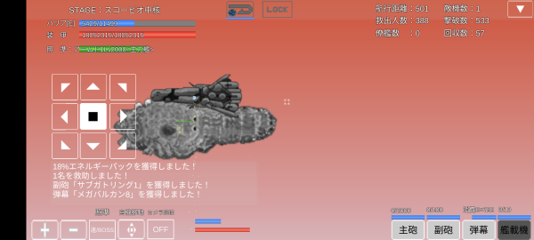

## スコーピオ

出撃制限が単艦限定で武装がガトリング、機銃限定である。
連装重ガトリング砲シリーズ、帝国要塞機銃シリーズがあればよいがボスドロップのため収集に時間がかかる。
持ち込めるエネルギー兵器はビームバルカン、ビームガトリングシリーズのみである。
ボスのアームド1がアームド級装甲戦艦の設計図をドロップするため、早めに入手するとよい。
いずれの武装も発射間隔が短く弾数も多いため、味方攻撃力+と相性が良い。
武装LvをあげずともトップクラスのDPSを叩き出す。

エリア10ボスのアームド1は実弾99.5%カット、E85%カット、爆風95%カットを誇るためエネルギー兵器で攻める方がよい。
自動回復も5秒間隔と早いため自動回復遅延チップが必須となる。

エリア10ボス以外は実弾50.5%カット、E99%カット、爆風0%カット、回避率70%であるが、やはり時間がかかるのはエリア10ボスである。

### 光化 単艦突破例

ボス用にエネルギー兵器を用意したい。
ver1.1.8にて収束ビームガトリングがガトリング砲に変更となったため利用する。

| 武装                 |  ダメージ | 装填時間 | 発射数 | カット率 |        DPS |
|----------------------|----------:|---------:|-------:|---------:|-----------:|
| 収束ビームガトリング | 3,600,000 |      0.1 |      1 |       85 | 36,000,000 |
| サブガトリング1      |     1,000 |      0.1 |      1 |     99.5 |     10,000 |
| 帝国要塞機銃4        |     7,000 |      0.1 |     15 |     99.5 |  1,050,000 |

```
旗艦: 深宇宙探査船
主砲: 収束ビームガトリング
副砲: サブガトリング1
弾幕: 帝国要塞機銃4
```

収束ビームガトリングは拡散重ビーム砲5からの開発が必要となる。
武装を集めるのに時間がかかるため、兵種の[主砲攻撃力](兵種.md#主砲、副砲、弾幕攻撃力)を上げるとよい。
[砲艦艦種熟練度](艦種熟練度.md#巡洋艦、SF、砲艦)が9999あれば、主砲攻撃力を6844振るだけで威力カンストする。

### 真破 単艦突破例

スコーピオは旗艦防御力が1,999,600あれば全ての敵の攻撃を完全防御できる。
収束ビームガトリングは消費バリアが大きすぎるため、ビームバルカン2とDPSで大差がない。
収束ビームガトリングとビームバルカン2の両方を持ち込んでも、うまくエネルギー調整しないといけない。
ボス以外をサブガトリング1のみで対処するのも時間がかかるため、多重連装重ガトリングを利用する。

自動回復遅延x45を付ける場合、50秒毎に平均3.5%自動回復されてしまう。
ボスの装甲は5億50万あるため、回復量は平均17,517,500になる。
武装を最大まで強化すると各DPSは次の通りとなる。

| 武装                 | ダメージ | 装填時間 | 発射数 | カット率 |     DPS | 弾切れ考慮DPS |
|----------------------|---------:|---------:|-------:|---------:|--------:|--------------:|
| 多重連装重ガトリング |    5,000 |      0.2 |      8 |     99.5 | 200,000 |        50,000 |
| サブガトリング1      |    1,000 |      0.2 |      1 |     99.5 |   5,000 |           500 |
| ビームバルカン2      |   54,000 |      0.2 |      2 |       85 | 540,000 |       540,000 |

50秒間のダメージは29,525,000となり、弾切れを考慮しても回復量を上回ることができる。
多重連装重ガトリングの弾切れを防ぐためには実弾錬成術を20振る必要があるが、ボス戦に数時間余計にかかってしまう。
武装を集めるのに時間がかかるため、兵種の[弾幕攻撃力](兵種.md#主砲、副砲、弾幕攻撃力)を上げるとよい。
[巡洋艦艦種熟練度](艦種熟練度.md#巡洋艦、SF、砲艦)が9999あれば、弾幕攻撃力を795振るだけで威力カンストする。

```
旗艦: 深宇宙探査船
主砲: 多重連装重ガトリング
副砲: サブガトリング1
弾幕: ビームバルカン2
チップ: 実弾錬成術x5、自動回復遅延x45
```



### 真破 バグ利用単艦突破例

スコーピオは本来ガトリング、機銃限定限定エリアであるが[なんでも装備バグ](バグ.md#なんでも装備バグ)のせいで通常兵器が持ち込める。
Lv調整したリフレクターレーザーでクリア可能。
ただし、ボス撃破には非常に時間がかかる。

[人類の覚醒](兵種.md#人類の覚醒)実装前は通常攻略が不可能で、バグ利用による攻略しかできなかった。
人類の覚醒さえ取得すれば通常攻略の方が早く撃破できるため、あえてバグ利用攻略に頼る必要はない。

```
旗艦: メタルSF
主砲: リフレクターレーザー1(Lv=332、消費E=635)
チップ: 自動回復遅延x50
```

## 出現敵

{: #enemies-list}
| 機体名             | 主砲                                              | 副砲                                         | 弾幕                                       | 主砲威力 | 主砲装填時間 | 主砲発射数 | 主砲貫通力 | 副砲威力 | 副砲装填時間 | 副砲発射数 | 副砲貫通力 | 弾幕威力 | 弾幕装填時間 | 弾幕発射数 | 弾幕貫通力 | 機関            | 設計図                  | 実弾カット | Eカット | 爆風カット | 回避率 | 爆風回避率 | 回復間隔 |   装甲 | 速度 | 対火災力 | 対電磁力 | 資金 | 功績値 | 救出人数 | 登場ステージ                         |
|--------------------|---------------------------------------------------|----------------------------------------------|--------------------------------------------|---------:|-------------:|-----------:|-----------:|---------:|-------------:|-----------:|-----------:|---------:|-------------:|-----------:|-----------:|-----------------|-------------------------|-----------:|--------:|-----------:|-------:|-----------:|----------|-------:|-----:|---------:|---------:|-----:|-------:|---------:|--------------------------------------|
| 戦闘機G1           | ガトリング砲                                      | なし                                         | メガバルカン2                              |        4 |          0.1 |          1 |          1 |          |              |            |            |        3 |          0.2 |          1 |          1 | 原子炉B         | 対空迎撃機XX1           |         0% |    100% |         0% |    75% |        50% | なし     |    200 | 2.10 |       50 |       50 |  100 |    100 |        1 | 1、1ボス、2、3、4、5、6、7、8、9、10 |
| 極地迎撃機D1       | ガトリング砲                                      | なし                                         | メガバルカン4                              |        4 |          0.1 |          1 |          1 |          |              |            |            |        5 |          0.2 |          2 |          1 | 核融合炉A       | 対空迎撃機XX1           |      50.5% |     99% |         0% |    70% |        70% | なし     |    320 | 1.70 |       30 |       30 |  220 |    220 |        3 | 2ボス、3、4、5、6、7、8、9、10       |
| 極地迎撃機D2       | ガトリング砲                                      | なし                                         | メガバルカン3                              |        4 |          0.1 |          1 |          1 |          |              |            |            |        4 |          0.2 |          1 |          1 | 核融合炉B       | 対空迎撃機XX1           |      50.5% |     99% |         0% |    70% |        70% | なし     |    370 | 1.80 |       30 |       30 |  270 |    270 |        3 | 3ボス、4、5、6、7、8、9、10          |
| 極地戦闘機E1       | 重ガトリング砲                                    | なし                                         | メガバルカン5                              |        8 |          0.2 |          1 |          1 |          |              |            |            |        6 |          0.2 |          2 |          1 | 核融合炉C       | 発掘戦闘機Z             |      50.5% |     99% |         0% |    70% |        70% | なし     |    400 | 2.80 |       72 |       72 |  300 |    300 |        2 | 4ボス、5、6、7、8、9、10             |
| 極地戦闘機E2       | 重ガトリング砲                                    | なし                                         | メガバルカン6                              |        8 |          0.2 |          1 |          1 |          |              |            |            |        7 |          0.2 |          2 |          1 | 核融合炉D       | 発掘戦闘機F18           |      50.5% |     99% |         0% |    70% |        70% | なし     |    420 | 3.20 |       72 |       72 |  320 |    320 |        2 | 5ボス、6、7、8、9、10                |
| ハルバードG型      | SF用携帯ガトリング3                               | サブガトリング1                              | メガバルカン7                              |        7 |          0.3 |          1 |          1 |       10 |          0.2 |          1 |          1 |        8 |          0.2 |          2 |          1 | 核融合炉E       | 汎用SF-AS21             |      50.5% |     99% |         0% |    70% |        70% | なし     |    790 | 1.60 |       80 |       70 |  490 |    490 |        3 | 6、6ボス、7、8、9、10                |
| ファランクスG型    | SF用携帯ガトリング4                               | サブガトリング1                              | メガバルカン8                              |       16 |          0.2 |          1 |          1 |       10 |          0.2 |          1 |          1 |       10 |          0.2 |          2 |          1 | 核融合炉F       | 支援SF-AS22             |      50.5% |     99% |         0% |    70% |        70% | なし     |    950 | 1.30 |       80 |       70 |  550 |    550 |        3 | 7ボス、8、9、10                      |
| ヴァルキリー級G型  | 連装重ガトリング砲                                | なし                                         | 28mm速射機銃座                             |       16 |          0.3 |          2 |          1 |          |              |            |            |       28 |          0.2 |          4 |          1 | 試作対消滅機関B | 軽巡洋艦                |      50.5% |     99% |         0% |    70% |        70% | なし     |   2500 | 1.20 |       80 |       80 | 1000 |   1000 |       65 | 8ボス、9、10                         |
| Gヴァルキリー級G型 | 連装重ガトリング砲2                               | なし                                         | 30mm速射機銃座                             |       32 |          0.2 |          3 |          5 |          |              |            |            |       30 |          0.2 |          4 |          2 | 対消滅機関B     | Gヴァルキリー級重巡洋艦 |      50.5% |     99% |         0% |    70% |        70% | なし     |   4500 | 1.20 |       85 |       85 | 1200 |   1200 |       75 | 9ボス、10                            |
| アームド1          | 多重連装重ガトリング(Lv補正、命中+65%、装填0.2秒) | サブガトリング1(Lv補正、命中+95%、装填5.2秒) | 帝国要塞機銃4(Lv補正、命中+20%、装填0.1秒) |       50 |          0.2 |          8 |         99 |       10 |          5.2 |          1 |          1 |       70 |          0.1 |         15 |          1 | 縮退炉C         | アームド級装甲戦艦      |      99.5% |     85% |        95% |     0% |         0% | 5秒      | 500000 | 0.50 |      100 |      100 | 4500 |   4500 |     3200 | 10ボス                               |

武装の( )内は補正値
カット率、回復間隔の[ ]内は光化、真破でのみ受ける補正値
