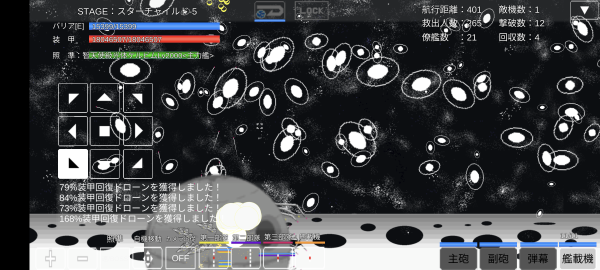

## スターチャイルド

ボスの智天使級光体ケルビムは超重力子榴砲(基礎攻撃力9999)を持つ。
旗艦の攻撃程度では役に立たないため、真破 単艦突破は期待できない。

敵の誘導兵器が多く、非常に重くなり雑魚が枯れるまでに異常な時間を要する。
ver1.1.0にて武装見直しがあったが、それでも雑魚が枯れるまでに1時間程度かかる。

雑魚敵が弾破壊999の攻撃を撃つため、遠距離戦では全く攻撃が届かない。
接近して撃つのが有効となる。

### 真破 艦隊突破例

超重力子榴砲のダメージは `基礎攻撃力9999 * 威力倍率補正1001 - 旗艦防御力1,999,600` となり8,009,399である。
ボスの攻撃を完全防御するには防御艦9隻が必要。

```
旗艦: 空母アマテラス
艦載機: アクエリアス級義体艦x40
僚艦: 防衛システムBB2x9、アクエリアス級義体艦x12
チップ: 四次元格納庫x10、自動回復遅延x40
```

### 真破 ダミー突破例

戦力がギリギリのため、ボスとの戦闘に相当時間がかかる。
火災スリップダメージがあるため病院船が必要になる。

自動回復遅延x40を付ける場合、41秒毎に平均3.5%自動回復されてしまう。
ボスの装甲は10億100万あるため[弩級戦艦の僚艦配備スキル](僚艦配備スキル.md#僚艦配備スキル)で20%装甲を下げ、回復量を平均28,028,000に下げる。
最大まで強化した光爆3、武装強化なしのアームドへ味方攻撃力9999とすると各DPSは次の通りとなる。
光爆3は実弾部分がヒットすると[ゼロダメージ爆風](ダメージ計算.md#爆風について)となるため、実弾が外れた後に爆風がヒットするものとして回避率を計算している。

{: .nowrap}
| 武装            |  ダメージ | 装填時間 | 発射数 |  回避 |    DPS |
|-----------------|----------:|---------:|-------:|------:|-------:|
| 光爆3(実弾部分) | 2,100,000 |       15 |      4 |    95 | 28,000 |
| 光爆3(爆風部分) |   840,000 |       15 |      4 | 95.25 | 10,640 |
| アームド(主砲)  |    12,626 |      0.2 |      8 |    95 | 25,252 |
| アームド(副砲)  |     5,000 |      0.2 |      1 |    95 |  1,250 |
| アームド(弾幕)  |    12,627 |      0.3 |     15 |    95 | 31,567 |

アクエリアス14隻、アームド3隻あるため、41秒間のダメージは29,321,724となり、回復量を上回ることができる。
なお、この構成ではボス撃破までに数時間かかる。
全てのアクエリアスをアームドにすればDPSは上がるが負荷が大きく実際に早くなるかは分からない、途中でエラーになる事もある。

```
旗艦: ダミー要塞
艦載機: アクエリアス級義体艦x11
僚艦: 超重改修艦ハーシェルx3、防衛システムBB2x9、アーク級グスタフx3、アクエリアス級義体艦x3、アームド級装甲戦艦x3
チップ: 四次元格納庫x10、自動回復遅延x40
```



## 出現敵

{: #enemies-list}
| 機体名                | 主砲                                                      | 副砲                                                       | 弾幕 | 主砲威力 | 主砲装填時間 | 主砲発射数 | 主砲貫通力 | 副砲威力 | 副砲装填時間 | 副砲発射数 | 副砲貫通力 | 弾幕威力 | 弾幕装填時間 | 弾幕発射数 | 弾幕貫通力 | 機関    | 設計図                     | 実弾カット | Eカット | 爆風カット | 回避率 | 爆風回避率 | 回復間隔 |    装甲 | 速度 | 対火災力 | 対電磁力 | 資金 | 功績値 | 救出人数 | 登場ステージ      |
|-----------------------|-----------------------------------------------------------|------------------------------------------------------------|------|---------:|-------------:|-----------:|-----------:|---------:|-------------:|-----------:|-----------:|---------:|-------------:|-----------:|-----------:|---------|----------------------------|-----------:|--------:|-----------:|-------:|-----------:|----------|--------:|-----:|---------:|---------:|-----:|-------:|---------:|-------------------|
| 光臨戦艦エル・トロ    | 光輪3(Lv補正、命中+50%、装填1.5秒、弾破壊+3)              | なし(Lv補正、命中+50%、装填0.5秒、弾破壊+999)              | なし |     2200 |          1.5 |          4 |       2333 |          |          0.5 |            |            |          |              |            |            | 縮退炉E | 強襲揚陸艦                 |        90% |     99% |        95% |    80% |        90% | 5秒      |  100000 | 0.30 |       99 |       99 | 3500 |   4500 |      100 | 1、2、3、4、5     |
| 光臨戦艦エル・デウス  | 重戦艦有線ビーム砲(Lv補正、命中+50%、装填1.5秒、弾破壊+3) | 光子追尾レーザー(Lv補正、命中+50%、装填0.5秒、弾破壊+999)  | なし |     2000 |          1.5 |          5 |       2085 |      500 |          0.5 |          1 |       2100 |          |              |            |            | 縮退炉E | 空中戦艦                   |        90% |     99% |        95% |    80% |        90% | 5秒      |  150000 | 0.40 |       99 |       99 | 4500 |   5500 |      100 | 1、2、3、4、5     |
| 光臨戦艦エル・ドラ    | 対艦光子ミサイル(Lv補正、命中+50%、装填1.5秒、弾破壊+3)   | なし(Lv補正、命中+50%、装填0.5秒、弾破壊+999)              | なし |     4000 |          1.5 |          1 |       2190 |          |          0.5 |            |            |          |              |            |            | 縮退炉E | ペ級弩級戦艦改             |        90% |     99% |        95% |    80% |        90% | 5秒      |  200000 | 0.40 |       99 |       99 | 5500 |   6500 |      100 | 1、2、3、4、5     |
| 光臨戦艦エル・レカ    | ツインHi光子砲改(Lv補正、命中+50%、装填1.5秒、弾破壊+3)   | なし(Lv補正、命中+50%、装填0.5秒、弾破壊+999)              | なし |     3600 |          1.5 |          2 |       2299 |          |          0.5 |            |            |          |              |            |            | 縮退炉E | エ級弩級戦艦改             |        90% |     99% |        95% |    80% |        90% | 5秒      |  250000 | 0.50 |       99 |       99 | 6600 |   6600 |      100 | 1、2、3、4、5     |
| 光臨空母エル・ノートB | 拡散重ビーム砲3(Lv補正、命中+50%、装填1.5秒、弾破壊+3)    | なし(Lv補正、命中+50%、装填0.5秒、弾破壊+999)              | なし |      600 |          1.5 |         10 |       2017 |          |          0.5 |            |            |          |              |            |            | 縮退炉F | 青版超級空母               |        90% |     99% |        95% |    80% |        90% | 5秒      |  258000 | 0.40 |       99 |       99 | 5550 |   4550 |      150 | 1ボス、2、3、4、5 |
| 光臨空母エル・ノートR | 拡散光線2(Lv補正、命中+50%、装填1.5秒、弾破壊+3)          | なし(Lv補正、命中+50%、装填0.5秒、弾破壊+999)              | なし |     2400 |          1.5 |         10 |       2038 |          |          0.5 |            |            |          |              |            |            | 縮退炉F | 赤版超級空母               |        90% |     99% |        95% |    80% |        90% | 5秒      |  286000 | 0.30 |       99 |       99 | 6560 |   5400 |      150 | 2ボス、3、4、5    |
| 光臨戦艦エル・メタ    | ツインHi光子砲(Lv補正、命中+50%、装填1.5秒、弾破壊+3)     | なし(Lv補正、命中+50%、装填0.5秒、弾破壊+999)              | なし |     1600 |          1.5 |          2 |       2099 |          |          0.5 |            |            |          |              |            |            | 縮退炉G | 超弩級戦艦メタトロン       |        90% |     99% |        95% |    80% |        90% | 5秒      |  300000 | 0.60 |       99 |       99 | 7450 |   6450 |      120 | 3ボス、4、5       |
| 光臨空母エル・マザー  | トライHi光子砲(Lv補正、命中+50%、装填1.5秒、弾破壊+3)     | なし(Lv補正、命中+50%、装填0.5秒、弾破壊+999)              | なし |     3000 |          1.5 |          3 |       2249 |          |          0.5 |            |            |          |              |            |            | 縮退炉G | 超時空戦闘母艦             |        90% |     99% |        95% |    80% |        90% | 5秒      |  400000 | 0.20 |       99 |       99 | 7500 |   7500 |      375 | 4ボス、5          |
| 智天使級光体ケルビム  | 超重力子榴砲                                              | なし(Lv補正、命中+60%、装填1秒、弾破壊+999)                | なし |     9999 |           40 |          1 |        999 |          |            1 |            |            |          |              |            |            | 星生炉D | 権天使級光体               |      97.5% |   99.9% |        99% |    95% |        95% | 1秒      | 1000000 | 0.30 |      100 |      100 | 8999 |   8999 |      100 | 5ボス             |
| 智天使ケルビム        | 超重力子榴砲(Lv補正、命中+60%、装填2秒、弾破壊+3)         | 光子追尾レーザー(Lv補正、命中+60%、装填0.1秒、弾破壊+9999) | なし |     9999 |            2 |          1 |       3299 |      500 |          0.1 |          1 |       2100 |          |              |            |            | 星生炉F | 智天型空母マザーメタトロン |      98.5% |   99.9% |        99% |    97% |        97% | 1秒      | 1000000 | 0.30 |      100 |      100 | 9999 |   9999 |      100 | 5裏ボス(光化以上) |

武装の( )内は補正値
カット率、回復間隔の[ ]内は光化、真破でのみ受ける補正値
