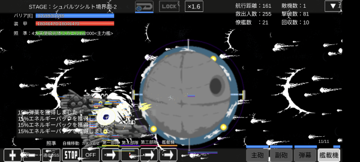
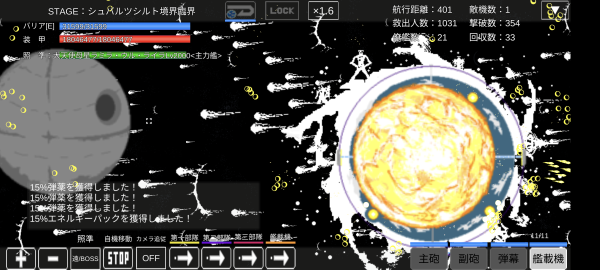

## シュバルツシルト境界面

銀河中心核のスターチャイルドの右隣に出現する。
初回攻略まではマップに名前が表示されないが、一度攻略すると表示される。

エリア2ボスの4大天使級光体ミカエルがメガフレアコア(基礎攻撃力9999)を連発してくる。
ボスの大天使母星ラミラ・ウル・ライラが星爆弾(基礎攻撃力22000)を撃ってくるが、エリア2さえ突破できれば脅威ではない。

どのボスも高い回復とカット率と回避率を誇るため、真破攻略は艦体突破すら恐らくできないであろう。

### 光化 単艦突破例1

[迎撃弾幕強化](チップ.md#迎撃弾幕強化)で相殺を図る。
エリア2、4ボス以外は顔面アタックで距離をとって攻撃するとよい。
エリア4ボスも弾破壊が高いが完全防御できるため接近して撃ち込めばよい。

エリア2ボスはメガフレアコアの弾破壊が高く、すさまじい速度で連発しまともに相殺することはできないため、上下に移動し回避と相殺で対処する。
顔面アタックはまっすぐ飛ぶため全てメガフレアコアに相殺されてしまう。
宙域1を発射後すぐに移動し射線をそらせて宙域1を当てる。
雑魚が残っていると弾破壊が間に合わずにメガフレアコアに当たってしまうため、ボスが出る前に顔面アタックで枯らせておきたい。

エリア5ボスは画面左端で顔面アタックと帝国要塞機銃4を撃っておけば攻撃が全く届かずに勝つことができる。
宙域1を撃ち続けると処理落ちするため、エリア2ボス以外には使用しない方がよい。

```
旗艦: 発掘宇宙戦艦9999
主砲: 宙域制圧ミサイル1
副砲: 顔面アタック
弾幕: 帝国要塞機銃4
```

### 光化 単艦突破例2

強襲SF-AS400GBの移動速度があればエリア2ボスにも顔面アタックをあてることができる。
操作に慣れないと早すぎてメガフレアコアに突っ込んでしまうため注意。

主砲にソード系武装を積み[斬鉄剣](チップ.md#斬鉄剣)でさらに相殺を図ってもよいが、ソード系は弾数が少なぎてほとんど効果はない。

```
旗艦: 強襲SF-AS400GB
副砲: 顔面アタック
弾幕: 帝国要塞機銃4
```

<iframe width="560" height="315" src="https://www.youtube.com/embed/jtYBqYufHGk" title="YouTube video player" frameborder="0" allow="accelerometer; autoplay; clipboard-write; encrypted-media; gyroscope; picture-in-picture; web-share" allowfullscreen></iframe>

### 光化 ダミー突破例

エリア2ボスの攻略が重要になる。
ダミー攻略では[斬鉄剣](チップ.md#斬鉄剣)や[迎撃弾幕強化](チップ.md#迎撃弾幕強化)でボスの弾を**旗艦の近くで相殺してはいけない。**
相殺すると[爆風が発生してしまい](ダメージ計算.md#爆風について)ダミーでは避けきれず旗艦がやられてしまう。
旗艦を大型艦で覆いゼロダメージ爆風にして耐えきり、ある程度距離が離れ停止したところで攻撃を行う。
旗艦に重なる場合はほぼクリア不可能になる。



エリア5ボスは左端待機する。
大型艦をボスにかぶせ、輸送艦の僚艦配備スキルで[燃料切れを防げば](僚艦配備スキル.md#弾薬ドロップ率+)ボスの弾を相殺必要なく撃破することができる。
エリア5ボスは移動しないため、戦力さえ揃っていれば安定するものの、撃破するのに非常に時間がかかる。



```
旗艦: ダミー要塞
艦載機: アクエリアス級義体艦x11
僚艦: 防衛システムBB2x9、アクエリアス級義体艦x7、アームド級装甲戦艦x3、移動都市M6x1、重輸送艦x1
```

## 出現敵

{: #enemies-list}
| 機体名                         | 主砲                                                  | 副砲                                                          | 弾幕 | 主砲威力 | 主砲装填時間 | 主砲発射数 | 主砲貫通力 | 副砲威力 | 副砲装填時間 | 副砲発射数 | 副砲貫通力 | 弾幕威力 | 弾幕装填時間 | 弾幕発射数 | 弾幕貫通力 | 機関        | 設計図                     | 実弾カット | Eカット | 爆風カット | 回避率 | 爆風回避率 | 回復間隔 |    装甲 | 速度 | 対火災力 | 対電磁力 | 資金 | 功績値 | 救出人数 | 登場ステージ      |
|--------------------------------|-------------------------------------------------------|---------------------------------------------------------------|------|---------:|-------------:|-----------:|-----------:|---------:|-------------:|-----------:|-----------:|---------:|-------------:|-----------:|-----------:|-------------|----------------------------|-----------:|--------:|-----------:|-------:|-----------:|----------|--------:|-----:|---------:|---------:|-----:|-------:|---------:|-------------------|
| 重天使級光体タノエル           | 光槍3(Lv補正、命中+50%、装填1.5秒、弾破壊+3)          | なし(Lv補正、命中+50%、装填0.5秒、弾破壊+999)                 | なし |     1500 |          1.5 |          3 |       2088 |          |          0.5 |            |            |          |              |            |            | 小型光体炉A | 天使級光体                 |        90% |     99% |        95% |    80% |        90% | 5秒      |   50000 | 2.30 |       98 |       98 | 3500 |   3500 |       10 | 1、2、3、4、5     |
| 重天使級光体ヌカエル           | 光弾3(Lv補正、命中+50%、装填1.5秒、弾破壊+3)          | なし(Lv補正、命中+50%、装填0.5秒、弾破壊+999)                 | なし |      900 |          1.5 |          2 |       2048 |          |          0.5 |            |            |          |              |            |            | 小型光体炉B | 天使級光体                 |        90% |     99% |        95% |    80% |        90% | 5秒      |   60000 | 1.50 |       98 |       98 | 3500 |   3500 |       10 | 2、3、4、5        |
| 重天使級光体ミヤエル           | 光輪3(Lv補正、命中+50%、装填1.5秒、弾破壊+3)          | なし(Lv補正、命中+50%、装填0.5秒、弾破壊+999)                 | なし |     2200 |          1.5 |          4 |       2333 |          |          0.5 |            |            |          |              |            |            | 小型光体炉C | 天使級光体                 |        90% |     99% |        95% |    80% |        90% | 5秒      |   70000 | 1.80 |       98 |       98 | 3500 |   3500 |       10 | 3、4、5           |
| 4大天使級光体ラファエル        | 光子フィン(Lv補正、命中+60%、装填2秒、弾破壊+3)       | なし(Lv補正、命中+60%、装填0.1秒、弾破壊+9999)                | なし |     7800 |            2 |         24 |      12299 |          |          0.1 |            |            |          |              |            |            | 星生炉E     | 権天使級光体               |      98.5% |   99.9% |        99% |    97% |        97% | 1秒      | 1000000 | 0.30 |      100 |      100 | 8999 |   8999 |      100 | 1ボス             |
| 4大天使級光体ミカエル          | なし(Lv補正、命中+60%、装填2秒、弾破壊+3)             | メガフレアコア(Lv補正、命中+60%、装填0.1秒、弾破壊+9999)      | なし |          |            2 |            |            |     9999 |          0.1 |          3 |       2999 |          |              |            |            | 星生炉E     | 権天使級光体               |      98.5% |   99.9% |        99% |    97% |        97% | 1秒      | 1000000 | 0.30 |      100 |      100 | 8999 |   8999 |      100 | 2ボス             |
| 4大天使級光体ウリエル          | 拡散超質量氷塊弾(Lv補正、命中+60%、装填2秒、弾破壊+3) | なし(Lv補正、命中+60%、装填0.1秒、弾破壊+9999)                | なし |     9999 |            2 |          8 |       2400 |          |          0.1 |            |            |          |              |            |            | 星生炉E     | 権天使級光体               |      98.5% |   99.9% |        99% |    97% |        97% | 1秒      | 1000000 | 0.30 |      100 |      100 | 8999 |   8999 |      100 | 3ボス             |
| 4大天使級光体ガブリエル        | なし(Lv補正、命中+60%、装填2秒、弾破壊+3)             | 拡散ブルーレーザー1(Lv補正、命中+60%、装填0.1秒、弾破壊+9999) | なし |          |            2 |            |            |      100 |          0.1 |          4 |       2030 |          |              |            |            | 星生炉E     | 権天使級光体               |      98.5% |   99.9% |        99% |    97% |        97% | 1秒      | 1000000 | 0.30 |      100 |      100 | 8999 |   8999 |      100 | 4ボス             |
| 大天使母星ラミラ・ウル・ライラ | 星爆弾(Lv補正、命中+900%、装填2秒、弾破壊+3)          | なし(Lv補正、命中+120%、装填0.1秒、弾破壊+9999)               | なし |    22000 |            2 |          1 |     109299 |          |          0.1 |            |            |          |              |            |            | 星生炉F     | 衛星要塞サジタリウス       |      99.5% |   99.9% |      99.5% |    99% |        99% | 1秒      | 1000000 | 0.01 |      100 |      100 | 9999 |   9999 |      100 | 5ボス             |
| 熾天使級光体セラフ             | 超重力子榴砲(Lv補正、命中+900%、装填2秒、弾破壊+3)    | 重反物質ロケット(Lv補正、命中+120%、装填0.1秒、弾破壊+9999)   | なし |     9999 |            2 |          1 |      10299 |     1600 |          0.1 |          5 |       2020 |          |              |            |            | 星生炉F     | 熾天型銀河航行艦セラフィム |      99.5% |   99.9% |      99.5% |    99% |        99% | 1秒      | 1000000 | 0.01 |      100 |      100 | 9999 |   9999 |     1000 | 5裏ボス(光化以上) |

武装の( )内は補正値
カット率、回復間隔の[ ]内は光化、真破でのみ受ける補正値
