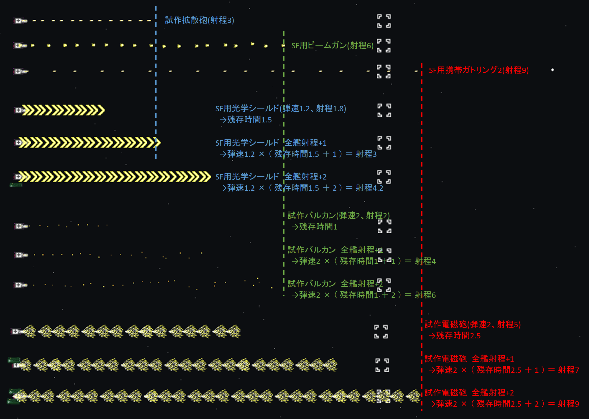
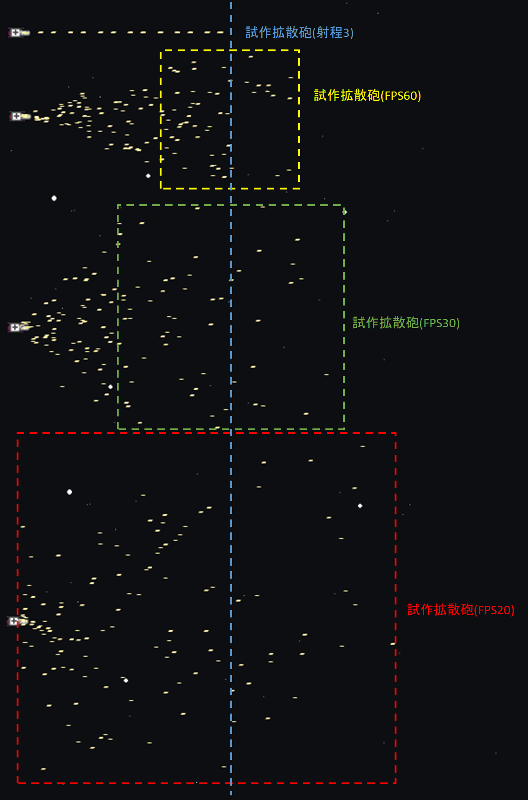

## その他

### 射程

武装には弾速と射程が表示されるが、実際には弾速と残存時間というパラメータしかない。
ゲーム内の射程表記は `弾速 * 残存時間` を表示している。

[実弾近接化系チップ](チップ.md#実弾近接化系チップ)や[全艦射程](僚艦配備スキル.md#全艦射程)では残存時間が増減する。
実際の射程は `(弾速 + 全艦弾速 + 散布界によるランダム値) * max(0.1, 射程 / 弾速 + 全艦射程 - 実弾近接化Lv * 0.05)` となる。

以下は試作拡散砲(射程3)、SF用ビームガン(射程6)、SF用携帯ガトリング2(射程9)を基準に弾の到達距離を比較したものである。

| 武装             | 弾速 | 射程(ゲーム内表記) | 残存時間 | 検証内容                        |
|------------------|-----:|-------------------:|---------:|---------------------------------|
| SF用光学シールド |  1.2 |                1.8 |      1.5 | 全艦射程+1で実際の射程が3になる |
| 試作バルカン     |  2.0 |                2.0 |      1.0 | 全艦射程+2で実際の射程が6になる |
| 試作電磁砲       |  2.0 |                5.0 |      2.5 | 全艦射程+2で実際の射程が9になる |

### 散布界

武装には散布界が表示されるが、このゲームにおいて散布界は射出角度ではない。
散布界が上がるとランダムに飛ぶ方向が変わる。
弾の進行方向に対するx軸、y軸成分に `-散布界 ～ +散布界のランダム値 / 2.8 / FPS` を加えるため、弾の速度が変わる。
FPSが上がると弾に加わる加速が減り、散布界が狭まる。

以下は試作拡散砲(射程3)を散布界0と散布界60の各FPSで撃った時の弾の到達距離を比較したものである。
おおむね枠内まで弾が到達する。
枠内の左側で消える弾は、弾の速度が遅いことが確認できる。

### 多弾頭兵器

ゲーム中では明言されていないが多弾頭兵器が存在する。
多弾頭兵器は親弾の[残存時間](#射程)が**0.1秒以下**になると子弾を発射する。
この時、画面更新タイミング毎に子弾を1発づつ発射するため**FPSが高いと発射機会が増える。処理落ちすると発射機会は減る。**
おおむね60FPSで5発、30FPSで3発、20FPSで2発の発射機会がある。
FPSを上げて1倍速にすると最も多く発射機会が得られる。

子弾は親弾の[加算攻撃力](ダメージ計算.md#旗艦の与ダメージ)を引き継ぐため、子弾のLvを上げる必要はない。
最も子弾を多くばらまくのは宙域制圧ミサイル1で、宙域制圧ミサイル1x8発が宙域制圧ミサイル2x40発となり、誘導ミサイルV7x200発に分裂する。
誘導ミサイルV7の1発あたり `宙域制圧ミサイル1の基礎攻撃力1500 * 19999` の[加算攻撃力](ダメージ計算.md#旗艦の与ダメージ)を持つ事になる。
ただし、宙域1はほぼ確実に処理落ちを起こし、理論値通りにはならない。

多弾頭兵器は以下の通り。

| 親弾                   | 親弾威力 | 親弾発射数 | 子弾                  | 子弾威力 | 子弾発射数 |
|------------------------|---------:|-----------:|-----------------------|---------:|-----------:|
| 試作有線ビーム砲       |       10 |          2 | 連装追尾レーザー      |       45 |          4 |
| 宙域制圧ミサイル1      |    1,500 |          8 | 宙域制圧ミサイル2     |      500 |          8 |
| 宙域制圧ミサイル2      |      500 |          8 | 誘導ミサイルV7        |       20 |          7 |
| 戦艦有線ビーム砲       |       20 |          5 | 拡散重ビーム砲        |      300 |          8 |
| リフレクターレーザー1  |      400 |         16 | リフレクターレーザー2 |      400 |          1 |
| リフレクターレーザー2  |      400 |          1 | リフレクターレーザー3 |      400 |          1 |
| リフレクターレーザー3  |      400 |          1 | リフレクターレーザー4 |      400 |          1 |
| リフレクターレーザー4  |      400 |          1 | リフレクターレーザー5 |      400 |          1 |
| 宙域制圧ミサイル3      |      500 |          6 | 誘導ミサイルV7        |       20 |          7 |
| サテライトキャノン     |    7,200 |          4 | 拡散ビーム砲          |       60 |         10 |
| 拡散重カノン砲         |    1,200 |          5 | 46cm7連装カノン砲     |       46 |          7 |
| 重戦艦有線ビーム砲     |    2,000 |          5 | 拡散重ビーム砲2       |      400 |          9 |
| 超重力子榴砲           |    9,999 |          1 | 超重力子弾            |    9,999 |          4 |
| 試作多弾頭ミサイルS00  |        1 |          1 | 誘導ミサイルV6        |       15 |          6 |
| 重多弾頭ミサイルS99    |        1 |         20 | 誘導ミサイルV6        |       15 |          6 |
| 多弾頭ミサイルS01      |        3 |          1 | 誘導ミサイルV7        |       20 |          7 |
| 分裂追尾レーザー       |       30 |         10 | 連装追尾レーザー＋    |       80 |          6 |
| 多弾頭ミサイルS02      |        5 |          3 | 誘導ミサイルV7        |       20 |          7 |
| 有線ビームソード       |       50 |          4 | ハイパービームソード  |      360 |          1 |
| 分裂追尾レーザー+      |       80 |          6 | 分裂追尾レーザー      |       30 |         10 |
| 花火1                  |       50 |          1 | 花火2                 |       30 |         40 |
| 拡散ブルーレーザー1    |      100 |          4 | 拡散ブルーレーザー2   |       50 |          4 |
| 拡散ブルーレーザー2    |       50 |          4 | 拡散ブルーレーザー3   |       25 |          4 |
| サイコ・ソード         |    1,500 |          1 | 艦載ビームソード      |      333 |          1 |
| サイコ・マニピュレータ |    3,500 |          4 | サイコ・ソード        |    1,500 |          1 |
| メガフレアコア         |    9,999 |          3 | メガフレア            |    8,888 |         10 |
| 地球防衛ロケットE1     |    9,999 |          1 | 地球防衛ロケットE2    |    1,000 |         10 |
| 地球防衛ロケットE2     |    1,000 |         10 | 地球防衛ロケットE3    |      100 |         10 |

有線系はヒモ部分が実弾判定、その後に飛び出すソードやビームはエネルギー兵器判定となる。

### サイコ兵器

サイコ兵器は0.8秒毎に子弾を発射する。
0.8秒経過後の画面更新タイミング毎に子弾を1発づつ発射するためFPSが低くても発射機会が減ることはほとんどない。
子弾発射数に上限はなく、[全艦射程](僚艦配備スキル#全艦射程)で残存時間が延びれば、その分多く子弾を発射する。
子弾は親弾の[加算攻撃力](ダメージ計算.md#旗艦の与ダメージ)を引き継ぐため、子弾のLvを上げる必要はない。

| サイコ兵器       | 子弾               | 残存時間 | 子弾発射数 | 全艦射程+1 | 全艦射程+2 |
|------------------|--------------------|---------:|-----------:|-----------:|-----------:|
| サイコ・ピットα | 30型携帯レーザー砲 |      6.0 |          7 |          8 |         10 |
| サイコ・ピットβ | 0式重ビーム砲      |      6.5 |          8 |          9 |         10 |
| サイコ・ピットγ | 1式重ビーム砲      |      7.0 |          8 |         10 |         11 |
| サイコ・ピットΩ | 2式重ビーム砲      |      7.5 |          9 |         10 |         11 |

サイコ兵器はヒモ部分が実弾判定、その後に飛び出すビームはエネルギー兵器判定となる。

### 貫通力と弾破壊力

弾が相手艦にヒットした際は弾の与ダメージから敵のバリア、装甲分だけ引いて、貫通力を合計2減らし貫通していく。
弾が相手艦の弾にヒットした際はお互いの弾の貫通力を1減らし貫通していく。
与ダメージがなくなるか貫通力がなくなると弾は消滅、または爆発する。

原則、弾同士の衝突では貫通力は1しか減らないが、弾破壊力に補正を持つものがある。
弾同士の衝突の場合は貫通後に互いの貫通力を減らす。
[実弾近接化系チップ](チップ.md#実弾近接化系チップ)を使用し味方艦を大きな爆風円の中に入れても、貫通力を減らすのは爆風から抜けた後のため、弾消し効果は全くない。(ダメージ目的の運用であれば意味はある)

| 弾同士の衝突                             |           弾破壊力 |
|------------------------------------------|-------------------:|
| 通常弾                                   |                  1 |
| 爆風                                     |                  1 |
| エネルギー吸収フィールド                 |                 21 |
| 試作防御フィールド                       |                101 |
| ソード系                                 |       1 + 斬鉄剣Lv |
| 対空機銃系                               | 1 + 迎撃弾幕強化Lv |
| 光臨戦艦エル・トロの主砲                 |                  4 |
| 光臨戦艦エル・デウスの主砲               |                  4 |
| 光臨戦艦エル・デウスの副砲               |              1,000 |
| 光臨戦艦エル・ドラの主砲                 |                  4 |
| 光臨戦艦エル・レカの主砲                 |                  4 |
| 光臨空母エル・ノートBの主砲              |                  4 |
| 光臨空母エル・ノートRの主砲              |                  4 |
| 光臨戦艦エル・メタの主砲                 |                  4 |
| 光臨空母エル・マザーの主砲               |                  4 |
| 力天使級光体デニリオンの副砲             |              1,000 |
| 力天使エル・デニリオンの副砲             |              1,000 |
| 智天使ケルビムの主砲                     |                  4 |
| 智天使ケルビムの副砲                     |             10,000 |
| アーク・ノヴァ級参番艦アレクシオンの主砲 |                  4 |
| アーク・ノヴァ級参番艦アレクシオンの副砲 |              1,000 |
| 紅雀の副砲                               |             10,000 |

相手艦にヒットした場合は衝突した瞬間にダメージ判定と貫通力を減らす。
大型艦であっても衝突中に連続ヒットはしない。
相手艦から弾が離れた時にも貫通力を1減らす。

| 相手艦との衝突 |             衝突時の弾破壊力 | 貫通後 |
|----------------|-----------------------------:|-------:|
| 相手艦         |                            1 |      1 |
| 味方防御艦     | 1 + {防御艦艦種熟練度 / 100} |      1 |
| ダミー標的1    |                            2 |      1 |
| ダミー標的2    |                         1001 |      1 |

なお、チップの[サイクロプス](チップ.md#サイクロプス)は貫通力を上げるチップではない。

### 火災

武装に設定された `熱量` パーセントの確率で火災が発生する。
ただし旗艦は `対火災力 + 対火災防御Lv + 旗艦が消防船なら消防船熟練度 * 10 + 1` パーセントで回避する。
僚艦・艦載機は `対火災力 + 味方対火電Lv + 1` パーセントで回避する。
敵艦は `対火災力 + 1` パーセントで回避する。

旗艦の被害(火災の継続時間)は `max(1, 10 - 僚艦の消防船の数 * 2)` 秒となる。
僚艦・艦載機・敵艦の被害は `10` 秒固定となる。
敵にドワーフ2級重消防艦がいると10秒毎に敵全艦の残り火災被害時間を8割減する。

火災ダメージは毎秒 最大装甲の3%づつのスリップダメージが発生する。
火災から回復後にクールタイムはないため、ダミー旗艦など対火災力が低い場合は常に火災が続くことになる。
真破ではスリップダメージを軽減する方法がほぼ存在しないため、ダミー突破を狙う場合は常時火災状態となる。

### 電磁障害

武装に設定された `電磁力` パーセントの確率で電磁障害が発生する。
ただし旗艦は `対電磁力 + 対電磁防御Lv + 旗艦が工作船なら工作船熟練度 * 10 + 1` パーセントで回避する。
僚艦・艦載機は `対火災力 + 味方対火電Lv + 1` パーセントで回避する。
敵艦は `対火災力 + 1` パーセントで回避する。

被害(電磁障害の継続時間)は `max(1, 10 - 僚艦の工作船の数 * 2)` 秒となる。
僚艦・艦載機・敵艦の被害は `10` 秒固定となる。
敵にノーム2級重工作艦がいると10秒毎に敵全艦の残り電磁障害被害時間を8割減する。

電磁障害の効果は旗艦とそれ以外で若干異なる。
旗艦は武装の装填がストップしバリア回復も止まる。
僚艦・艦載機・敵艦は武装の装填は続くが発射がキャンセルされ、バリア回復は止まる。
電磁障害から回復後にクールタイムはない。
旗艦は電磁障害中にエネルギーパック取得すると、電磁障害残り時間が1秒に短縮される。

15秒かかる装填の開始直後に電磁障害が発生した場合、
旗艦は装填が止まるため、電磁障害回復後に武装の装填が再開され結果的に25秒後武装発射となる。
僚艦・艦載機・敵艦は装填が止まらないため、電磁障害回復中にも武装の装填が継続され結果的に15秒後武装発射となる。

### 病院船

旗艦が病院船の場合は30秒毎に15%装甲回復する。病院船の艦種熟練度分加算される。
僚艦に病院船がいる場合は30秒毎に1隻につき15%装甲回復する。兵種の回復率分だけランダムで加算される。

ダミー突破を狙う場合は3体程度の病院船が必要になるが、まれに45%程度しか回復しないこともある。

### 回避率

旗艦の回避率の最大値は90%である。爆風は旗艦が戦闘機か単艦の時のみ回避率が使用される。(艦隊で戦闘機以外なら爆風は回避不可能)
僚艦・艦載機は潜宙艦のみ回避率と潜宙艦の僚艦配備スキルのみ適用される。潜宙艦以外は潜宙艦の僚艦配備スキルのみである。爆風は回避不可能。
敵は回避率(実弾・E兼用)と爆風回避率を持つ。こちらは敵毎に設定値が異なる。

### 敵のLv

敵のLvは難易度に応じて変動する。
熟練兵以上であれば太陽系以外のボス、レア敵(メタルSF、小型移民船B01、資金運搬船)はLv固定となる。
太陽系内でも戦闘訓練場だけはLv固定となる。
小惑星ベヒモスや帝国軍移民船団に通常敵枠で出るメタルSF、小型移民船B01、資金運搬船はあくまで通常敵枠のため雑魚敵のLv帯で出現する。

| 難易度 | 雑魚敵のLv | 太陽系以外のボス、レア敵Lv |
|--------|-----------:|---------------------------:|
| 一般兵 |          0 |                          0 |
| 熟練兵 |      1～10 |                         11 |
| 強化兵 |     11～30 |                         31 |
| 親衛隊 |    31～100 |                        101 |
| 覚醒者 |   101～998 |                        999 |
| 光化   | 1000～1999 |                       2000 |
| 真破   | 1500～1999 |                       2000 |

敵のLvの効果は以下の通り。

* 装甲が `[装甲 * Lv / 2]` 加算される。
* 資金が `[資金 * Lv / 10]` 加算される。
* 功績値が `[経験値 * Lv / 10]` 加算される。
* 武装威力が `[威力 * Lv / 2]` 加算される。
* 敵によってはさらに武装威力に補正値としてLvを加算する。

### 敵の撤退

雑魚敵は3分経過すると右端に移動し撤退する。
1ステージあたり出現する敵の最大値が決まっているため、放置していれば雑魚敵が枯れる。
後半の真破では雑魚敵を処理しきれない場合が多いので放置が基本となる。

ある程度左に移動しないと撤退開始しないため超重力宙域H1では雑魚敵が撤退しないことがある。

### 敵の自動回復

敵は一定間隔で自動回復するが、1隻が自動回復すると**敵全艦が自動回復**する。
自動回復する雑魚敵がいると1隻ごとに回復判定が発生するため、雑魚敵が枯れるまでまともにボスの装甲を減らすことができない。
自動回復は `最大装甲の2～5%` のランダムになる。

自動回復遅延チップで自動回復間隔を延ばすことができる。
自動回復遅延チップで自動回復を止めることはできない。

### 艦体Lv熟練度

艦体Lv熟練度は敵撃破やエリアクリア時に旗艦や僚艦に加算される。
敵を撃破すれば旗艦の艦体Lv熟練度が上昇する。
エリアクリア時には僚艦の艦体Lv熟練度が上昇する。

| 条件                         | 上昇値                  |
|------------------------------|-------------------------|
| 敵撃破                       | 旗艦に+0.5ポイント      |
| 敵撃破(単艦時)               | 旗艦に+1ポイント        |
| エリアクリア時               | 僚艦1隻あたり+1ポイント |
| エリアクリア時(旗艦がダミー) | 僚艦1隻あたり+6ポイント |

### 最大値

主にステータス画面の1面目について、各ステータスの最大値は以下の通り。(ver1.1.0調べ)

| ステータス      |           上限 |
|-----------------|---------------:|
| レベル          |         49,999 |
| 功績値          | 24,999,000,020 |
| 資金            |    999,999,999 |
| 人口            |     99,999,999 |
| 資源            |     99,999,999 |
| 撃破数          |    999,999,999 |
| 地球レベル      |            330 |
| 闘技場MAXランク |            466 |
| 時間跳躍        |          9,999 |
| コイン          |         10,000 |
| 星くず          | 99,999,999,999 |

撃沈回数、総航行距離、装甲は上限が設定されていない。
これらは32bit符号付整数の上限である2,147,483,647が実質的な上限となるが、これ以上上げるとオーバーフローしマイナスになる。
特に装甲はマイナスになるとゲーム進行に重大な影響を及ぼすため[集めすぎ](バグ.md#アイテム多重取得バグ)には注意すること。

### 武装破棄

主砲・副砲・弾幕破棄で破棄数1個につき
資金は10分の1の確率で1増える、
資源は300分の1の確率で1増える、
星くずは1000分の1の確率で1増える。

取得は完全ランダムで、武装の種類は関係がない。
星くずには用途はない。(ver1.1.5調べ)

<blockquote class="twitter-tweet">
<a href="https://twitter.com/hashtag/%E5%AE%87%E5%AE%99%E6%88%A6%E8%89%A6%E7%89%A9%E8%AA%9ERPG?src=hash&amp;ref_src=twsrc%5Etfw">#宇宙戦艦物語RPG</a> で星くずがどういう効果なのか調べてみたけど、結局何も実装されてないっぽい？ 兵器の破棄で破棄数1個につき 資金は10分の1の確率で1増える 資源は300分の1の確率で1増える 星くずは1000分の1の確率で1増える 完全ランダム、兵器の種類は関係ない  星くずの上限は99,999,999,999
&mdash; やぎゆういち (@zenuas) <a href="https://twitter.com/zenuas/status/1248711473137770497?ref_src=twsrc%5Etfw">April 10, 2020</a></blockquote> 
