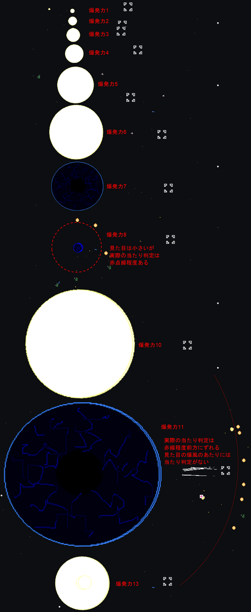

## ダメージ計算

ダメージ計算の元となる敵の武装と攻撃力は以下より確認できる。

* [敵艦データ](敵艦データ.md)
* [武装データ](武装データ.md)

### 旗艦の与ダメージ

```
与ダメージ = [ダメージ * (100 - 敵艦カット率 * (1 - エネルギー中和磁場Lv / 3000)) / 100] + 光拳加算
ダメージ = 基礎攻撃力 + 加算攻撃力
加算攻撃力 = [(武装Lv上昇 + 重撃上昇 + 兵種上昇) * (1 + 艦種Lv * 0.01)] + エース上昇
武装Lv上昇 = [基礎攻撃力 * 0.02 * 武装Lv]
重撃上昇 = [基礎攻撃力 * (1 + 重撃チップ / 80) * 3] - 基礎攻撃力
光拳加算 = [ヒト熟練度 / 10] * max(1, [min(20, ヒト僚艦数) / 2])

※与ダメージの最大は9,999,999
※加算攻撃力の最大は「10,000 + 銀河の英雄」倍が最大となる
※重撃チップがゼロの場合、重撃上昇はゼロ
※光拳加算は旗艦がヒトで、武装が光拳の場合のみ加算
※エネルギー中和磁場はE兵器にのみ適用

式中の[ ]は小数点切り上げ
```

多弾頭兵器は `ダメージ = 子弾の基礎攻撃力 + 親弾の加算攻撃力` となる。
爆風はダメージがそのまま引き継がれる。
エネルギー兵器は `加算攻撃力 / 500` を切り捨てした分消費バリアが上昇する。威力固定兵器であっても消費バリアが上昇する。
威力固定兵器は加算攻撃力がゼロになる。

<form action="#" method="get" class="inline-grid grid2-auto-fr" oninput="kikan()">

<label for="power">基礎攻撃力</label>
<input type="number" id="power" value="1000" min="1" max="99999" step="1" data-auto-cookie required>

<label for="lv">武装Lv</label>
<input type="number" id="lv" value="1" min="1" max="999999" step="1" data-auto-cookie required>

<label for="status" title="主砲攻撃力、副砲攻撃力、弾幕攻撃力のLv">兵種Lv</label>
<input type="number" id="status" value="0" min="0" max="9999" step="1" data-auto-cookie required>

<label for="jyuugeki">重撃チップ</label>
<input type="number" id="jyuugeki" value="0" min="0" max="1000" step="1" data-auto-cookie required>

<label for="kansyu" title="砲艦、SF、巡洋艦の艦種熟練度Lv">艦種Lv</label>
<input type="number" id="kansyu" value="9999" min="0" max="9999" step="1" data-auto-cookie required>

<label for="ace">一騎当千Lv</label>
<input type="number" id="ace" value="0" min="0" max="9999" step="1" data-auto-cookie required>

<label for="over">銀河の英雄Lv</label>
<input type="number" id="over" value="9999" min="0" max="9999" step="1" data-auto-cookie required>

<label for="lvup">武装Lv上昇</label>
<output id="lvup" for="power lv"></output>

<label for="statusup">兵種上昇</label>
<output id="statusup" for="status"></output>

<label for="jyuugekiup">重撃上昇</label>
<output id="jyuugekiup" for="power jyuugeki"></output>

<label for="aceup">エース上昇</label>
<output id="aceup" for="ace"></output>

<label for="damage">ダメージ</label>
<output id="damage" for="power lv status jyuugeki kansyu ace over"></output>

<label for="cut">敵艦カット率</label>
<input type="number" id="cut" value="0" min="0" max="100" step="0.1" data-auto-cookie required>

<label for="tyuuwa">エネルギー中和磁場Lv</label>
<input type="number" id="tyuuwa" value="0" min="0" max="900" step="1" data-auto-cookie required>

<label for="result">与ダメージ</label>
<output id="result" for="power lv status jyuugeki kansyu ace over cut tyuuwa"></output>

</form>

### 僚艦・艦載機の与ダメージ

```
与ダメージ = [ダメージ * (100 - 敵艦カット率 * (1 - エネルギー中和磁場Lv / 3000)) / 100] + 光拳加算
ダメージ = 基礎攻撃力 + 加算攻撃力
加算攻撃力 = (武装Lv上昇 + 潜宙艦熟練 + 攻撃司令上昇)
武装Lv上昇 = [基礎攻撃力 * 0.02 * 武装Lv]
光拳加算 = [ヒト熟練度 / 10]

※与ダメージの最大は9,999,999
※加算攻撃力の最大は「10,000 + 銀河の英雄」倍が最大となる
※潜宙艦熟練は主砲にのみ適用
※光拳加算は武装が光拳の場合のみ加算
※エネルギー中和磁場はE兵器にのみ適用

式中の[ ]は小数点切り上げ
```

多弾頭兵器は `ダメージ = 子弾の基礎攻撃力 + 親弾の加算攻撃力` となる。
爆風はダメージがそのまま引き継がれる。
威力固定兵器は加算攻撃力がゼロになる。

<form action="#" method="get" class="inline-grid grid2-auto-fr" oninput="ryoukan()">

<label for="power2">基礎攻撃力</label>
<input type="number" id="power2" value="1000" min="1" max="99999" step="1" data-auto-cookie required>

<label for="lv2">武装Lv</label>
<input type="number" id="lv2" value="0" min="1" max="999999" step="1" data-auto-cookie required>

<label for="status2">攻撃司令Lv</label>
<input type="number" id="status2" value="9999" min="0" max="9999" step="1" data-auto-cookie required>

<label for="kansyu2">潜宙艦Lv</label>
<input type="number" id="kansyu2" value="0" min="0" max="9999" step="1" data-auto-cookie required>

<label for="over2">銀河の英雄Lv</label>
<input type="number" id="over2" value="9999" min="0" max="9999" step="1" data-auto-cookie required>

<label for="lvup2">武装Lv上昇</label>
<output id="lvup2" for="power2 lv2"></output>

<label for="statusup2">攻撃司令上昇</label>
<output id="statusup2" for="status2"></output>

<label for="damage2">ダメージ</label>
<output id="damage2" for="power2 lv2 status2 kansyu2 over2"></output>

<label for="cut2">敵艦カット率</label>
<input type="number" id="cut2" value="0" min="0" max="100" step="0.1" data-auto-cookie required>

<label for="tyuuwa2">エネルギー中和磁場Lv</label>
<input type="number" id="tyuuwa2" value="0" min="0" max="900" step="1" data-auto-cookie required>

<label for="result2">与ダメージ</label>
<output id="result2" for="power2 lv2 status2 kansyu2 over2 cut2 tyuuwa2"></output>

</form>

### 旗艦の防御について

旗艦の防御は `[(装甲兵Lv + 戦艦熟練度) * max(戦艦熟練度 / 100, 1)]` となる。
敵の攻撃より旗艦の防御が上回る場合、ダメージ1となり完全防御できる。
旗艦の防御力は戦艦艦種熟練度9999、対ダメージ9999まで上げても1,999,600が限界となる。
以下は旗艦防御力の近似値である。原則切り上げであるがfloat型で計算を行うため小数部で誤差が発生し1ずれることがある。

<form action="#" method="get" class="inline-grid grid2-auto-fr" oninput="document.getElementById('kikan-bougyo').textContent = floatceil((parseInt(document.getElementById('job-soukouhei').value) + parseInt(document.getElementById('jukuren-senkan').value)) * Math.max(parseInt(document.getElementById('jukuren-senkan').value) / 100, 1)).toLocaleString()">

<label for="job-soukouhei">装甲兵Lv</label>
<input type="number" id="job-soukouhei" value="9999" min="0" max="9999" step="1" required>

<label for="jukuren-senkan">戦艦熟練度</label>
<input type="number" id="jukuren-senkan" value="9999" min="0" max="9999" step="1" required>

<label for="kikan-bougyo">旗艦防御力</label>
<output id="kikan-bougyo" for="job-soukouhei jukuren-senkan">1,999,600</output>

</form>

光化でも異次元銀河までは大体の攻撃を完全防御できるが、銀河中心宙域以降は防御艦を入れる事を検討する。
防御艦は防衛システムBB2が攻撃面でも強いのだが、光体などのEカット率の高い敵との戦闘では分が悪くなる。
最低限の防御艦と病院船でカバーして残りを攻撃役にあてるのが良い。

戦艦艦種熟練度9999、対ダメージ9999、光化以上(威力倍率補正1001倍)の場合の完全防御ラインは以下の通り。

{: .th-wrap}
| 防御艦 | 完全防御ライン          | 威力補正+2000がある敵の完全防御ライン |
|--------|-------------------------|---------------------------------------|
| 0      | 攻撃力1997まで完全防御  | 攻撃力1995まで完全防御                |
| 1      | 攻撃力2219まで完全防御  | 攻撃力2217まで完全防御                |
| 2      | 攻撃力2497まで完全防御  | 攻撃力2494まで完全防御                |
| 3      | 攻撃力2853まで完全防御  | 攻撃力2850まで完全防御                |
| 4      | 攻撃力3329まで完全防御  | 攻撃力3326まで完全防御                |
| 5      | 攻撃力3995まで完全防御  | 攻撃力3991まで完全防御                |
| 6      | 攻撃力4994まで完全防御  | 攻撃力4989まで完全防御                |
| 7      | 攻撃力6658まで完全防御  | 攻撃力6652まで完全防御                |
| 8      | 攻撃力9988まで完全防御  | 攻撃力9978まで完全防御                |
| 9      | 攻撃力19976まで完全防御 | 攻撃力19956まで完全防御               |

### 僚艦・艦載機の防御について

僚艦・艦載機の防御は `[(防空指令 + ダミー熟練) * max(ダミー熟練 / 100, 1)]` となる。
敵の攻撃より僚艦・艦載機の防御が上回る場合、ダメージ1となり完全防御できる。
僚艦はダミー艦種熟練度9999、味方対ダメ7303まで上げれば、防御艦なしでどんな攻撃も完全防御できる。
以下は僚艦・艦載機防御力の近似値である。原則切り上げであるがfloat型で計算を行うため小数部で誤差が発生し1ずれることがある。

<form action="#" method="get" class="inline-grid grid2-auto-fr" oninput="document.getElementById('ryoukan-bougyo').textContent = floatceil((stepover100(parseInt(document.getElementById('job-boukuusirei').value)) + parseInt(document.getElementById('jukuren-dummy').value)) * Math.max(parseInt(document.getElementById('jukuren-dummy').value) / 100, 1)).toLocaleString()">

<label for="job-boukuusirei">防空指令Lv</label>
<input type="number" id="job-boukuusirei" value="7303" min="0" max="9999" step="1" required>

<label for="jukuren-dummy">ダミー熟練度</label>
<input type="number" id="jukuren-dummy" value="9999" min="0" max="9999" step="1" required>

<label for="ryoukan-bougyo">僚艦・艦載機防御力</label>
<output id="ryoukan-bougyo" for="job-boukuusirei jukuren-dummy">28,036,596</output>

</form>

防御艦9隻の場合であれば、ダミー艦種熟練度9999、味方対ダメ1849でどんな攻撃も完全防御できる。
ただし、基礎攻撃力が9999を超える武装は限られているため、
通常は基礎攻撃力9999までを完全防御できれば十分である。

基礎攻撃力が9999でダミー艦種熟練度9999、光化以上(威力倍率補正1001倍)の場合の完全防御ラインは以下の通り。

{: .th-wrap}
| 防御艦 | 攻撃力9999の完全防御ライン | 攻撃力9999補正+2000がある敵の完全防御ライン |
|--------|----------------------------|---------------------------------------------|
| 0      | 味方対ダメ4195             | 味方対ダメ4195                              |
| 1      | 味方対ダメ3952             | 味方対ダメ3952                              |
| 2      | 味方対ダメ3694             | 味方対ダメ3694                              |
| 3      | 味方対ダメ3416             | 味方対ダメ3416                              |
| 4      | 味方対ダメ3114             | 味方対ダメ3114                              |
| 5      | 味方対ダメ2780             | 味方対ダメ2780                              |
| 6      | 味方対ダメ2401             | 味方対ダメ2401                              |
| 7      | 味方対ダメ1951             | 味方対ダメ1951                              |
| 8      | 味方対ダメ1365             | 味方対ダメ1366                              |
| 9      | 味方対ダメ12               | 味方対ダメ14                                |

### 敵艦の攻撃について

```
被ダメージ = ダメージ + ダメージ補正 - 旗艦・僚艦防御力
ダメージ = (基礎攻撃力 + [基礎攻撃力 * Lv / 2]) * (1 - 防御艦僚艦配備スキル * 0.1)

※被ダメージの最大は9,999,999、最小は1

式中の[ ]は小数点切り上げ
```

威力固定兵器は旗艦・僚艦防御力と防御艦僚艦配備スキルがゼロになる。
爆風ダメージは防御艦僚艦配備スキルがゼロになる。
ダメージ補正には敵毎に設定されているレベル補正、[宇宙闘技場のランク補正](12.宇宙闘技場.md#ランク補正)がある。

敵の攻撃は武装威力が `[基礎攻撃力 * Lv / 2]` 加算される。
難易度によって敵のLv帯が決まっているため威力の倍率は以下の通りとなる。
熟練兵以上であれば太陽系以外のボス、レア敵(メタルSF、小型移民船B01、資金運搬船)は必ずその難易度の最大Lv+1で出現するため最大倍率となる。
太陽系内でも戦闘訓練場だけはLv固定となる。
小惑星ベヒモスや帝国軍移民船団に通常敵枠で出るメタルSF、小型移民船B01、資金運搬船はあくまで通常敵枠のため雑魚敵のLv帯で出現する。

{: .th-wrap}
| 難易度 | 雑魚敵の威力倍率補正 | 太陽系以外のボス、レア敵威力倍率補正 |
|--------|---------------------:|-------------------------------------:|
| 一般兵 |                  1倍 |                                  1倍 |
| 熟練兵 |             1.5～6倍 |                                6.5倍 |
| 強化兵 |            6.5～16倍 |                               16.5倍 |
| 親衛隊 |           16.5～51倍 |                               51.5倍 |
| 覚醒者 |          51.5～500倍 |                              500.5倍 |
| 光化   |          501～1000倍 |                               1001倍 |
| 真破   |          751～1000倍 |                               1001倍 |

### 敵艦の防御について

敵艦はカット率による減衰しかしない。
実弾とエネルギー兵器と爆風についてそれぞれカット率が設定されている。
おおむね実弾とエネルギー兵器より爆風カット率が低い場合が多い。

旗艦側とは異なり、カット率100%であればダメージを全く受けない。

### メタル属性

メタル属性を持つ敵は実弾、E、爆風の全ての被ダメージを1にする。
全ての被ダメージを1にするため[ゼロダメージの爆風](#爆風について)でも被ダメージが1になる。
威力固定兵器と光拳だけはそのままダメージが通るものの、基礎攻撃力にはカット率が適用される。
火災のスリップダメージは軽減されない。
メタル属性を持つ敵は以下の通り。

| 船名             |                装甲 | 対火災力 |
|------------------|--------------------:|---------:|
| メタルSF         |                  22 |       50 |
| 銀河移民船Q01    | 7777 * (Lv / 2 + 1) |       50 |
| 小型移民船B01    |    4 * (Lv / 2 + 1) |       10 |
| 資金運搬船       |    4 * (Lv / 2 + 1) |       10 |
| ハイメタルSF     |                  33 |       66 |
| ヘビーメタルSF   |                  66 |       77 |
| ニューメタルSF   |                 155 |       88 |
| 真・メタルSF     |                1001 |       99 |
| 幻・メタルSF     |                2002 |       99 |
| メタルダミー標的 |                  10 |      100 |

装甲は一部例外はあるものの、上記のものになる。([例外1](10.帝国軍移民船団.md#出現敵)、[例外2](51.ブルクムーン回廊.md#出現敵))

### 威力固定兵器について

威力固定兵器は味方と敵で扱いが異なる。
味方が使用する威力固定兵器は威力固定で[メタル属性](#メタル属性)の敵以外には不利になる。
敵が使用する威力固定兵器は威力がLvで上昇し、防御力や[防御艦僚艦配備スキル](僚艦配備スキル.md#全艦ダメージカット)を無視してくる。

### 貫通ダメージについて

弾が敵にヒットした際は弾の与ダメージから敵のバリア、装甲分だけ引いて、貫通力を1減らす。
与ダメージと貫通力が残っていれば貫通する。
次の敵にヒットすると `与ダメージ = [残り与ダメージ * (100 - 敵艦カット率) / 100]` を再度更新しダメージ計算を行う。
チップのサイクロプスは要塞砲が敵にヒットした際に与ダメージを `サイクロプス * 0.1` パーセント分切り捨てし回復し、最終的に与ダメージが100以下になると弾は消滅する。

貫通ダメージの概算は以下の通り。ただし表示の都合上 貫通力は20とする。

<form action="#" method="get" class="inline-grid grid2-auto-fr" oninput="kantuu()">

<label for="damage3">ダメージ</label>
<input type="number" id="damage3" value="99999999" min="1" max="99999999" step="1" data-auto-cookie required>

<label for="cyclops3">サイクロプスチップ</label>
<input type="number" id="cyclops3" value="700" min="0" max="700" step="1" data-auto-cookie required>

<label for="cut3">敵艦カット率</label>
<input type="number" id="cut3" value="60" min="0" max="100" step="0.1" data-auto-cookie required>

<label for="tyuuwa3">エネルギー中和磁場Lv</label>
<input type="number" id="tyuuwa3" value="0" min="0" max="900" step="1" data-auto-cookie required>

<label for="armor3">敵艦装甲</label>
<input type="number" id="armor3" value="5000000" min="1" max="9999999" step="1" data-auto-cookie required>

</form>

{: #kantuu}
| 貫通 | ダメージ | ステータス |
|-----:|---------:|------------|
|    0 |        0 |            |

### 爆風について

爆発力が1以上ある弾が次の状態になったときに爆発し、円状のエリアに爆風ダメージが発生する。

* 弾が敵or味方にヒットして威力がゼロになった場合
* 弾が敵or味方の弾や艦にヒットして貫通力がゼロになった場合
* 弾の残存時間がゼロになった場合

爆風ダメージは弾の残りダメージを引き継ぐ。弾破壊力、熱量、電磁力は引き継がない。
爆風ダメージは通常の弾に比べて次の違いがある。

* 敵or味方にヒットしても残バリア分しかダメージ減少しない
* 弾破壊力は1固定(弾破壊力のある弾の爆発であっても1固定)
* 爆風が消滅するまでの時間は[武装](武装データ.md)に設定されている
* [旗艦](#旗艦の防御について)・[僚艦・艦載機](#僚艦・艦載機の防御について)は防御艦によるダメージ軽減ができない
* 旗艦は戦闘機か単艦の時のみ回避率が使用される(艦隊で戦闘機以外なら爆風は回避不可能)
* 僚艦・艦載機は回避不可能
* 敵艦は爆風カット率、爆風回避率が独自に設定されている、おおむね通常カット率、回避率より低めに設定されている

爆風範囲は爆発力によって決まっている。色や大きさはダメージに影響しない。
爆発力8、11については見た目と当たり判定が一致しない。

| 爆発力 | 範囲 | 備考                                   |
|-------:|-----:|----------------------------------------|
|      0 | 0.04 | 存在しない                             |
|      1 | 0.07 | Mk系ロケット、リフレクターレーザーなど |
|      2 | 0.14 | ミサイル系、光子機雷など               |
|      3 | 0.22 | 大質量氷塊弾、核融合爆雷系など         |
|      4 | 0.30 | 対艦ミサイルX系、280cm9連収束カノン砲  |
|      5 | 0.59 | 光爆防御弾系、宙域制圧ミサイル2・3など |
|      6 | 0.88 | 対艦ミサイルX7、古の光、デブリアタック |
|      7 | 0.91 | 重力子爆弾、超重力子ロケット           |
|      8 | 0.91 | 反物質系など                           |
|      9 | 0.14 | 存在しない                             |
|     10 | 1.80 | ダークマター                           |
|     11 | 1.80 | 超重力子爆弾                           |
|     12 | 1.80 | 存在しない                             |
|     13 | 0.90 | 地球防衛ロケットE1                     |
|     14 | 1.80 | 星爆弾                                 |



弾が敵or味方にヒットして残りダメージがゼロになった場合の爆風はゼロダメージの爆風になる。
ゼロダメージの爆風は[メタル属性](#メタル属性)と[爆風資源ドロップ](資源.md#爆風資源ドロップ)と[弾破壊力](その他.md#貫通力と弾破壊力)しか関係しない。

### 爆風ダメージについて

爆風ダメージだけは**バリアを超えるダメージが発生した時に限り、残りバリアの2倍がダメージになる**。
バリアがなくなっている場合は爆風ダメージをそのまま食らう。

* 残りバリアが0で500の爆風ダメージを食らうと、装甲に500ダメージが入る。
* 残りバリアが1000で500の爆風ダメージを食らうと、バリアが500減る、装甲は無傷。
* 残りバリアが100で500の爆風ダメージを食らうと、バリアがなくなり、装甲に100ダメージが入る。(バリアに100ダメージ、装甲に100ダメージ)

これは最大バリアでなく、その時点の残りバリアがダメージとなるためどんな攻撃も1回だけわずかなダメージで済む可能性がある。
この法則は旗艦、僚艦、艦載機、敵艦全て同様である。

### 限界カット率

敵のカット率次第では、どんなに高威力の武装を[カンスト武装Lv](武装ドロップ.md#カンスト武装Lv)まで集めても、ダメージカンスト(単発与ダメージが9,999,999)まで到達することができない。
次の限界カット率を超える敵はダメージカンストすることができない。

| 武装                             | 基礎威力 | 限界カット率 |
|----------------------------------|---------:|-------------:|
| 波動光子砲                       |   28,000 |         98.2 |
| 星生炉縮退砲                     |   25,000 |           98 |
| 星爆弾                           |   22,000 |         97.7 |
| クラウ・ソラス                   |   19,999 |         97.4 |
| 2018式発掘光線砲                 |   18,000 |         97.2 |
| 隕石爆弾                         |   12,000 |         95.8 |
| 拡散超質量氷塊弾など(同威力多数) |    9,999 |         94.9 |
| 光子フィン                       |    7,800 |         93.5 |
| 光爆防御弾3                      |    4,000 |         87.5 |
| 光輪3                            |    2,200 |         77.2 |

実弾、Eカットの低い方の武装で挑めればよいが、両方のカット率が限界カット率を超える敵も存在する。
高カット率の敵には装填時間が短く、発射数が多い武装が有利になりやすい。もしくは、回避率を考慮したり爆風のある武装などを選択したい。
実弾、Eカットの低い方ですら光輪3の限界カット率を超える敵は以下の通り。

| 船名                               | 実弾カット | Eカット | 爆風カット |
|------------------------------------|-----------:|--------:|-----------:|
| 大天使母星ラミラ・ウル・ライラ     |       99.5 |    99.9 |       99.5 |
| 熾天使級光体セラフ                 |       99.5 |    99.9 |         95 |
| とある未来の地球                   |       99.1 |    99.1 |         85 |
| G08武装移民船                      |         99 |      99 |         60 |
| 太陽                               |         99 |      99 |         99 |
| エクリプス                         |         99 |      99 |         99 |
| とある地球                         |         99 |      99 |         80 |
| キング・クリムゾン・グローリー     |         99 |      99 |         99 |
| メガ・スーパーネビュラ級帝国要塞   |         99 |      99 |         99 |
| 力天使エル・デニリオン             |       98.5 |    99.9 |         99 |
| 智天使ケルビム                     |       98.5 |    99.9 |         99 |
| 4大天使級光体ラファエル            |       98.5 |    99.9 |         99 |
| 4大天使級光体ミカエル              |       98.5 |    99.9 |         99 |
| 4大天使級光体ウリエル              |       98.5 |    99.9 |         99 |
| 4大天使級光体ガブリエル            |       98.5 |    99.9 |         99 |
| 力天使級光体デニリオン             |       97.5 |    99.9 |         99 |
| 智天使級光体ケルビム               |       97.5 |    99.9 |         99 |
| 発掘戦艦YMT                        |         96 |      96 |       99.2 |
| 大惑星キングベヒモス               |         96 |      99 |         96 |
| サターン級惑星収縮要塞             |         95 |      95 |          0 |
| 超重改修艦ハーシェル               |         95 |      95 |          0 |
| レッドドラゴン級義体艦             |         95 |      95 |          0 |
| フレイヤ                           |         95 |      95 |         60 |
| 強襲SF-AS400GB                     |         95 |      95 |         90 |
| 大深度地下都市M6                   |         95 |      95 |         95 |
| ディアスポラ1M                     |         95 |      99 |         95 |
| クリムゾン・グローリー             |         95 |      95 |         95 |
| スーパーネビュラ級帝国要塞         |         95 |      95 |         95 |
| 惑星級多面体マーズO9               |         95 |    99.5 |         95 |
| アーク・ノヴァ級伍番艦ハイペリオン |         92 |      92 |         92 |
| 深宇宙探査船UD13                   |         90 |      90 |          0 |
| 漂流艦マルドゥック                 |         90 |      90 |          0 |
| スペースデスティニーランド         |         90 |      90 |          0 |
| 深宇宙探査船UD28                   |         90 |      99 |         99 |
| スターレーザー                     |       99.9 |      90 |       99.9 |
| アースライト・ノヴァ               |         90 |      90 |       99.9 |
| 逆襲の大海賊船                     |         90 |    99.9 |         90 |
| ガーデン・ガード                   |         90 |      90 |         90 |
| 黄道騎士アクエリアス               |         90 |      90 |         90 |
| 光臨戦艦エル・トロ                 |         90 |      99 |         95 |
| 光臨戦艦エル・デウス               |         90 |      99 |         95 |
| 光臨戦艦エル・ドラ                 |         90 |      99 |         95 |
| 光臨戦艦エル・レカ                 |         90 |      99 |         95 |
| 光臨空母エル・ノートB              |         90 |      99 |         95 |
| 光臨空母エル・ノートR              |         90 |      99 |         95 |
| 光臨戦艦エル・メタ                 |         90 |      99 |         95 |
| 光臨空母エル・マザー               |         90 |      99 |         95 |
| 紅雀                               |         90 |      90 |       99.9 |
| アーク・ノヴァ級参番艦アレクシオン |         90 |      99 |         95 |
| 重天使級光体タノエル               |         90 |      99 |         95 |
| 重天使級光体ヌカエル               |         90 |      99 |         95 |
| 重天使級光体ミヤエル               |         90 |      99 |         95 |
| 能天使級光体アルバエル             |         88 |    99.9 |       99.9 |
| キング級義体艦                     |         85 |      85 |          0 |
| ゴールド・ナイト                   |         85 |      85 |          0 |
| EライトPタイプ                     |         85 |      85 |          0 |
| ヴァルゴス                         |         85 |      85 |         85 |
| アームド1                          |       99.5 |      85 |         95 |
| 武装移民船G79強行型                |       99.5 |      85 |         95 |
| 空中都市アンリ・マンユ             |         80 |      80 |         80 |
| アイスフォース                     |         80 |    99.9 |         30 |
| グレイトアース                     |       80.9 |      80 |       80.9 |
| 権天使級光体フロエル               |         80 |    99.9 |       99.9 |
| 権天使級光体ファイエル             |         80 |    99.9 |       99.9 |
| 権天使級光体サンデル               |         80 |    99.9 |       99.9 |
| 宇宙闘技場ランク249～298           |         90 |      90 |         90 |
| 宇宙闘技場ランク299～398           |         99 |      99 |         99 |
| 宇宙闘技場ランク399以上            |         99 |      99 |         99 |

宇宙闘技場の仕様は[ランク補正](12.宇宙闘技場.md#ランク補正)参照。


<script type="module">
import * as Dom from "./assets/dom.js";

const stepover100 = (lv) => {
	var a = Math.floor(lv / 100);
	var b = lv % 100;
	return((a + 1) * (50 * a + b + 1) - 1);
};
const floatceil = (v) => v >= 1000000 ? Math.floor(v) : Math.ceil(v);
const kikan = () => {
	const power      = document.getElementById("power");
	const lv         = document.getElementById("lv");
	const status     = document.getElementById("status");
	const jyuugeki   = document.getElementById("jyuugeki");
	const kansyu     = document.getElementById("kansyu");
	const ace        = document.getElementById("ace");
	const over       = document.getElementById("over");
	const lvup       = document.getElementById("lvup");
	const statusup   = document.getElementById("statusup");
	const jyuugekiup = document.getElementById("jyuugekiup");
	const aceup      = document.getElementById("aceup");
	const damage     = document.getElementById("damage");
	const cut        = document.getElementById("cut");
	const tyuuwa     = document.getElementById("tyuuwa");
	const result     = document.getElementById("result");
	
	const power_v      = parseInt(power.value);
	const jyuugeki_v   = parseInt(jyuugeki.value);
	const over_v       = parseInt(over.value) + 10000;
	const lvup_v       = Math.ceil(power_v * 0.02 * parseInt(lv.value));
	const statusup_v   = stepover100(status.value);
	const jyuugekiup_v = jyuugeki_v == 0 ? 0 : Math.ceil(power_v * (1 + jyuugeki_v / 80) * 3) - power_v;
	const aceup_v      = stepover100(parseInt(ace.value));
	const damage_v     = power_v + Math.min(power_v * over_v, Math.ceil((lvup_v + jyuugekiup_v + statusup_v) * (1 + parseInt(kansyu.value) * 0.01)) + aceup_v);
	const result_v     = Math.min(9999999, Math.ceil(damage_v * (100 - parseFloat(cut.value) * (1 - parseFloat(tyuuwa.value) / 3000)) / 100));
	
	lvup.textContent       = lvup_v.toLocaleString();
	statusup.textContent   = statusup_v.toLocaleString();
	jyuugekiup.textContent = jyuugekiup_v.toLocaleString();
	aceup.textContent      = aceup_v.toLocaleString();
	damage.textContent     = damage_v.toLocaleString();
	result.textContent     = result_v.toLocaleString();
};

const ryoukan = () => {
	const power    = document.getElementById("power2");
	const lv       = document.getElementById("lv2");
	const status   = document.getElementById("status2");
	const kansyu   = document.getElementById("kansyu2");
	const over     = document.getElementById("over2");
	const lvup     = document.getElementById("lvup2");
	const statusup = document.getElementById("statusup2");
	const damage   = document.getElementById("damage2");
	const cut      = document.getElementById("cut2");
	const tyuuwa   = document.getElementById("tyuuwa2");
	const result   = document.getElementById("result2");
	
	const power_v    = parseInt(power.value);
	const over_v     = parseInt(over.value) + 10000;
	const lvup_v     = Math.ceil(power_v * 0.02 * lv.value);
	const statusup_v = stepover100(status.value);
	const damage_v   = power_v + Math.min(power_v * over_v, lvup_v + parseInt(kansyu.value) + statusup_v);
	const result_v   = Math.min(9999999, Math.ceil(damage_v * (100 - parseFloat(cut.value) * (1 - parseFloat(tyuuwa.value) / 3000)) / 100));
	
	lvup.textContent     = lvup_v.toLocaleString();
	statusup.textContent = statusup_v.toLocaleString();
	damage.textContent   = damage_v.toLocaleString();
	result.textContent   = result_v.toLocaleString();
};

const kantuu = () => {
	const kantuutbl = document.getElementById("kantuu");
	const kantuutbd = kantuutbl.querySelector("tbody");
	
	const damage   = document.getElementById("damage3");
	const cyclops  = document.getElementById("cyclops3");
	const cut      = document.getElementById("cut3");
	const tyuuwa   = document.getElementById("tyuuwa3");
	const armor    = document.getElementById("armor3");
	
	let   damage_v   = parseInt(damage.value);
	const cyclops_v  = parseInt(cyclops.value);
	const cut_v      = parseInt(cut.value);
	const tyuuwa_v   = parseInt(tyuuwa.value);
	const armor_v    = parseInt(armor.value);
	
	Dom.removeChildAll(kantuutbd);
	for(let i = 1; i <= 20 && damage_v > 0; i++)
	{
		damage_v = Math.min(9999999, Math.ceil(damage_v * (100 - cut_v * (1 - tyuuwa_v / 3000)) / 100));
		const tr = Dom.from_html(`<table><tbody><tr><td style="text-align: right">${ i }体目</td><td style="text-align: right">${ damage_v.toLocaleString() }</td><td>${ damage_v >= armor_v ? "撃破" : "貫通" }</td></tr></tbody></table>`).childNodes[0].childNodes[0];
		kantuutbd.appendChild(tr);
		if(cyclops_v == 0)
		{
			damage_v -= armor_v;
		}
		else
		{
			damage_v = Math.min(damage_v, Math.max(0, damage_v - armor_v) + Math.floor(damage_v * cyclops_v * 0.001));
			if(damage_v <= 100) break;
		}
	}
	kantuutbl.dispatchEvent(new Event("update"));
};
kikan();
ryoukan();
kantuu();

window.kikan       = kikan;
window.ryoukan     = ryoukan;
window.kantuu      = kantuu;
window.stepover100 = stepover100;
window.floatceil   = floatceil;
</script>
