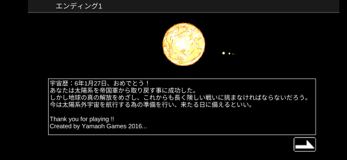
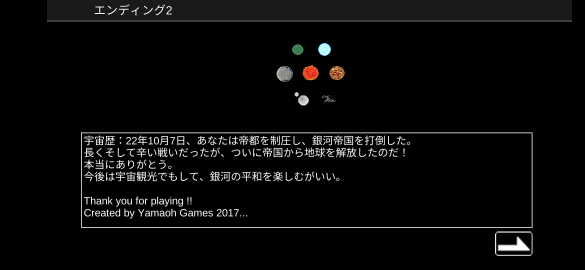

## 序盤攻略

太陽系～アウレリウス恒星系までの攻略を考察する。

### プロローグ

ゲームスタート時は試作宇宙戦艦が配備される。
プロローグの選択によって初期配備艦が追加される。

| 選択             | 初期配備艦               |
|------------------|--------------------------|
| 伝説の艦長       | 強襲揚陸艦               |
| エースパイロット | 特化SF-AS01              |
| 天使の修理屋     | 病院船                   |
| 目立ちたくない   | ダミー隕石               |
| 何も望まない     | 僚艦に試作宇宙戦艦配備可 |

また、目立ちたくない(ダミー隕石)を選択した場合は弾幕が次の中から一つ入手できる。

| 初期配備兵装       | 重量 | 弾数 | 消費バリア |      DPS |
|--------------------|-----:|-----:|-----------:|---------:|
| 10mm機銃座         |   26 | 3000 |          0 |    30.00 |
| 10mm連装機銃座     |   30 | 3000 |          0 |    45.00 |
| 12mm機銃座         |   32 | 3000 |          0 |    40.00 |
| 試作対空レーザー   |   20 |    0 |          1 |    13.33 |
| 14mm機銃座         |   32 | 3000 |          0 |    50.00 |
| 核融合爆雷         |   80 |  160 |          0 |     3.88 |
| 光子機雷           |   50 |   80 |          0 |     3.50 |
| 連装光子機雷       |  100 |   80 |          0 |     7.00 |
| 対空レーザーα     |   21 |    0 |          2 |    20.00 |
| 16mm機銃座         |   33 | 3000 |          0 |    60.00 |
| 制圧ルビーレーザー |  999 |    0 |          5 |   525.00 |
| メガバルカン       |   20 | 1000 |          0 |    10.00 |
| 18mm機銃座         |   36 | 2800 |          0 |    70.00 |
| 殲滅ルビーレーザー |  999 |    0 |         10 |   650.00 |
| 対空レーザーβ     |   24 |    0 |          3 |    26.67 |
| 超核融合爆雷       |   85 |  120 |          0 |     6.30 |
| 光子レーザー       |  999 |    0 |          6 |   360.00 |
| 20mm機銃座         |   40 | 2800 |          0 |    80.00 |
| 対空レーザーγ     |   26 |    0 |          4 |    33.33 |
| 帝国要塞機銃       |  999 | 4000 |          0 | 1,550.00 |
| 移民船団用防御機銃 |  999 | 4200 |          0 |   120.00 |
| メガバルカン2      |   21 | 1000 |          0 |    20.00 |
| 反応爆雷           |   90 |  100 |          0 |    13.60 |
| 対空レーザーδ     |   26 |    0 |          4 |    40.00 |
| 壊滅ルビーレーザー |  999 |    0 |         10 |   775.00 |
| 近接用拡散ビーム   |  100 |    0 |         15 |    46.40 |
| ビームバルカン     |   30 |    0 |          3 |    20.00 |
| 22mm機銃座         |   42 | 2750 |          0 |    90.00 |
| メガバルカン3      |   22 | 1000 |          0 |    25.00 |

伝説の艦長(強襲揚陸艦)を選択すればアステロイドベルトあたりまで有利に進めるものの、早期に設計図も入手できるため恩恵は薄い。
エースパイロット(特化SF-AS01)を選択し、火星で強襲揚陸艦を入手し特化SF-AS01を艦載機にするのが序盤最も効率が良い。

### 旗艦

旗艦より僚艦、艦載機を強くする方が簡単に攻略できる。
旗艦には艦載機数、積載量が多い機体が有利である。

| 旗艦おすすめ         | 艦載機数 | 積載量 | ドロップ                        |
|----------------------|---------:|-------:|---------------------------------|
| 強襲揚陸艦           |        3 |     92 | 火星                            |
| 宇宙空母             |        8 |    130 | 天王星                          |
| 重宇宙空母           |       12 |    220 | 帝国軍太陽系要塞                |
| 統合軍宇宙戦艦       |        7 |   1020 | 地球Lv30                        |
| 隕石要塞             |        9 |   1100 | フロンティア9遺跡               |
| 青版超級空母         |       13 |   1100 | ラグランジュ3、ディアスポラ回廊 |
| 超弩級戦艦メタトロン |        8 |   2200 | 連星ディオス、フォーマルハウト  |

### 僚艦、艦載機

僚艦は僚艦配備スキルがあるため戦闘機、砲艦を配備し、好みのドロップ上昇効果を持つ僚艦を配備するとよい。
僚艦、艦載機は弾切れやエネルギー切れを起こさないためDPS(`威力 * 発射数 / 装填時間`)が最も高いものを選べばよい。
武装Lvは0で序盤から入手できる艦を侵攻に合わせ以下に示す。

| 僚艦、艦載機おすすめ    | 重量 | 乗員数 | 初期配備コスト | 対火災力 |     DPS | ドロップ                         |
|-------------------------|-----:|-------:|---------------:|---------:|--------:|----------------------------------|
| 試作SF-AS00             |   20 |      1 |          1,400 |       20 |   17.00 | 月                               |
| 強襲揚陸艦              |  400 |    120 |          3,000 |       23 |   27.92 | 火星                             |
| 統合軍軽巡洋艦          |  350 |     65 |          1,700 |       18 |   31.92 | 地球Lv6                          |
| 宇宙空母                |  770 |    200 |         12,000 |       18 |   41.98 | 天王星                           |
| 特化SF-AS01             |   50 |      2 |          9,800 |       28 |   50.77 | 海王星                           |
| 重宇宙空母              | 1200 |    800 |         32,000 |       30 |   52.57 | 帝国軍太陽系要塞                 |
| 統合軍重巡洋艦          |  790 |    360 |         14,000 |       25 |   76.10 | 地球Lv12                         |
| 汎用SF-AS21             |   80 |      4 |         19,800 |       38 |  101.43 | ムーサ宇宙基地、フォーマルハウト |
| 重病院船                |  360 |    220 |         12,000 |       55 |  162.00 | ラグランジュ3                    |
| 統合軍宇宙戦艦          | 2200 |   1200 |        120,000 |       60 |  214.70 | 地球Lv30                         |
| 重輸送艦                |  330 |    240 |         12,000 |       55 |  240.00 | ラグランジュ3                    |
| 強襲SF-AS400            | 1380 |     12 |      7,000,000 |       70 |  460.00 | フォーマルハウト                 |
| ス級弩級戦艦            | 2500 |   9800 |      1,200,000 |       50 |  874.74 | ムーサ宇宙基地、ヴァルハラ宙域   |
| Gヴァルキリー級重巡洋艦 |  990 |   1260 |         24,000 |       35 | 1160.00 | スコーピオ                       |
| 青版超級空母            | 3400 |  18000 |      1,600,000 |       42 | 1739.50 | ラグランジュ3、ディアスポラ回廊  |

最終的に旗艦に超弩級戦艦メタトロン、艦載機に強襲SF-AS400、僚艦に青版超級空母を配備できればアウレリウス恒星系までの一般兵はクリア可能になる。
ただし、強襲SF-AS400を作るのはアウレリウス恒星系クリアより難しい。
艦載機としては[スコーピオ](44.スコーピオ.md)のエリア9ボスから取得できるGヴァルキリー級重巡洋艦が最強となる。
序盤の戦力ではスコーピオは通常攻略が難しいが、[スコーピオ再出撃バグ](バグ.md#スコーピオ再出撃バグ)を利用すれば比較的簡単に入手できる。

### 攻略方針

序盤は特に資金と人口が不足するため、僚艦が撃沈されないことが重要である。
旗艦や艦載機は撃沈してもなんのデメリットもないため弾除けや前衛に配置する。
艦載機がやられ僚艦に被害が及びそうであれば早期に撤退する。

序盤は武装Lvや戦艦Lvを上げることにほとんど意味がないため、資金は僚艦配備に回す。
僚艦をほぼ撃沈無しで進め、機体開発もほぼ行わなければ太陽系をゲーム内時間の5年から6年で攻略することができる。
旗艦も利用しないため、チップは四次元格納庫チップのみを上げる。

太陽系クリア後は帝国首都バビロンを攻略しエンディング2に到達を目指す。
選べる兵種や機体が増えるため、攻略方法はおおむね3パターンに分かれる。
旗艦を無視して僚艦、艦載機を強くするのであればゲーム内時間の25年程度で攻略することができる。
単艦にしエースを上げていくのであればゲーム内時間の35年程度で攻略することができる。
アウレリアス恒星系を無視して撃破数を稼ぎ攻撃指令を解放してから攻略すると、ゲーム内時間の50年程度で攻略することができる。

