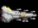

## 戦艦データ

<ul class="commands">
	<li class="buttons"><a href="javascript:kikan_toggle()"   class="box">旗艦</a></li>
	<li class="buttons"><a href="javascript:ryoukan_toggle()" class="box">僚艦・艦載機</a></li>
	<li class="buttons"><a href="javascript:other_toggle()"   class="box">その他</a></li>
	<li class="buttons"><a href="javascript:drop_toggle()"    class="box">ドロップ</a></li>
	<li><input type="text" oninput="javascript:table_filter(this.value)" data-auto-param="q"></li>
</ul>

{: sticky-column="3"}
|  No | イメージ                                                                           | 船名                               | 艦種     | 主砲                           | 副砲                   | 弾幕                   | 機関            |      装甲 | バリア | バリア回復 | 回避率 | 対火災力 | 対電磁力 | 速度 | 艦載機数 | 撤退時間 | 積載量 |       全長 |      重量 |     乗員数 |    燃料 | 初期配備コスト | 配備コスト減少開始Lv | 説明文                                                   | 設計図ドロップ宙域 |
|----:|------------------------------------------------------------------------------------|------------------------------------|----------|--------------------------------|------------------------|------------------------|-----------------|----------:|-------:|-----------:|-------:|---------:|---------:|-----:|---------:|---------:|-------:|-----------:|----------:|-----------:|--------:|---------------:|---------------------:|----------------------------------------------------------|--------------------|
|   0 |                        | 試作宇宙戦艦                       | 戦艦     | 壊れかけのカノン砲             | Mk1ロケット            | 壊れかけの機銃座       | 軽燃料炉C       |       100 |      4 |          1 |     15 |       10 |       10 | 1.00 |        1 |     2.50 |     50 |         75 |       320 |         20 |   3,000 |            100 |                    1 | 大破壊後、地球で初めて試作された戦艦                     |                    |
|   1 |                       | 宇宙作業艇D51                      | 小型艇   | 20型携帯レーザー砲             | なし                   | なし                   | 軽燃料炉A       |         5 |      1 |          1 |     30 |       25 |       25 | 1.00 |        0 |     1.00 |      6 |         10 |        10 |          2 |     200 |            100 |                    1 | 俗称スペースダルマ                                       |                    |
|   2 |                    | 試作宇宙戦闘機X0                   | 戦闘機   | 20型携帯レーザー砲             | Mk1ロケット            | なし                   | 軽燃料炉A       |        10 |      1 |          1 |     40 |       18 |       13 | 2.00 |        0 |     1.00 |      5 |         10 |         8 |          2 |     400 |            200 |                    2 | 宇宙用に試作された戦闘機                                 |                    |
|   3 |                              | 軽空母                             | 空母     | なし                           | なし                   | 8mm機銃座              | 軽燃料炉E       |        80 |     11 |          1 |      5 |       13 |       15 | 1.00 |        4 |     3.00 |     46 |         80 |       340 |         50 |   3,000 |          1,200 |                    1 | 敵の技術を奪取して開発した宇宙空母                       |                    |
|   4 |                         | 試作SF-AS00                        | SF       | SF用試作ビーム砲               | ビームソード           | 試作バルカン           | 軽燃料炉D       |        55 |      7 |          1 |     50 |       20 |       20 | 4.00 |        0 |     1.50 |     35 |         18 |        20 |          1 |   1,000 |          1,400 |                    1 | プロトタイプSF、全てはここから始まった                   |                    |
|   5 |                            | 軽巡洋艦                           | 巡洋艦   | 試作ビーム砲                   | Mk2ロケット            | 8mm機銃座              | 軽燃料炉E       |       120 |     11 |          1 |     18 |       13 |       15 | 1.00 |        1 |     3.00 |     60 |         90 |       360 |         60 |   1,400 |          1,800 |                    1 | 敵の技術を利用して作られた巡洋艦                         |                    |
|   6 |                         | 量産SF-AS11                        | SF       | 21型携帯レーザー砲             | アイアンロッド         | 試作バルカン           | 軽燃料炉C       |        27 |      4 |          1 |     35 |       20 |       20 | 3.00 |        0 |     1.80 |     15 |         18 |        15 |          1 |   1,000 |            900 |                    1 | 地球軍初の量産型SFだが基本的な能力は低い                 |                    |
|   7 |                        | 宇宙戦闘機X1                       | 戦闘機   | 21型携帯レーザー砲             | Mk1ロケット            | 試作バルカン           | 軽燃料炉B       |        18 |      2 |          1 |     43 |       20 |       15 | 2.00 |        0 |     1.00 |      6 |         12 |         9 |          2 |     500 |            500 |                    1 | 正式採用された戦闘機だが性能は今ひとつ                   |                    |
|   8 |                        | 宇宙戦闘機X2                       | 戦闘機   | 21型携帯レーザー砲             | Mk1ロケット            | 試作バルカン           | 軽燃料炉B       |        22 |      2 |          1 |     45 |       30 |       25 | 2.00 |        0 |     1.20 |      9 |         12 |        10 |          2 |     550 |            700 |                    1 | X1のマイナーチェンジ版                                   |                    |
|   9 |                          | 強襲揚陸艦                         | 巡洋艦   | 0式ビーム砲                    | Mk2連装ロケット        | 10mm機銃座             | 軽燃料炉G       |       180 |     22 |          1 |     22 |       23 |       25 | 1.00 |        3 |     3.20 |     92 |        100 |       400 |        120 |   1,600 |          3,000 |                    1 | SFの運用を考慮されて開発された強襲艦                     |                    |
|  10 |                         | 支援SF-AS12                        | SF       | SF用ツインカノン               | アイアンロッド         | 試作バルカン           | 軽燃料炉D       |        31 |      7 |          1 |     30 |       20 |       20 | 2.00 |        0 |     1.80 |     22 |         19 |        18 |          3 |   1,000 |          1,500 |                    2 | 連装カノン砲を装備した支援用SF                           |                    |
|  11 |                          | ミサイル艦                         | 砲艦     | 対艦ミサイルX1                 | 誘導ミサイル           | 10mm機銃座             | 軽燃料炉G       |       190 |     22 |          1 |     10 |        1 |       22 | 1.00 |        1 |     3.50 |    105 |        125 |       390 |        100 |   1,200 |          8,000 |                    2 | ミサイル攻撃に特化した砲艦                               |                    |
|  12 |                              | 輸送艦                             | 輸送船   | なし                           | なし                   | 8mm機銃座              | 軽燃料炉F       |       100 |     16 |          1 |      5 |       15 |       15 | 1.00 |        0 |     3.00 |     30 |         70 |       330 |         60 |   1,500 |          2,000 |                    2 | 定期的に補給物資を落とす                                 |                    |
|  13 |                              | 工作艦                             | 工作船   | なし                           | なし                   | 8mm機銃座              | 軽燃料炉F       |       100 |     16 |          1 |      5 |       15 |       15 | 1.00 |        0 |     3.00 |     30 |         70 |       360 |         60 |   1,500 |          2,000 |                    2 | 電磁障害を修理する                                       |                    |
|  14 |                              | 病院船                             | 病院船   | なし                           | なし                   | 8mm機銃座              | 軽燃料炉F       |       100 |     16 |          1 |      5 |       15 |       15 | 1.00 |        0 |     3.00 |     30 |         70 |       360 |         60 |   1,500 |          2,000 |                    2 | 定期的に回復ドローンを落とす                             |                    |
|  15 |                              | 消防艦                             | 消防船   | なし                           | なし                   | 8mm機銃座              | 軽燃料炉F       |       100 |     16 |          1 |      5 |       15 |       15 | 1.00 |        0 |     3.00 |     30 |         70 |       330 |         60 |   1,500 |          2,000 |                    2 | 火災を消火する                                           |                    |
|  16 |                            | 宇宙空母                           | 空母     | レールガン2                    | Mk3連装ロケット        | 12mm機銃座             | 軽燃料炉I       |       320 |     37 |          1 |      5 |       18 |       25 | 1.00 |        8 |     3.50 |    130 |        340 |       770 |        200 |   6,000 |         12,000 |                    2 | 標準的な大きさの空母                                     |                    |
|  17 |                        | 重シールド艦                       | 防御艦   | なし                           | なし                   | 核融合爆雷             | 軽燃料炉I       |       650 |     37 |          1 |     20 |       40 |       40 | 1.00 |        0 |     4.00 |    100 |        220 |       440 |        120 |   2,400 |         10,000 |                    2 | 厚い装甲で味方艦を守る                                   |                    |
|  18 |                            | 重巡洋艦                           | 巡洋艦   | 30口径レーザー砲               | Mk4連装ロケット        | 対空レーザーα         | 軽燃料炉J       |       380 |     45 |          1 |     18 |       20 |       20 | 1.00 |        4 |     4.00 |    160 |        590 |       800 |        350 |   6,400 |         14,400 |                    2 | 船体を大型化し重武装が可能となった巡洋艦                 |                    |
|  19 |                         | 特化SF-AS01                        | SF       | メガビームライフル             | メガビームソード       | メガバルカン           | 軽燃料炉I       |       175 |     37 |          1 |     55 |       28 |       40 | 4.00 |        0 |     1.20 |     60 |         18 |        50 |          2 |   1,800 |          9,800 |                    2 | エース用SF、別名白い彗星                                 |                    |
|  20 |                            | 宇宙戦艦                           | 戦艦     | 5式ビーム砲                    | 誘導ミサイルV          | 18mm機銃座             | 原子炉A         |       500 |     70 |          2 |     10 |       20 |       20 | 1.00 |        4 |     5.00 |    200 |        650 |       990 |        630 |   7,400 |         25,000 |                    4 | 統合軍の正式戦艦                                         |                    |
|  21 |                          | 重宇宙空母                         | 空母     | レールガン3                    | Mk3連装ロケット        | 14mm機銃座             | 原子炉B         |       660 |     80 |          2 |      5 |       30 |       30 | 1.00 |       12 |     5.50 |    220 |      1,040 |     1,200 |        800 |   6,000 |         32,000 |                    2 | 内部に工廠も備える重宇宙空母                             |                    |
|  22 |                    | 超兵器搭載実験機                   | 実験艦   | なし                           | なし                   | なし                   | 原子炉A         |        10 |     70 |          2 |      1 |        1 |        1 | 1.00 |        0 |     5.20 |  1,000 |        400 |       999 |        425 |   3,000 |         44,000 |                    1 | 超兵器実験用の機体                                       |                    |
|  23 |                          | 銀河移民船                         | 移民船   | なし                           | なし                   | 移民船団用防御機銃     | 試作対消滅機関J |     9,999 |    800 |         55 |      1 |        1 |        1 | 1.00 |       18 |    30.00 |  3,000 |     10,000 |    99,999 |    999,999 |  99,999 |    999,999,999 |                   99 | 恒星間移民をする為の巨大船                               |                    |
|  24 |                            | 改造漁船                           | 小型艇   | 壊れかけのカノン砲             | なし                   | 壊れかけの機銃座       | 軽燃料炉A       |        35 |      1 |          1 |     20 |       10 |       13 | 1.00 |        0 |     1.50 |     30 |         30 |        20 |          3 |     250 |            400 |                    1 | 宇宙漁船を戦闘用に改造した船                             |                    |
|  25 |                        | パトロール艇                       | 小型艇   | 22型携帯レーザー砲             | なし                   | 壊れかけの機銃座       | 軽燃料炉A       |        40 |      1 |          1 |     25 |       15 |       13 | 2.00 |        0 |     1.20 |     35 |         22 |        22 |          4 |     250 |            300 |                    1 | 地球軍の地球近郊パトロール艇                             |                    |
|  26 |                          | ミサイル艇                         | 小型艇   | なし                           | 試作誘導ミサイル       | なし                   | 軽燃料炉B       |        50 |      2 |          1 |     30 |       16 |       13 | 2.00 |        0 |     1.00 |     38 |         40 |        26 |         10 |     350 |            800 |                    1 | ミサイル攻撃に特化した小型艇                             |                    |
|  27 |                          | 長距離砲艦                         | 砲艦     | 試作レールガン                 | なし                   | 8mm機銃座              | 軽燃料炉F       |       140 |     16 |          1 |     10 |       20 |        5 | 1.00 |        0 |     3.50 |    110 |        130 |       420 |        110 |   1,100 |          9,000 |                    2 | 長距離攻撃に特化した砲艦                                 |                    |
|  28 |                       | 対空迎撃機XX1                      | 戦闘機   | 24型携帯レーザー砲             | 誘導ミサイル           | メガバルカン           | 原子炉A         |       100 |     70 |          2 |     25 |       15 |       15 | 3.00 |        0 |     1.20 |     50 |         28 |        25 |          8 |     300 |         12,000 |                    2 | 戦艦防衛用に開発された大型戦闘機                         |                    |
|  29 |                          | ダミー隕石                         | ダミー   | 搭載不可                       | 搭載不可               | 搭載不可               | 軽燃料炉A       |         1 |      1 |          1 |      0 |        1 |        1 | 1.00 |        0 |     3.50 |      2 |         60 |         1 |          1 |  99,999 |            100 |                    1 | 偽装用のダミーバルーン隕石                               |                    |
|  30 |                          | ダミー戦艦                         | ダミー   | 搭載不可                       | 搭載不可               | 搭載不可               | 軽燃料炉A       |         1 |      1 |          1 |      0 |        1 |        1 | 1.00 |        0 |     3.50 |      2 |        650 |         1 |          1 |  99,999 |            200 |                    1 | 偽装用のダミーバルーン宇宙戦艦                           |                    |
|  31 |                      | 試作宇宙戦艦改                     | 戦艦     | 16cmカノン砲                   | Mk1ロケット            | 8mm機銃座              | 軽燃料炉D       |       110 |      7 |          1 |     16 |       12 |       12 | 1.00 |        1 |     2.60 |     55 |         80 |       340 |         30 |   1,600 |            550 |                    1 | 試作宇宙戦艦に改良を施した戦艦                           |                    |
|  32 |                            | 隕石要塞                           | 要塞     | ベータ要塞砲                   | Mk3連装ロケット        | 連装光子機雷           | 試作対消滅機関A |     1,200 |    350 |         10 |      0 |        5 |        5 | 1.00 |        9 |    15.50 |  1,100 |      3,000 |     5,200 |     12,000 |  25,000 |        300,000 |                   10 | 隕石を利用して作られた宇宙要塞                           |                    |
|  33 |                        | テ級弩級戦艦                       | 弩級戦艦 | タイタニア                     | Mk5連装ロケット        | 連装光子機雷           | 試作対消滅機関B |     1,100 |    400 |         15 |      5 |       30 |       30 | 1.00 |        2 |    10.00 |  1,200 |      1,500 |     2,200 |      8,800 |   9,900 |      1,000,000 |                   10 | ティターニア級弩級戦艦                                   |                    |
|  34 |                              | 氷塊船                             | 移民船   | 大質量氷塊弾                   | なし                   | なし                   | 試作対消滅機関C |     1,500 |    450 |         20 |      0 |       99 |       99 | 1.00 |        0 |    20.00 |      3 |      1,700 |     9,999 |     22,000 |  99,999 |        200,000 |                   10 | 氷塊をくり抜いて動力をつけた船                           |                    |
|  35 |                            | メタルSF                           | SF       | なし                           | メタルソード           | なし                   | 軽燃料炉J       |         1 |     45 |          1 |     60 |       99 |       10 | 5.00 |        0 |     1.50 |     20 |         10 |     9,999 |          1 |   1,000 |        100,000 |                    3 | 謎の技術で作られたSF                                     |                    |
|  36 |                         | 汎用SF-AS21                        | SF       | SF用対艦バズーカ               | ギガビームソード       | ビームバルカン         | 原子炉A         |       350 |     70 |          2 |     55 |       38 |       40 | 4.00 |        0 |     1.40 |    100 |         24 |        80 |          4 |   2,200 |         19,800 |                    4 | 第二世代の汎用SF                                         |                    |
|  37 |                         | 支援SF-AS22                        | SF       | SF用レールガン                 | アイアンスピア         | 近接用拡散ビーム       | 原子炉B         |       275 |     80 |          2 |     55 |       38 |       48 | 2.00 |        0 |     1.40 |    110 |         23 |        90 |          6 |   2,000 |         17,800 |                    4 | 第二世代の支援SF                                         |                    |
|  38 |                          | 高熱量砲艦                         | 砲艦     | なし                           | 高熱量弾               | なし                   | 原子炉C         |       150 |     90 |          2 |     10 |       50 |        5 | 1.00 |        0 |     3.50 |    140 |        100 |       430 |        120 |   1,500 |         20,000 |                    4 | 高熱量攻撃に特化した砲艦                                 |                    |
|  39 |                            | 電磁砲艦                           | 砲艦     | なし                           | 超電磁砲               | なし                   | 原子炉D         |       160 |    100 |          2 |     10 |        5 |       50 | 1.00 |        0 |     3.50 |    140 |        102 |       440 |        140 |   1,200 |         20,000 |                    4 | 電磁攻撃に特化した砲艦                                   |                    |
|  40 |                        | ス級弩級戦艦                       | 弩級戦艦 | 8式ビーム砲                    | 艦載ビームソード       | 重撃エメラルドレーザー | 試作対消滅機関D |     1,250 |    500 |         25 |     20 |       50 |       50 | 3.00 |        2 |     8.00 |  1,300 |      1,550 |     2,500 |      9,800 |  10,000 |      1,200,000 |                   10 | スプリガン級弩級戦艦                                     |                    |
|  41 |                      | EX重シールド艦                     | 防御艦   | ビームシールド                 | なし                   | 反応爆雷               | 試作対消滅機関E |     2,000 |    550 |         30 |      5 |       60 |       60 | 1.00 |        0 |    15.00 |    230 |      1,120 |     2,000 |      1,800 |   2,900 |        600,000 |                   10 | 複数のシールド艦を連結した複合船                         |                    |
|  42 |                   | 高機動型作業艇D77                  | 小型艇   | 20cmカノン砲                   | アイアンロッド         | なし                   | 軽燃料炉B       |         3 |      2 |          1 |     35 |       28 |       20 | 4.00 |        0 |     0.50 |     10 |         11 |        12 |          2 |     920 |            120 |                    1 | SF開発用に作られた高機動試験作業艇                       |                    |
|  43 |                      | 統合軍軽巡洋艦                     | 巡洋艦   | 20cm連装カノン砲               | Mk3ロケット            | 10mm機銃座             | 軽燃料炉F       |       100 |     16 |          1 |     22 |       18 |       13 | 2.00 |        2 |     2.50 |     65 |         88 |       350 |         65 |   1,500 |          1,700 |                    1 | 統合軍初の正式宇宙艦艇                                   |                    |
|  44 |                      | 統合軍重巡洋艦                     | 巡洋艦   | 26cm4連装カノン砲              | 誘導ミサイル           | 16mm機銃座             | 原子炉A         |       300 |     70 |          2 |     20 |       25 |       18 | 1.00 |        5 |     3.50 |    170 |        375 |       790 |        360 |   6,600 |         14,000 |                    1 | 銀河帝国の大型艦に負けない性能をもつ主力艦               |                    |
|  45 |                      | 統合軍宇宙空母                     | 空母     | レールガン4                    | Mk4連装ロケット        | 14mm機銃座             | 原子炉B         |       280 |     80 |          2 |     15 |       32 |       23 | 1.00 |        9 |     3.20 |    140 |        430 |       760 |        300 |   7,000 |         11,500 |                    1 | 統合軍初の地球製正式宇宙空母                             |                    |
|  46 |                        | ペ級弩級戦艦                       | 弩級戦艦 | レールガン6                    | 光子ミサイル           | 22mm機銃座             | 試作対消滅機関D |     1,350 |    500 |         25 |     12 |       52 |       52 | 1.00 |        3 |     9.00 |  1,400 |      1,700 |     2,800 |     12,000 |  10,000 |      1,400,000 |                   10 | ペンドラゴン級弩級戦艦                                   |                    |
|  47 |                      | 試作重SA-AS100                     | SA       | SF用携帯ガトリング             | 試作多弾頭ミサイルS00  | ビームバルカン         | 原子炉E         |       575 |    110 |          2 |     20 |       48 |       42 | 2.00 |        0 |     5.00 |    220 |        120 |       380 |         12 |   2,800 |        500,000 |                    4 | 敵から鹵獲したSAを再利用した機体                         |                    |
|  48 |                    | 統合軍高速強襲艦                   | 巡洋艦   | 28cm5連装カノン砲              | 誘導ミサイルV2         | 20mm機銃座             | 原子炉B         |       200 |     80 |          2 |     42 |       30 |       30 | 3.00 |        3 |     3.20 |    195 |        400 |       820 |        370 |   7,000 |         17,000 |                    1 | 要塞攻略の要として極秘に開発された高速強襲艦             |                    |
|  49 |                        | エ級弩級戦艦                       | 弩級戦艦 | 試作ソーラ砲                   | 連装追尾レーザー       | 対空レーザーδ         | 試作対消滅機関E |     1,450 |    550 |         30 |     14 |       60 |       60 | 2.00 |        5 |    10.00 |  1,500 |      2,200 |     3,200 |     15,000 |  10,000 |      1,700,000 |                   10 | エウレカ級弩級戦艦                                       |                    |
|  50 |                        | 青版超級空母                       | 空母     | 重力子爆弾                     | 連装反物質ロケット     | 壊滅ルビーレーザー     | 試作対消滅機関F |     1,000 |    600 |         35 |      3 |       42 |       42 | 1.00 |       13 |    10.00 |  1,100 |      1,800 |     3,400 |     18,000 |  10,000 |      1,600,000 |                   10 | ブルーノート級超級空母                                   |                    |
|  51 |                | 超弩級戦艦メタトロン               | 弩級戦艦 | 光子砲                         | Hi光子ミサイル         | 光子レーザー           | 試作対消滅機関G |     1,800 |    650 |         40 |     30 |       75 |       75 | 2.00 |        8 |    12.00 |  2,200 |      2,500 |     3,800 |     25,000 |  20,000 |      2,800,000 |                   15 | 謎の技術で開発された超弩級戦艦                           |                    |
|  52 |                          | 重SA-AS200                         | SA       | テラビームライフル             | ハイパービームソード   | メガバルカン4          | 原子炉I         |       775 |    170 |          2 |     40 |       78 |       72 | 2.00 |        0 |     5.50 |    280 |        140 |       580 |         22 |   4,200 |      1,200,000 |                    5 | 敵から鹵獲したSAを研究し開発した機体                     |                    |
|  53 |                            | 重病院船                           | 病院船   | なし                           | 単装追尾レーザー       | 24mm機銃座             | 試作対消滅機関A |       500 |    350 |         10 |     10 |       55 |       55 | 1.00 |        1 |     3.50 |    130 |        120 |       360 |        220 |   2,500 |         12,000 |                    3 | 重武装化した病院船                                       |                    |
|  54 |                            | 重輸送艦                           | 輸送船   | なし                           | Mk8連装ロケット        | 24mm機銃座             | 試作対消滅機関B |       500 |    400 |         15 |     10 |       55 |       55 | 1.00 |        1 |     3.50 |    130 |        123 |       330 |        240 |   9,000 |         12,000 |                    3 | 重武装化した輸送艦                                       |                    |
|  55 |                        | 重主砲実験艦                       | 実験艦   | リフレクターレーザー2          | 搭載不可               | 搭載不可               | 試作対消滅機関C |        20 |    450 |         20 |      1 |        1 |        1 | 1.00 |        0 |     5.60 |  3,600 |      1,200 |     3,999 |      1,425 |   5,000 |      2,000,000 |                    3 | 解析出来ない主砲の実験艦                                 |                    |
|  56 |                      | 豪華宇宙観光船                     | 観光船   | 搭載不可                       | 花火1                  | 搭載不可               | 試作対消滅機関D |       100 |    500 |         25 |      1 |        1 |        1 | 0.20 |        0 |    13.00 |  3,000 |      3,200 |     5,500 |     10,000 |   5,300 |      1,000,000 |                    1 | 宇宙を遊覧する為の豪華客船                               |                    |
|  57 |                        | 赤版超級空母                       | 空母     | 重ガトリング砲                 | 多弾頭ミサイルS01      | 重撃エメラルドレーザー | 試作対消滅機関H |     1,100 |    700 |         45 |      3 |       46 |       46 | 1.00 |       12 |    10.00 |  1,150 |      1,900 |     3,600 |     17,000 |  10,000 |      1,700,000 |                   10 | レッドノート級超級空母                                   |                    |
|  58 |                          | 重SA-AS111                         | SA       | SF用携帯ガトリング2            | 有線ビームソード       | メガバルカン3          | 原子炉F         |       650 |    125 |          2 |     20 |       58 |       45 | 2.00 |        0 |     6.00 |    280 |        130 |       450 |         20 |   2,800 |        600,000 |                    4 | SA100をベースにした強化機体                              |                    |
|  59 |                            | 空中戦艦                           | 戦艦     | 戦艦有線ビーム砲               | 連装追尾レーザー＋     | 対空レーザーγ         | 試作対消滅機関I |     1,200 |    750 |         50 |     30 |       45 |       35 | 2.60 |        6 |     6.00 |  1,600 |        900 |     2,300 |     12,000 |  20,000 |      2,500,000 |                    8 | 大気圏内での戦闘に特化した戦艦らしい                     |                    |
|  60 |                            | 帝式要塞                           | 要塞     | ネビュラ級要塞砲               | 搭載不可               | 帝国要塞機銃           | 対消滅機関A     |     3,200 |  1,050 |         60 |      0 |       35 |       35 | 0.10 |       13 |    18.00 |  3,300 |     20,000 |    18,000 |    500,000 |  25,000 |      6,000,000 |                   10 | 帝国軍の前線に配置される要塞                             |                    |
|  61 |                      | テ級弩級戦艦改                     | 弩級戦艦 | 重ガトリング砲                 | 反物質拡散砲           | 22mm機銃座             | 試作対消滅機関E |     1,100 |    550 |         30 |      5 |       30 |       30 | 1.00 |        3 |    10.00 |  1,400 |      1,500 |     2,200 |      9,800 |   9,900 |      1,200,000 |                   10 | 投降したティターニア級弩級戦艦改                         |                    |
|  62 |                      | ス級弩級戦艦改                     | 弩級戦艦 | 0式重ビーム砲                  | ハイパービームソード   | 重撃エメラルドレーザー | 試作対消滅機関F |     1,250 |    600 |         35 |     20 |       50 |       50 | 3.00 |        3 |     8.00 |  1,500 |      1,550 |     2,500 |     12,800 |  10,000 |      1,400,000 |                   10 | 投降したスプリガン級弩級戦艦改                           |                    |
|  63 |                      | ペ級弩級戦艦改                     | 弩級戦艦 | 46cm7連装カノン砲              | Hi光子ミサイル         | 浄化パールレーザー     | 試作対消滅機関G |     1,350 |    650 |         40 |     12 |       52 |       52 | 1.00 |        4 |     9.00 |  1,600 |      1,700 |     2,800 |     14,000 |  10,000 |      1,600,000 |                   10 | 投降したペンドラゴン級弩級戦艦改                         |                    |
|  64 |                      | エ級弩級戦艦改                     | 弩級戦艦 | 拡散重ビーム砲                 | 連装追尾レーザー＋     | 壊滅ルビーレーザー     | 試作対消滅機関H |     1,450 |    700 |         45 |     14 |       60 |       60 | 2.00 |        6 |    10.00 |  1,700 |      2,200 |     3,200 |     17,000 |  10,000 |      1,900,000 |                   10 | 投降したエウレカ級弩級戦艦改                             |                    |
|  65 |                        | 試作SF-AS300                       | SF       | SF用携帯ガトリング3            | 301式発掘超鋼剣        | メガバルカン5          | 反物質炉A       |     1,250 |    520 |          5 |     60 |       68 |       75 | 5.00 |        0 |     5.00 |    580 |        150 |       950 |     44,444 |   1,700 |      6,000,000 |                    4 | 未知の技術を利用して開発した試作生体SF                   |                    |
|  66 |                            | 発掘戦艦                           | 弩級戦艦 | 時空転移砲                     | 分裂追尾レーザー       | 反物質爆雷             | 反物質炉F       |     3,600 |    620 |          5 |      2 |       95 |       95 | 2.10 |       10 |    12.00 |  3,800 |      3,200 |    14,300 |    100,000 |  80,000 |     10,000,000 |                    8 | 遥か太古、宙空を埋め尽くしたとされる戦艦                 |                    |
|  67 |                    | コロニーレーザー                   | 特殊艦   | 999式発掘光線砲                | 搭載不可               | 搭載不可               | 反物質炉C       |     3,000 |    560 |          5 |      1 |        1 |        1 | 0.01 |        0 |    15.00 |  5,000 |    350,000 |    29,000 | 20,000,000 |  90,000 |     20,000,000 |                    8 | 遺跡を利用して開発した特殊兵器                           |                    |
|  68 |                         | 発掘戦闘機Z                        | 戦闘機   | 搭載不可                       | 搭載不可               | メガバルカン6          | 軽燃料炉I       |       120 |     37 |          1 |     52 |       18 |        1 | 3.60 |        0 |     0.50 |     50 |          9 |        80 |          2 |   1,000 |         10,000 |                    1 | 太古の戦闘機                                             |                    |
|  69 |                       | 発掘戦闘機F18                      | 戦闘機   | 搭載不可                       | 反物質ロケット         | メガバルカン6          | 軽燃料炉J       |       140 |     45 |          1 |     62 |       18 |        1 | 4.30 |        0 |     0.50 |     85 |         17 |       120 |          2 |   1,300 |         12,000 |                    1 | 太古の高速戦闘機                                         |                    |
|  70 |                        | 発掘宇宙空母                       | 空母     | 搭載不可                       | Zアタック              | 26mm機銃座             | 原子炉I         |     1,500 |    170 |          2 |      5 |       50 |        1 | 1.20 |       12 |     8.00 |  1,300 |        520 |     2,800 |      6,800 |   4,000 |      1,300,000 |                   10 | 太古の空母                                               |                    |
|  71 |                        | 発掘宇宙戦艦                       | 戦艦     | ネビュラ級要塞砲               | 誘導ミサイルV8         | 26mm機銃座             | 原子炉J         |     1,750 |    190 |          2 |      5 |       50 |        1 | 1.80 |        4 |    10.00 |  1,350 |        540 |     3,200 |      5,800 |   4,500 |      1,500,000 |                   10 | 太古の戦艦                                               |                    |
|  72 |                      | 統合軍大型砲艦                     | 砲艦     | 光子砲                         | 連装追尾レーザー＋     | 搭載不可               | 試作対消滅機関J |       480 |    800 |         55 |      1 |       60 |        1 | 1.40 |        0 |     6.00 |  1,000 |        500 |     1,200 |      1,800 |   3,000 |        500,000 |                   10 | 独自の技術で開発された大型砲艦                           |                    |
|  73 |                      | 発掘宇宙大戦艦                     | 戦艦     | 80cm2*4連装カノン砲            | Mk10連装ロケット       | 26mm機銃座             | 核融合炉A       |     2,200 |    220 |          3 |      5 |       60 |        1 | 2.80 |        2 |    10.00 |  1,700 |        526 |     3,600 |      7,800 |   5,500 |      1,700,000 |                   10 | 太古の大戦艦                                             |                    |
|  74 |                      | 発掘宇宙大空母                     | 空母     | 搭載不可                       | F18アタック            | 26mm機銃座             | 核融合炉B       |     2,000 |    240 |          3 |      5 |       70 |        1 | 1.10 |       16 |    12.00 |  1,750 |        666 |     4,200 |      9,800 |   6,000 |      1,900,000 |                   10 | 太古の大空母                                             |                    |
|  75 |                        | 強襲SF-AS400                       | SF       | SF用携帯ガトリング3            | 702式発掘超鋼剣        | メガバルカン6          | 反物質炉B       |     1,380 |    540 |          5 |     66 |       70 |       80 | 5.00 |        0 |     1.00 |    880 |        350 |     1,380 |         12 |   3,700 |      7,000,000 |                   10 | 長距離侵攻可能な強襲SF                                   |                    |
|  76 |                    | 帝式惑星級戦闘体                   | 特殊艦   | 対艦ミサイルX7                 | 弩級艦載ビームソード   | 26mm多連装機銃座       | 反物質炉E       |     3,800 |    600 |          5 |      1 |       20 |       40 | 1.80 |       14 |    20.00 |  4,700 |     42,000 |    19,000 |  9,999,999 |  99,000 |    999,999,999 |                    1 | 帝国の力を結集して作られた巨大戦闘体                     |                    |
|  77 |                        | 発掘航空戦艦                       | 戦艦     | 80cm2*4連装カノン砲            | Zアタック              | 26mm多連装機銃座       | 核融合炉C       |     2,100 |    260 |          3 |      3 |       70 |       10 | 2.00 |       10 |    11.00 |  1,900 |        700 |     4,500 |     12,800 |   6,500 |      2,100,000 |                   10 | 太古の航空戦艦                                           |                    |
|  78 |                                | 地球                               | 惑星     | 搭載不可                       | 搭載不可               | 搭載不可               | 搭載不可        | 9,999,999 |      0 |          0 |      0 |       99 |       99 | 0.00 |        0 | 9,999.00 |  9,999 | 12,756,274 | 9,999,999 |          1 | 999,999 |     99,999,999 |                   10 | 太陽系第三惑星                                           |                    |
|  79 |                      | 特化SF-Eライト                     | SF       | 拡散メガライフル               | 901式発掘超鋼剣        | ビームバルカン2        | 反物質炉C       |     1,550 |    560 |          5 |     70 |       78 |       85 | 5.00 |        0 |     5.00 |  1,080 |        140 |     2,250 |          1 |   1,600 |      9,500,000 |                   12 | 地球防衛軍の極秘兵器「地球光」                           |                    |
|  80 |                      | 超時空戦闘母艦                     | 戦艦     | 光子砲                         | 分裂追尾レーザー       | 浄化パールレーザー     | 反物質炉B       |     5,200 |    540 |          5 |      1 |       60 |       70 | 1.80 |       16 |    20.00 |  5,200 |     32,768 |    32,000 | 17,200,000 |  99,000 |     80,000,000 |                    5 | コードネーム32の3乗、戦艦に分類される                    |                    |
|  81 |                        | 生体SF-AS301                       | SF       | 発掘光弾1                      | 702式発掘超鋼剣        | メガバルカン7          | 反物質炉B       |     1,650 |    540 |          5 |     63 |       73 |       79 | 5.00 |        0 |     6.00 |    950 |        152 |     1,050 |     44,444 |   1,700 |      8,000,000 |                    6 | 生体SFの制式版、操縦は困難を極める                       |                    |
|  82 |                | 人工惑星ディアスポラ               | 惑星     | 壊れかけのカノン砲             | Mk1ロケット            | 壊れかけの機銃座       | 軽燃料炉A       |     9,999 |      1 |          1 |      0 |       99 |       99 | 0.00 |       20 |   100.00 |  9,999 |  6,000,000 |   999,999 | 99,999,999 | 999,999 |    999,999,999 |                   10 | ディアスポラ回廊に建設された人工惑星                     |                    |
|  83 |                          | 試作潜宙艦                         | 潜宙艦   | 搭載不可                       | 搭載不可               | 反物質爆雷             | 反物質炉A       |       350 |    520 |          5 |     90 |       10 |       10 | 1.30 |        0 |     4.50 |    200 |        420 |     1,300 |        550 |   2,200 |         38,000 |                   10 | 別次元に潜航し、敵弾を回避する                           |                    |
|  84 |                      | 特化SF砲火小隊                     | SF       | 88式メガカノン砲               | 搭載不可               | 搭載不可               | 核融合炉H       |     1,100 |    360 |          3 |      1 |       20 |       10 | 0.20 |        0 |     9.00 |    750 |         98 |     1,500 |         30 |   2,500 |        250,000 |                   10 | メガカノン砲で支援する部隊                               |                    |
|  85 |                    | 発掘SF-Mシャドウ                   | SF       | SF用携帯ガトリング3            | 月光                   | メガバルカン7          | 縮退炉B         |     1,150 |  3,300 |        330 |     90 |       75 |       75 | 1.50 |        0 |     5.00 |    980 |        140 |     1,750 |         10 |   1,700 |      9,500,000 |                   12 | 月面に埋まっていた謎のSF                                 |                    |
|  86 |                          | 特化SF大隊                         | SF       | メガビームライフル一斉射       | 搭載不可               | 搭載不可               | 核融合炉I       |     3,200 |    380 |          3 |      1 |       99 |       99 | 2.20 |        0 |    10.00 |  2,750 |        540 |     5,200 |         60 |   8,500 |        600,000 |                   10 | 編隊を組んだ特化SF大隊                                   |                    |
|  87 |                      | 統合軍宇宙戦艦                     | 戦艦     | 30cm6連装カノン砲              | 誘導ミサイルV6         | 24mm機銃座             | 核融合炉A       |     1,080 |    220 |          3 |      1 |       60 |       70 | 1.20 |        7 |    12.00 |  1,020 |        833 |     2,200 |      1,200 |   4,500 |        120,000 |                   10 | 帝国領侵攻の主戦力として開発された統合軍宇宙戦艦         |                    |
|  88 |                  | 漂流艦マルドゥック                 | 戦艦     | 発掘拡散レーザー               | 連続追尾レーザー       | カリストレーザー       | 縮退炉D         |     3,380 |  3,900 |        390 |      1 |       78 |       75 | 1.60 |       10 |    10.00 |  3,620 |        848 |     8,900 |      2,300 |   6,500 |      8,200,000 |                   10 | 木星軌道を漂っていた謎の戦艦                             |                    |
|  89 |                         | Vファイター                        | 小型艇   | 25型携帯レーザー砲             | 搭載不可               | 搭載不可               | 軽燃料炉B       |       100 |      2 |          1 |     35 |       30 |       30 | 0.80 |        0 |     0.50 |     30 |         13 |        30 |          4 |     920 |            320 |                    1 | 様々なV戦隊のコントロール艇                              |                    |
|  90 |                           | Vシールド                          | 防御艦   | 対艦ミサイルX7                 | 搭載不可               | 搭載不可               | 試作対消滅機関E |     4,000 |    550 |         30 |      1 |       60 |       60 | 0.50 |        0 |    10.00 |    900 |      1,800 |     4,000 |      1,800 |   4,900 |        900,000 |                   10 | V戦隊の盾となる艦                                        |                    |
|  91 |                  | 発掘面体-Mアタック                 | 小型艇   | ドリルパンチ                   | 搭載不可               | 搭載不可               | 縮退炉C         |     1,200 |  3,600 |        360 |     90 |       95 |       95 | 3.20 |        0 |     5.00 |    180 |         24 |        50 |         10 |   1,700 |      9,500,000 |                   12 | 火星に埋まっていた謎の面体                               |                    |
|  92 |              | サターン級惑星収縮要塞             | 要塞     | ソドムの光                     | 超重力子ロケット       | 強化パールレーザー     | 縮退炉E         |     5,500 |  4,200 |        420 |      0 |       99 |       99 | 0.10 |       15 |    60.00 |  8,500 |  2,500,000 |   999,999 | 79,999,999 |  45,000 |     90,000,000 |                   20 | 土星コアを収縮させて移動基地とした要塞らしい             |                    |
|  93 |                               | Vガン                              | 砲艦     | SF用携帯ガトリング2            | なし                   | なし                   | 軽燃料炉E       |       125 |     11 |          1 |     10 |       20 |       20 | 1.30 |        0 |     2.00 |     55 |         18 |        60 |          3 |   1,000 |          1,600 |                    2 | Vファイターにガンポッドを装備した機体                    |                    |
|  94 |                           | Vパワード                          | 戦闘機   | SA用重キャノン                 | 多弾頭ミサイルS01      | なし                   | 核融合炉A       |       260 |    220 |          3 |     30 |        5 |        5 | 1.70 |        0 |     5.00 |    120 |         40 |       220 |          3 |   1,300 |          8,000 |                    3 | Vファイターにブースターを装備した機体                    |                    |
|  95 |                           | Vバトラー                          | 巡洋艦   | 2式重ビーム砲                  | 多弾頭ミサイルS02      | 26mm機銃座             | 反物質炉B       |     1,300 |    540 |          5 |      3 |       50 |       50 | 0.60 |        3 |     8.00 |    800 |      2,500 |     1,500 |        100 |   2,500 |         80,000 |                    5 | V戦隊の攻撃の中核となる巡洋艦                            |                    |
|  96 |                             | ビッグV                            | 特殊艦   | 銀河級ドリルミサイル           | サブドリルミサイル     | 近接用拡散ビーム4      | 縮退炉E         |     4,800 |  4,200 |        420 |      1 |       75 |       90 | 0.20 |        5 |    50.00 |  6,800 |     12,000 |    34,000 | 68,000,000 |   9,999 |    999,999,999 |                   10 | V戦隊が合体した超大型戦闘体                              |                    |
|  97 |                | 超重改修艦ハーシェル               | 病院船   | デブリアタック                 | 搭載不可               | 26mm多連装機銃座       | 縮退炉D         |     3,000 |  3,900 |        390 |      0 |       99 |       99 | 0.20 |       10 |    20.00 |  3,200 |      7,000 |    25,000 |  5,000,000 | 321,500 |    135,000,000 |                    5 | 多くの船を収容できる移動宇宙船ドック                     |                    |
|  98 |                    | アーマー級義体艦                   | 義体艦   | 重ガトリング砲                 | 搭載不可               | 搭載不可               | 核融合炉B       |     1,250 |    240 |          3 |     30 |       60 |       90 | 0.70 |        0 |     2.00 |    250 |         28 |     1,500 |          1 |   1,200 |        160,000 |                    8 | 義体化した装甲兵                                         |                    |
|  99 |                | フルアーマー級義体艦               | 義体艦   | 拡散重ビーム砲                 | 搭載不可               | 搭載不可               | 核融合炉C       |     2,250 |    260 |          3 |     30 |       70 |       95 | 0.60 |        0 |     2.00 |    350 |         30 |     2,000 |          1 |   1,400 |        320,000 |                    8 | 義体化した上級装甲兵                                     |                    |
| 100 |                  | ウイザード級義体艦                 | 義体艦   | Hi光子砲                       | 搭載不可               | 搭載不可               | 核融合炉D       |     1,050 |    280 |          3 |     60 |       80 |       95 | 0.90 |        0 |     1.00 |    550 |         27 |     2,200 |          1 |   1,100 |        640,000 |                   10 | 義体化した魔術師                                         |                    |
| 101 |              | レッドドラゴン級義体艦             | 義体艦   | 搭載不可                       | ファイアブレス         | 搭載不可               | 縮退炉I         |     6,800 |  5,400 |        540 |      1 |      100 |      100 | 0.20 |        0 |    30.00 |  8,800 |      4,500 |    19,000 | 72,000,000 |   9,999 |    888,888,888 |                   10 | 一つの都市が素体となった竜型の義体                       |                    |
| 102 |                      | キング級義体艦                     | 義体艦   | 搭載不可                       | キングオブキングス     | 搭載不可               | 縮退炉J         |     5,500 |  6,000 |        600 |     90 |      100 |      100 | 2.30 |        0 |     2.00 |  1,550 |         27 |    16,000 |          1 |   1,800 |    999,999,999 |                   10 | 義体となった異世界の覇王                                 |                    |
| 103 |                     | WEX重シールド艦                    | 防御艦   | 搭載不可                       | 重ビームサブシールド   | 反物質爆雷             | 縮退炉A         |     5,000 |  3,000 |        300 |      1 |       80 |       80 | 0.50 |        0 |    11.00 |  1,200 |      1,900 |     4,000 |      2,200 |   4,900 |      1,000,000 |                    5 | 艦隊の盾となる為の陣形を組んだシールド艦                 |                    |
| 104 |                               | SDL01                              | 観光船   | 搭載不可                       | 搭載不可               | 28mm速射機銃座         | 核融合炉E       |       150 |    300 |          3 |      1 |       10 |       10 | 0.20 |        1 |    16.00 |  3,300 |      5,000 |     5,500 |     40,000 |   5,300 |     30,000,000 |                    5 | スペースデスティニーランドで夢の世界を！                 |                    |
| 105 |                       | 強襲SF-AS400R                      | SF       | SF用携帯ガトリング4            | トリプルビームクナイ   | メガバルカン8          | 核融合炉C       |     1,200 |    260 |          3 |     75 |       70 |       80 | 4.10 |        0 |     1.00 |  1,350 |         60 |     1,580 |          8 |     600 |      7,500,000 |                    6 | 長距離侵攻用のタンクを捨て、武装を強化したAS400          |                    |
| 106 |                      | 特殊SF-Gナイト                     | SF       | Hi光子砲                       | ゴールデンスピア       | 搭載不可               | 縮退炉I         |     3,350 |  5,400 |        540 |     92 |       95 |       95 | 0.30 |        0 |     5.00 |  1,450 |         70 |     7,750 |         13 |   1,700 |     49,500,000 |                   13 | 金色に光る謎の機体                                       |                    |
| 107 |                        | 超級軽巡洋艦                       | 巡洋艦   | 連装レールガン1                | Mk9連装ロケット        | 24mm機銃座             | 核融合炉F       |       380 |    320 |          3 |     40 |       25 |       25 | 1.70 |        0 |     2.00 |    220 |        120 |       420 |         90 |   2,300 |          8,200 |                    3 | 敵の新型巡洋艦技術を利用して作られた巡洋艦               |                    |
| 108 |                        | 超重SAフレイ                       | SA       | 拡散メガライフル2              | 試作防御フィールド     | メガバルカン8          | 縮退炉B         |     3,800 |  3,300 |        330 |      1 |       70 |       70 | 0.80 |        0 |     8.00 |  1,700 |      1,080 |     4,800 |        100 |   3,500 |      8,500,000 |                   10 | AIが作り出した防御型巨大SA                               |                    |
| 109 |                      | 超重SAフレイヤ                     | SA       | ハイメガビーム一斉射           | ナインテイル           | メガバルカン8          | 縮退炉C         |     5,200 |  3,600 |        360 |      1 |       75 |       75 | 1.20 |        0 |     6.00 |  2,800 |      1,240 |     5,500 |        150 |   4,000 |     60,000,000 |                   12 | AIが作り出した攻撃型巨大SA                               |                    |
| 110 |                | トライデント級巡洋艦               | 巡洋艦   | 搭載不可                       | 拡散ブルーレーザー1    | 反物質爆雷             | 反物質炉A       |       480 |    520 |          5 |     70 |       35 |       35 | 2.20 |        0 |     2.50 |  1,220 |        600 |     3,200 |        130 |   1,000 |     55,550,000 |                   10 | 海王星に突如現れた謎の巡洋艦                             |                    |
| 111 |                       | サイキッカーA                      | ヒト     | 搭載不可                       | 光拳：連               | 搭載不可               | ネオ縮退炉B     |       120 |     70 |         11 |     65 |       25 |       43 | 2.00 |        0 |     1.20 |    700 |          2 |       220 |          1 |     250 |     54,000,000 |                   10 | 光体人体実験の際に未知の力を獲得した人類                 |                    |
| 112 |                      | 強襲SF-AS400GB                     | SF       | 発掘拡散レーザー               | ムラマサブレード       | 近接用拡散ビーム4      | 星生炉A         |     7,200 |  6,500 |        800 |     90 |       95 |       95 | 4.70 |        0 |     5.00 |  4,350 |         80 |    28,000 | 99,999,999 |   3,600 |    999,999,999 |                   80 | 構成原理から異なる幻のAS400、別名ゴーストバスター        |                    |
| 113 |                 | 超時空戦闘機プルト1                | 戦闘機   | Hiレーザー砲                   | 誘導ミサイルV8         | 反物質爆雷N2           | 小型光体炉A     |     1,200 |    730 |         10 |     99 |       90 |       90 | 1.40 |        0 |     8.00 |  1,300 |         65 |     5,000 |         12 |   4,600 |     90,000,000 |                   10 | 時の彼方より、冥王星に潜伏していた特殊戦闘機             |                    |
| 114 |                       | サイキッカーB                      | ヒト     | 搭載不可                       | 光拳：突               | 搭載不可               | ネオ縮退炉A     |        80 |     50 |         10 |     35 |       20 |       35 | 1.50 |        0 |     1.20 |    560 |          2 |       180 |          1 |     250 |        300,000 |                    3 | 未知の力を獲得した人類の第二世代                         |                    |
| 115 |                          | 移動都市M6                         | 移民船   | 拡散重ビーム砲4                | 誘導ミサイルV9         | 26mm多連装機銃座       | 星生炉A         |     4,500 |  6,500 |        800 |      0 |       90 |       90 | 0.10 |       10 |    50.00 |  7,000 |    500,000 |   999,999 | 80,000,000 |  55,000 |     70,000,000 |                   30 | 水星の大深度地下に建設された移動式要塞都市               |                    |
| 116 |                        | 生体SF-AS333                       | SF       | 発掘レーザー1                  | 901式発掘超鋼剣        | メガバルカン8          | 反物質炉D       |     1,800 |    580 |          5 |     73 |       80 |       95 | 5.00 |        0 |     6.00 |  1,250 |        148 |     1,350 |     55,555 |   1,600 |     18,000,000 |                    6 | 生体SFの改良版、さらに素材が必要とされる                 |                    |
| 117 |                            | ダミーSF                           | ダミー   | 搭載不可                       | 搭載不可               | 搭載不可               | 軽燃料炉A       |         1 |      1 |          1 |      0 |        1 |        1 | 2.00 |        0 |     3.00 |      3 |         18 |         1 |          1 |  99,999 |            120 |                    1 | 緊急回避用のダミーバルーンSF                             |                    |
| 118 |                          | ダミー要塞                         | ダミー   | 搭載不可                       | 搭載不可               | 搭載不可               | 軽燃料炉A       |         1 |      1 |          1 |      0 |        1 |        1 | 1.00 |        1 |     5.00 |     50 |    100,000 |    10,000 |          1 |  99,999 |     52,000,000 |                   10 | 超巨大ダミーバルーン要塞                                 |                    |
| 119 |                  | アーク級ブルーノア                 | 弩級戦艦 | 時空転移砲                     | 分裂追尾レーザー+      | 対空レーザーΖ         | 縮退炉E         |     4,200 |  4,200 |        420 |      1 |       90 |       90 | 1.00 |        8 |    18.00 |  4,000 |     13,000 |    35,800 |    200,000 |  82,000 |    200,000,000 |                   10 | 遥か太古、地球から脱出するために建造された戦艦           |                    |
| 120 |                          | 武装移民船                         | 移民船   | 拡散重カノン砲                 | 搭載不可               | 28mm速射機銃座         | 反物質炉E       |     3,800 |    600 |          5 |      1 |        1 |        1 | 1.00 |        8 |    30.00 |  3,200 |     10,000 |    99,999 |    100,000 |  99,999 |     99,999,999 |                   30 | 武装した移民船、防御力は大きく低下している               |                    |
| 121 |                        | 深宇宙探査船                       | 特殊艦   | 超重力子爆弾                   | Mk12連装ロケット       | 反物質爆雷N2           | 星生炉B         |     5,800 |  7,000 |        830 |      0 |       99 |       99 | 0.10 |       10 |    60.00 |  9,200 |    500,000 |   999,999 | 88,888,888 |  95,000 |     95,000,000 |                   20 | 半永久的な宇宙探査を行う為、小惑星を改造して作成した船   |                    |
| 122 |                            | 空中要塞                           | 要塞     | 拡散重ビーム砲4                | 連装反物質ロケット     | 帝国要塞機銃3          | 星生炉E         |     3,200 |  8,500 |        920 |      1 |       40 |       40 | 0.30 |       14 |    48.00 |  3,000 |     19,000 |    99,999 | 20,000,000 |  35,000 |     65,000,000 |                   30 | 通常は大気圏内に浮遊する空中要塞                         |                    |
| 123 |                            | 特務砲艦                           | 砲艦     | ディメンションストリーム       | 搭載不可               | 搭載不可               | 星生炉A         |     2,200 |  6,500 |        800 |     90 |       10 |       10 | 1.10 |        0 |    26.00 |  3,800 |     10,200 |    22,000 |    180,000 |   4,000 |    100,000,000 |                   20 | 超次元空間から砲撃可能な特務砲艦                         |                    |
| 124 |                  | 統合軍大型砲艦改改                 | 砲艦     | ツインHi光子砲                 | 搭載不可               | 搭載不可               | 反物質炉F       |     1,200 |    620 |          5 |      1 |       60 |       10 | 1.40 |        0 |     8.00 |  1,400 |        650 |     1,800 |      2,800 |   3,200 |        900,000 |                   15 | 改良を重ねた大型砲艦                                     |                    |
| 125 |                | アーク級ブラッドレイ               | 弩級戦艦 | 拡散光線1                      | 超重力子ロケット       | 強化ルビーレーザー     | 縮退炉F         |     3,400 |  4,500 |        450 |      1 |       80 |       90 | 2.00 |        6 |    18.00 |  4,600 |     14,000 |    37,800 |    220,000 |  67,000 |    240,000,000 |                   12 | 伝説のエースが好んでの乗艦したというアーク級戦艦         |                    |
| 126 |                      | スターレーザー                     | 特殊艦   | 2018式発掘光線砲               | 搭載不可               | 搭載不可               | 星生炉D         |     5,000 |  8,000 |        890 |      1 |        1 |        1 | 0.01 |        0 |    30.00 |  9,800 |    420,000 |    99,000 | 30,000,000 |  90,000 |    400,000,000 |                   18 | 星生炉をエネルギー源とした発掘光線砲                     |                    |
| 127 |                      | サイコSF-AS500                     | SF       | 搭載不可                       | サイコ・ソード         | 搭載不可               | 縮退炉D         |     2,200 |  3,900 |        390 |     65 |       70 |       75 | 5.00 |        0 |    14.00 |  2,640 |        168 |     2,150 |        200 |   2,600 |     20,000,000 |                    7 | 精神波で操作する試作SF                                   |                    |
| 128 |                            | 氷塊巨船                           | 移民船   | 拡散超質量氷塊弾               | 搭載不可               | 搭載不可               | 星生炉D         |     9,999 |  8,000 |        890 |      0 |       99 |       75 | 1.00 |       16 |    35.00 |  9,000 |    600,000 |    88,000 | 79,999,999 |  99,999 |    500,000,000 |                   30 | 未知の氷の同位体を動力とする巨大な船                     |                    |
| 129 |                  | スコーピオ級義体艦                 | 義体艦   | 光槍1                          | 搭載不可               | 搭載不可               | 核融合炉E       |     1,650 |    300 |          3 |     35 |       75 |       95 | 1.30 |        0 |     2.00 |    450 |         28 |     3,000 |        100 |   1,800 |        420,000 |                   18 | サソリ型の義体                                           |                    |
| 130 |                    | アーク級グスタフ                   | 弩級戦艦 | 誘導光線1                      | 連続追尾レーザー       | 反物質爆雷             | 縮退炉G         |     2,800 |  4,800 |        480 |     99 |       10 |       10 | 0.20 |        8 |    20.00 |  4,000 |     15,000 |    42,000 |    320,000 |  87,000 |    340,000,000 |                   14 | 超次元潜行能力を持つアーク級戦艦                         |                    |
| 131 |                      | サイコSF-AS501                     | SF       | 搭載不可                       | サイコ・マニピュレータ | 搭載不可               | 縮退炉F         |     2,400 |  4,500 |        450 |     25 |       75 |       78 | 5.00 |        0 |    14.00 |  2,840 |        170 |     2,650 |        300 |   2,700 |     80,000,000 |                   10 | SF500シリーズの制式版                                    |                    |
| 132 |        | アーク・ノヴァ級ハイペリオン       | 移民船   | ツインHi光子砲                 | 搭載不可               | 光爆防御弾1            | 星生炉F         |    12,000 |  9,000 |        960 |      0 |       95 |       95 | 0.10 |       16 |    38.00 |  9,999 |    120,000 |    75,000 | 60,000,000 | 182,000 |    999,999,999 |                   12 | 第五世代対惑星時空間航行船                               |                    |
| 133 |                  | エグゼリオ級飛空艇                 | 戦闘機   | 宙域制圧ミサイル2              | Mk12連装ロケット       | 30mm速射機銃座         | 縮退炉A         |     1,400 |  3,000 |        300 |      1 |       10 |       50 | 0.60 |        4 |    10.00 |  1,200 |        600 |     1,700 |      2,200 |   3,500 |      1,200,000 |                   10 | 飛行大隊の空中母艦                                       |                    |
| 134 |                  | ゴライアス級飛空艇                 | 戦闘機   | 宙域制圧ミサイル3              | Mk13連装ロケット       | 帝国要塞機銃3          | 星生炉A         |     2,000 |  6,500 |        800 |      1 |       30 |       80 | 0.20 |       12 |    20.00 |  3,200 |      5,400 |    23,000 |    700,000 |  33,000 |    320,000,000 |                   22 | 半永久的に惑星を周回する空中基地                         |                    |
| 135 |                | 超時空戦闘機プルト1M               | 戦闘機   | 超重力子爆弾                   | 誘導ミサイルV10        | 反物質爆雷N3           | 小型光体炉B     |     1,000 |    760 |         10 |     99 |       90 |       90 | 1.80 |        0 |    10.00 |  1,500 |         68 |     5,600 |         13 |   4,800 |    120,000,000 |                   12 | 特殊戦闘機プルトの実弾装備タイプ                         |                    |
| 136 |                | サジタリウス級義体艦               | 義体艦   | デスニードル                   | 搭載不可               | 搭載不可               | 核融合炉F       |     1,750 |    320 |          3 |     30 |       70 |       90 | 1.20 |        0 |     2.00 |    550 |         32 |     3,200 |        200 |   1,900 |        470,000 |                   20 | 人馬型の義体                                             |                    |
| 137 |                  | ソーラーエンジェル                 | 光体     | 搭載不可                       | ファイアボール         | 搭載不可               | 光体炉A         |     1,200 |  1,200 |         20 |     99 |       99 |       99 | 2.60 |        0 |    10.00 |  1,800 |        320 |     6,600 |        250 |   6,800 |    100,000,000 |                   22 | 太陽軌道上で発見された謎の機体                           |                    |
| 138 |                      | 空母アマテラス                     | 空母     | 搭載不可                       | メガフレアコア         | 搭載不可               | 光体炉B         |    12,000 |  1,240 |         25 |      1 |       99 |       99 | 0.01 |       30 |    80.00 |  9,999 | 68,000,000 |   999,999 | 99,999,999 |  94,800 |    999,999,999 |                   32 | 異次元の太陽を本体とする恒星級空母                       |                    |
| 139 |                      | グレイトアース                     | 特殊艦   | 拡散光線1                      | イナヅマパンチ         | 反物質爆雷N3           | 光体炉A         |     8,000 |  1,200 |         20 |      1 |       83 |       83 | 2.50 |        0 |    20.00 |  8,800 |     28,000 |    69,000 | 10,000,000 |  99,000 |    999,999,999 |                   10 | 地球の資源をすべて費やして開発した惑星級戦闘体           |                    |
| 140 |                        | 大天使級光体                       | 光体     | 拡散重ビーム砲5                | 搭載不可               | 搭載不可               | 小型光体炉C     |     2,500 |    790 |         10 |      0 |        1 |        1 | 2.00 |        0 |    15.00 |  4,200 |     12,000 |     7,000 |      1,000 |   8,000 |     82,000,000 |                   10 | 大天使を模したが、性能まではコピー出来ていない           |                    |
| 141 |                  | カプリコン級義体艦                 | 義体艦   | 搭載不可                       | ゴールデンスピア       | 反物質爆雷N3           | 小型光体炉B     |     1,750 |    760 |         10 |     10 |       75 |       90 | 1.20 |        0 |    12.00 |  1,550 |      1,200 |     6,400 |     20,000 |   4,900 |      1,470,000 |                   20 | 黄金魚型の義体                                           |                    |
| 142 |                          | 天使級光体                         | 光体     | 光槍2                          | 搭載不可               | 搭載不可               | 小型光体炉D     |     2,100 |    820 |         10 |      0 |        1 |        1 | 2.20 |        0 |    15.00 |  3,800 |     10,000 |     5,600 |      3,000 |   8,000 |     62,000,000 |                   10 | 未知の設計図を元に、人類の技術で再現された天使           |                    |
| 143 |                | 宇宙戦艦アストライア               | 戦艦     | 拡散重ビーム砲3                | Mk12連装ロケット       | 28mm速射機銃座         | 縮退炉B         |     1,500 |  3,300 |        330 |     10 |       60 |       66 | 2.20 |        6 |    10.00 |  3,900 |        700 |     7,500 |      2,100 |   5,000 |      8,000,000 |                   10 | 別の銀河からきた宇宙船を元に設計された戦艦               |                    |
| 144 |              | 要塞惑星ディアスポラM2             | 要塞     | 星生炉縮退砲                   | 廃棄宇宙戦艦           | 反物質爆雷N3           | 星生炉G         |    12,000 |  9,500 |        990 |      0 |       99 |       99 | 0.00 |       18 |   100.00 |  9,999 |  6,000,000 |   999,999 | 99,999,999 | 999,999 |    999,999,999 |                   30 | 遥か銀河に旅立つために進化したディアスポラ               |                    |
| 145 |                     | 防衛システムBB2                    | 防御艦   | 光輪3                          | なし                   | 反物質爆雷N3           | 縮退炉A         |     3,200 |  3,000 |        300 |     20 |       90 |       90 | 1.20 |        0 |    15.00 |  1,700 |        200 |     3,600 |        100 |   2,800 |      2,000,000 |                   12 | 反重力シールドを備えた惑星防衛システム                   |                    |
| 146 |                          | とある地球                         | 惑星     | 搭載不可                       | 地球防衛ロケットE1     | 搭載不可               | 星生炉H         | 9,999,999 | 10,000 |      1,030 |      0 |       99 |       99 | 0.00 |        0 | 9,999.00 |  9,999 | 12,756,274 | 9,999,999 | 99,999,999 | 999,999 |     99,999,999 |                   10 | 別の可能性の地球？                                       |                    |
| 147 |                     | Eライト・ノヴァ                    | SF       | 拡散メガライフル2              | ムラマサブレード       | 光爆防御弾2            | 光体炉A         |     2,200 |  1,200 |         20 |     99 |       90 |       90 | 5.50 |        0 |    10.00 |  2,000 |        142 |    10,000 |          1 |   1,800 |     92,000,000 |                   25 | とある地球の最後の希望                                   |                    |
| 148 |                    | 発掘宇宙戦艦9999                   | 戦艦     | 波動光子砲                     | 地球防衛ロケットE2     | 強化ルビーレーザー     | 光体炉B         |     8,800 |  1,240 |         25 |     15 |       99 |       99 | 1.80 |        8 |    20.00 |  9,999 |        720 |   999,999 |     15,800 |   5,500 |     99,999,999 |                   20 | 別世界線の戦艦                                           |                    |
| 149 |                            | 大海賊船                           | 戦艦     | 拡散重カノン砲                 | Mk13連装ロケット       | 30mm速射機銃座         | 星生炉C         |     2,800 |  7,500 |        860 |      0 |       90 |       10 | 0.80 |        8 |    20.00 |  3,000 |      1,500 |    12,000 |    420,000 |  12,000 |    140,000,000 |                   17 | 海賊が全てをかけて開発した船だった・・・                 |                    |
| 150 |              | クリムゾン・グローリー             | 特殊艦   | 搭載不可                       | 搭載不可               | 帝国要塞機銃4          | 縮退炉F         |     7,700 |  4,500 |        450 |      0 |       99 |       99 | 0.01 |       16 |   100.00 |  9,800 |  1,000,000 | 9,999,999 | 99,999,999 | 120,000 |     68,000,000 |                   15 | オルフェウスに太古から存在する浮島                       |                    |
| 151 |                          | ダミー砲艦                         | ダミー   | 搭載不可                       | 搭載不可               | 搭載不可               | 軽燃料炉B       |        10 |      2 |          1 |      0 |        1 |        1 | 1.00 |        0 |     4.50 |      3 |         60 |         1 |          1 |  99,999 |            300 |                    1 | 偽装用のダミーバルーン砲艦                               |                    |
| 152 |                      | ガード級義体艦                     | 義体艦   | 拡散光線2                      | サイコ・ソード         | メガバルカン8          | 縮退炉C         |     1,100 |  3,600 |        360 |     45 |       85 |       95 | 1.50 |        0 |    10.00 |    980 |         27 |     4,200 |          1 |   1,300 |     56,000,000 |                   10 | 浮島の美しい庭を守る義体兵                               |                    |
| 153 |                        | 権天使級光体                       | 光体     | 冷凍光線                       | 搭載不可               | 搭載不可               | 星生炉D         |     4,500 |  8,000 |        890 |      0 |       30 |       30 | 0.10 |        0 |    25.00 |  6,500 |    120,000 |   127,000 |    100,000 |   8,500 |    150,000,000 |                   10 | 強大な権天使を模して開発した光体、ただし性能までは・・・ |                    |
| 154 |      | キング・クリムゾン・グローリー     | 特殊艦   | ゴモラの光                     | 分裂追尾レーザー+      | 帝国要塞機銃4          | 星生炉F         |    10,700 |  9,000 |        960 |      0 |       99 |       99 | 0.01 |       20 |   120.00 |  9,800 |  1,000,200 | 9,999,999 | 99,999,999 | 320,000 |    999,999,999 |                   15 | 伝説の王が降臨したとされる浮島                           |                    |
| 155 |                  | サイキッカー・リン                 | ヒト     | 搭載不可                       | 光拳：拳               | 搭載不可               | ネオ縮退炉E     |        80 |    150 |         14 |     75 |       35 |       43 | 3.00 |        0 |     1.20 |     80 |          2 |       100 |          1 |     250 |     74,000,000 |                   10 | 伝説の拳法家を模した肉体人の型                           |                    |
| 156 |                  | サイキッカー・ネオ                 | ヒト     | 搭載不可                       | 光拳：掌               | 搭載不可               | ネオ縮退炉G     |       120 |    210 |         16 |     85 |       65 |       72 | 4.00 |        0 |     1.20 |    100 |          3 |       120 |          1 |     280 |    120,000,000 |                   10 | 伝説の覇王を模した肉体人の型                             |                    |
| 157 |                  | サイキッカー・ソウ                 | ヒト     | 搭載不可                       | 光拳：斬               | 搭載不可               | ネオ縮退炉H     |       220 |    240 |         17 |     90 |       75 |       75 | 4.20 |        0 |     1.20 |    120 |          2 |       120 |          1 |     280 |    180,000,000 |                   15 | 異世界の修行僧を模した肉体人の型                         |                    |
| 158 |                  | サイキッカー・ジイ                 | ヒト     | 搭載不可                       | 光拳：波               | 搭載不可               | ネオ縮退炉H     |         1 |    240 |         17 |     92 |       15 |       18 | 6.00 |        0 |     1.20 |     30 |          2 |       100 |          1 |     280 |    340,000,000 |                   15 | 異世界の老人を模した肉体人の型                           |                    |
| 159 |                | アクエリアス級義体艦               | 義体艦   | 搭載不可                       | 搭載不可               | 光爆防御弾3            | 小型光体炉B     |       250 |    760 |         10 |      0 |       95 |       90 | 1.00 |        0 |    18.00 |    550 |         10 |     2,400 |      2,000 |   1,900 |      1,400,000 |                   25 | 黄金カメ型の義体                                         |                    |
| 160 |                      | 銀河級帝式要塞                     | 要塞     | スーパーネビュラ級要塞砲       | 誘導ミサイルV10        | 帝国要塞機銃4          | 縮退炉C         |     6,400 |  3,600 |        360 |      0 |       65 |       65 | 0.10 |       15 |    99.00 |  6,300 |    100,000 |   210,000 |  5,000,000 |  35,000 |     60,000,000 |                   20 | 帝国が銀河中心侵攻用に開発した要塞                       |                    |
| 161 |                    | 超銀河級帝式要塞                   | 要塞     | メガ・スーパーネビュラ級要塞砲 | 廃棄宇宙戦艦           | 帝国要塞機銃4          | 星生炉C         |     9,400 |  7,500 |        860 |      0 |       99 |       99 | 0.10 |       20 |   199.00 | 12,300 |  1,000,000 | 9,999,999 | 99,999,999 | 350,000 |    999,999,999 |                   30 | 帝国が別銀河侵攻用に開発した惑星要塞                     |                    |
| 162 |               | 特化SF-AS01スナイパー              | SF       | 光子スナイパーライフル         | メガビームソード       | メガバルカン           | 小型光体炉A     |       175 |    730 |         10 |     15 |       48 |       42 | 4.00 |        0 |     1.20 |    260 |         52 |       650 |          2 |   1,700 |         98,000 |                   12 | 最新技術を取り入れたAS01の狙撃仕様                       |                    |
| 163 |             | Gヴァルキリー級重巡洋艦            | 巡洋艦   | 連装重ガトリング砲2            | Mk8連装ロケット        | 30mm速射機銃座         | 対消滅機関B     |       350 |  1,100 |         65 |     10 |       35 |       38 | 1.20 |        3 |     6.50 |    370 |        875 |       990 |      1,260 |   6,600 |         24,000 |                    3 | ヴァリキリー級巡洋艦を武装強化した重巡                   |                    |
| 164 |                  | アームド級装甲戦艦                 | 戦艦     | 多重連装重ガトリング           | サブガトリング1        | 帝国要塞機銃4          | 縮退炉C         |     6,400 |  3,600 |        360 |      1 |       60 |       80 | 0.40 |        6 |    22.00 |  3,000 |      2,000 |    25,000 |     70,000 |  33,000 |     38,000,000 |                   22 | 迎撃能力と防御能力に優れた装甲戦艦                       |                    |
| 165 |                | 惑星級多面体マーズO9               | 要塞     | オリュンポスビーム             | 顔面アタック           | 搭載不可               | 星生炉D         |     9,600 |  8,000 |        890 |      0 |       99 |       99 | 0.10 |       12 |    60.00 |  9,080 |  1,400,000 | 9,999,999 | 99,999,999 |  31,600 |         調査中 |               調査中 | 火星コアから発掘された謎の多面球体                       |                    |
| 166 |                      | 小惑星ベヒモス                     | 要塞     | 隕石爆弾                       | 搭載不可               | 搭載不可               | 星生炉E         |     9,999 |  8,500 |        920 |      0 |       99 |       99 | 0.15 |       22 |   100.00 |  9,999 |  1,000,000 | 9,999,999 | 99,999,999 | 999,999 |         調査中 |               調査中 | アステロイドベルトから地球圏に移動してきた小惑星         |                    |
| 167 |            | 銀河統合軍巡洋艦ヴァーユ           | 巡洋艦   | 220式10連装カノン砲            | 重反物質ロケット       | 35mm速射機銃座         | 縮退炉D         |     3,200 |  3,900 |        390 |     10 |       90 |       90 | 1.40 |        2 |     5.00 |  3,200 |        800 |    12,000 |     72,000 |  13,000 |         調査中 |               調査中 | 銀河中心侵攻用として設計された巡洋艦                     |                    |
| 168 |                  | 力天型超重SAデニス                 | SA       | なし                           | クラウ・ソラス         | なし                   | 光体炉B         |     8,200 |  1,240 |         25 |      1 |       93 |       93 | 0.50 |        0 |    25.00 |  9,999 |      2,800 |    99,000 |  9,000,000 |  42,000 |         調査中 |               調査中 | 力天使の光体を流用した超巨大SA、重力制御で推進する       |                    |
| 169 |                                | 紅雀                               | SF       | 光子スナイパーライフル2        | サイコ・ピットα       | メガバルカン9          | 光体炉A         |     2,400 |  1,200 |         20 |     99 |       90 |       90 | 5.70 |        0 |    10.00 |  2,300 |        146 |     4,000 |          1 |   1,300 |         調査中 |               調査中 | 遥か昔、伝説のエースが操縦していたというSF               |                    |
| 170 |            | 銀河統合軍汎用SFバサラ01           | SF       | 収束ビームガトリング           | 909式発掘超鋼剣        | メガバルカン9          | 光体炉A         |     2,000 |  1,200 |         20 |     99 |       90 |       90 | 5.40 |        0 |    10.00 |  2,500 |        148 |     3,000 |          1 |   1,400 |         調査中 |               調査中 | 銀河中心に侵攻するために開発されたSF                     |                    |
| 171 |          | 智天型空母マザーメタトロン         | 空母     | 超重力子榴砲                   | 光子追尾レーザー       | 対空レーザーλ         | 星生炉D         |     9,200 |  8,000 |        890 |      0 |       99 |       99 | 0.10 |       15 |    60.00 |  9,380 |  1,200,000 | 9,999,999 | 99,999,999 |  31,600 |         調査中 |               調査中 | 時空を超えた技術で攻撃用に改修された超時空空母           |                    |
| 172 |  | アーク・ノヴァ級参番艦アレクシオン | 移民船   | トライHi光子砲                 | Mk12連装ロケット       | 強化パールレーザー     | 星生炉F         |    12,000 |  9,000 |        960 |      0 |       97 |       97 | 0.10 |       14 |    78.00 |  9,999 |    130,000 |   150,000 | 70,000,000 | 152,000 |         調査中 |               調査中 | 第六世代対惑星時空間航行船                               |                    |
| 173 |          | 熾天型銀河航行艦セラフィム         | 移民船   | 超重力子榴砲                   | 重反物質ロケット       | 対空レーザーλ         | 星生炉F         |    15,000 |  9,000 |        960 |      0 |       99 |       99 | 0.01 |       15 |    90.00 |  9,999 |  2,000,000 | 9,999,999 | 99,999,999 | 131,600 |         調査中 |               調査中 | 銀河の終焉に向かうために人類が開発した超巨大鑑           |                    |
| 174 |                    | 武装移民船強行型                   | 移民船   | 220式10連装カノン砲            | なし                   | 移民船団用防御機銃     | 縮退炉A         |     4,200 |  3,000 |        300 |      1 |       51 |       51 | 0.15 |        4 |    32.00 |  3,400 |     10,000 |   199,999 |     50,000 |  99,999 |         調査中 |               調査中 | 第二次リテラ大戦時に改修された武装移民船強行型           |                    |
| 175 |                | 衛星要塞サジタリウス               | 要塞     | なし                           | 地球防衛ロケットE1     | 対空レーザーλ         | 星生炉F         |     9,999 |  9,000 |        960 |      0 |       99 |       99 | 0.01 |       20 |   120.00 |  9,999 |  1,000,000 | 9,999,999 | 99,999,999 | 999,999 |         調査中 |               調査中 | 別銀河から召喚された衛星                                 |                    |
| 176 |      | 銀河統合軍強襲高速艦キュクノス     | 巡洋艦   | Hi光子砲                       | 拡散光子追尾レーザー   | 35mm速射機銃座         | 縮退炉E         |     3,600 |  4,200 |        420 |     30 |       90 |       90 | 2.40 |        2 |     3.00 |  3,200 |      1,200 |    22,000 |     96,000 |  23,000 |         調査中 |               調査中 | 高重力下での運用を想定した高速巡洋艦                     |                    |
| 177 |                    | シルバーウインド                   | 特殊艦   | 330式12連装カノン砲            |                        |                        | 縮退炉A         |     2,000 |  3,000 |        300 |      3 |       30 |       90 | 0.90 |        2 |    12.00 |  1,800 |      1,000 |    10,000 |     20,000 |  99,999 |         調査中 |               調査中 | 大昔に行方不明となっていた宇宙帆船。                     |                    |

