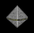

## 敵艦データ

<ul class="commands">
	<li class="buttons"><a href="javascript:weapon_toggle()"       class="box">武装・設計図</a></li>
	<li class="buttons"><a href="javascript:performance1_toggle()" class="box">基本性能</a></li>
	<li class="buttons"><a href="javascript:performance2_toggle()" class="box">詳細性能</a></li>
	<li class="buttons"><a href="javascript:other_toggle()"        class="box">その他</a></li>
	<li><input type="text" oninput="javascript:table_filter(this.value)" data-auto-param="q" /></li>
</ul>

{: sticky-column="3"}
|  No | イメージ                                                                         | 船名                               | 主砲                           | 副砲                   | 弾幕                   | 機関            | ドロップ設計図                     |      装甲 |   資金 | 経験値 |   速度 | 対火災力 | 対電磁力 | 救出人数 | エイムタイプ | 実弾カット | Eカット | 爆風カット | 回避率 | 爆風回避率 | 回復間隔 | 主砲威力 | 主砲命中率加算 | 主砲装填速度 | 副砲威力 | 副砲命中率加算 | 副砲装填速度 | 弾幕威力 | 弾幕命中率加算 | 弾幕装填速度 | 備考                                                                                 |
|----:|----------------------------------------------------------------------------------|------------------------------------|--------------------------------|------------------------|------------------------|-----------------|------------------------------------|----------:|-------:|-------:|-------:|---------:|---------:|---------:|--------------|-----------:|--------:|-----------:|-------:|-----------:|---------:|---------:|---------------:|-------------:|---------:|---------------:|-------------:|---------:|---------------:|-------------:|--------------------------------------------------------------------------------------|
|   0 |                      | 戦闘機カトラス                     | 20型携帯レーザー砲             | なし                   | なし                   | 軽燃料炉A       | 宇宙作業艇D51                      |         1 |      2 |      1 |    0.8 |        1 |        1 |        3 | ランダム     |          0 |       0 |          0 |      0 |          0 |        0 |        0 |              0 |            0 |        0 |              0 |            0 |        0 |              0 |            0 |                                                                                      |
|   1 |                    | 戦闘機カトラス改                   | 20型携帯レーザー砲             | なし                   | なし                   | 軽燃料炉A       | 宇宙作業艇D51                      |         2 |      3 |      2 |    0.8 |        1 |        1 |        3 | ランダム     |          0 |       0 |          0 |      0 |          0 |        0 |        0 |              0 |            0 |        0 |              0 |            0 |        0 |              0 |            0 |                                                                                      |
|   2 |                    | 重戦闘機シミター                   | 20型携帯レーザー砲             | Mk1ロケット            | なし                   | 軽燃料炉B       | 試作宇宙戦闘機X0                   |         3 |      6 |      3 |    0.7 |        1 |        1 |        3 | ランダム     |          0 |       0 |          0 |      0 |          0 |        0 |        0 |              0 |            0 |        0 |              0 |            0 |        0 |              0 |            0 |                                                                                      |
|   3 |                  | 重戦闘機シミター改                 | 20型携帯レーザー砲             | Mk2ロケット            | なし                   | 軽燃料炉B       | 試作宇宙戦闘機X0                   |         4 |      8 |      4 |    0.7 |        1 |        1 |        3 | ランダム     |          0 |       0 |          0 |      0 |          0 |        0 |        0 |              0 |            0 |        0 |              0 |            0 |        0 |              0 |            0 |                                                                                      |
|   4 |                 | 海賊船フィッシャー1                | なし                           | Mk1ロケット            | 試作バルカン           | 軽燃料炉C       | 改造漁船                           |        12 |     20 |      5 |    0.5 |        1 |        2 |        5 | ランダム     |          0 |       0 |          0 |      0 |          0 |        0 |        0 |              0 |            0 |        0 |              0 |            0 |        0 |              0 |            0 |                                                                                      |
|   5 |                 | 海賊船フィッシャー2                | 壊れかけのカノン砲             | Mk2ロケット            | 試作バルカン           | 軽燃料炉C       | 改造漁船                           |        18 |     21 |      6 |    0.5 |        1 |        2 |        5 | ランダム     |          0 |       0 |          0 |      0 |          0 |        0 |        0 |              0 |            0 |        0 |              0 |            0 |        0 |              0 |            0 |                                                                                      |
|   6 |                 | 海賊船フィッシャー3                | 壊れかけのカノン砲             | Mk2ロケット            | 試作バルカン           | 軽燃料炉C       | 改造漁船                           |        28 |     22 |      7 |    0.5 |        1 |        2 |        6 | ランダム     |          0 |       0 |          0 |      0 |          0 |        0 |        0 |              0 |            0 |        0 |              0 |            0 |        0 |              0 |            0 |                                                                                      |
|   7 |                | 海賊空母ハイレディン               | 壊れかけのカノン砲             | Mk1ロケット            | 壊れかけの機銃座       | 軽燃料炉D       | 軽空母                             |        35 |     33 |     20 |    0.3 |        1 |        3 |        7 | ランダム     |          0 |       0 |          0 |      0 |          0 |        0 |        0 |              0 |            0 |        0 |              0 |            0 |        0 |              0 |            0 |                                                                                      |
|   8 |                      | 海賊空母キッド                     | 壊れかけのカノン砲             | Mk1ロケット            | 壊れかけの機銃座       | 軽燃料炉D       | 軽空母                             |        37 |     35 |     12 |    0.3 |        1 |        3 |       10 | ランダム     |          0 |       0 |          0 |      0 |          0 |        0 |        0 |              0 |            0 |        0 |              0 |            0 |        0 |              0 |            0 |                                                                                      |
|   9 |                      | 海賊空母ラカム                     | 壊れかけのカノン砲             | Mk1ロケット            | 壊れかけの機銃座       | 軽燃料炉D       | 軽空母                             |        40 |     36 |     14 |    0.3 |        1 |        3 |       12 | ランダム     |          0 |       0 |          0 |      0 |          0 |        0 |        0 |              0 |            0 |        0 |              0 |            0 |        0 |              0 |            0 |                                                                                      |
|  10 |                   | 重海賊船ドレーク3                  | 16cmカノン砲                   | Mk2ロケット            | 8mm機銃座              | 軽燃料炉E       | 試作SF-AS00                        |       120 |     50 |     30 |    0.2 |        1 |        4 |       30 | ランダム     |          0 |       0 |          0 |      0 |          0 |        0 |        0 |              0 |            0 |        0 |              0 |            0 |        0 |              0 |            0 |                                                                                      |
|  11 |                      | 偵察機スピアー                     | 21型携帯レーザー砲             | なし                   | なし                   | 軽燃料炉D       | パトロール艇                       |        15 |     10 |      5 |    0.4 |        1 |        1 |        3 | ランダム     |          0 |       0 |          0 |      0 |          0 |        0 |        0 |              0 |            0 |        0 |              0 |            0 |        0 |              0 |            0 |                                                                                      |
|  12 |                      | グラス級偵察艇                     | 21型携帯レーザー砲             | なし                   | なし                   | 軽燃料炉D       | パトロール艇                       |        22 |     21 |     10 |    0.8 |        1 |        1 |        5 | ランダム     |          0 |       0 |          0 |      0 |          0 |        0 |        0 |              0 |            0 |        0 |              0 |            0 |        0 |              0 |            0 |                                                                                      |
|  13 |                  | マンティス級戦闘艇                 | 20型携帯レーザー砲             | Mk2ロケット            | なし                   | 軽燃料炉E       | ミサイル艇                         |        25 |     22 |     22 |    0.8 |       10 |       10 |        5 | ランダム     |          0 |       0 |          0 |      0 |          0 |        0 |        0 |              0 |            0 |        0 |              0 |            0 |        0 |              0 |            0 |                                                                                      |
|  14 |            | キラーマンティス級戦闘艇           | 16cmカノン砲                   | Mk2ロケット            | なし                   | 軽燃料炉E       | ミサイル艇                         |        28 |     23 |     23 |    0.8 |       10 |       10 |        5 | ランダム     |          0 |       0 |          0 |      0 |          0 |        0 |        0 |              0 |            0 |        0 |              0 |            0 |        0 |              0 |            0 |                                                                                      |
|  15 |                          | ソード型SF                         | 21型携帯レーザー砲             | アイアンロッド         | 試作バルカン           | 軽燃料炉F       | 量産SF-AS11                        |        40 |     24 |     24 |      1 |       10 |       10 |        2 | ランダム     |          0 |       0 |          0 |      0 |          0 |        0 |        0 |              0 |            0 |        0 |              0 |            0 |        0 |              0 |            0 |                                                                                      |
|  16 |                        | メイス型重SF                       | 21型携帯レーザー砲             | アイアンロッド         | 試作バルカン           | 軽燃料炉G       | 量産SF-AS11                        |        55 |     25 |     25 |      1 |       10 |       10 |        2 | ランダム     |          0 |       0 |          0 |      0 |          0 |        0 |        0 |              0 |            0 |        0 |              0 |            0 |        0 |              0 |            0 |                                                                                      |
|  17 |              | ヴァルキリー級軽巡洋艦             | 0式ビーム砲                    | Mk2連装ロケット        | 8mm機銃座              | 軽燃料炉H       | 軽巡洋艦                           |       152 |     30 |     30 |    0.4 |       10 |       10 |       10 | ランダム     |          0 |       0 |          0 |      0 |          0 |        0 |        0 |              0 |            0 |        0 |              0 |            0 |        0 |              0 |            0 |                                                                                      |
|  18 |             | ヴァルキリー2級軽巡洋艦            | 0式ビーム砲                    | Mk3ロケット            | 8mm機銃座              | 軽燃料炉H       | 軽巡洋艦                           |       160 |     31 |     31 |    0.4 |       20 |       10 |       10 | ランダム     |          0 |       0 |          0 |      0 |          0 |        0 |        0 |              0 |            0 |        0 |              0 |            0 |        0 |              0 |            0 |                                                                                      |
|  19 |                      | アーク級強襲艦                     | 18cmカノン砲                   | Mk2ロケット            | 10mm機銃座             | 軽燃料炉I       | 試作SF-AS00                        |       175 |     38 |     38 |    0.4 |       20 |       20 |       15 | ランダム     |          0 |       0 |          0 |      0 |          0 |        0 |        0 |              0 |            0 |        0 |              0 |            0 |        0 |              0 |            0 |                                                                                      |
|  20 |            | アルファ級帝国軍移動基地           | 20cmカノン砲                   | Mk3ロケット            | 10mm連装機銃座         | 軽燃料炉I       | 強襲揚陸艦                         |       350 |    100 |    100 |    0.2 |       18 |       15 |       50 | ランダム     |          0 |       0 |          0 |      0 |          0 |        0 |        0 |              0 |            0 |        0 |              0 |            0 |        0 |              0 |            0 |                                                                                      |
|  21 |              | モスキート級帝国突撃艇             | 21型携帯レーザー砲             | Mk2ロケット            | なし                   | 軽燃料炉G       | 宇宙戦闘機X1                       |        30 |     20 |     20 |      1 |        1 |        1 |        8 | ランダム     |          0 |       0 |          0 |      0 |          0 |        0 |        0 |              0 |            0 |        0 |              0 |            0 |        0 |              0 |            0 |                                                                                      |
|  22 |              | キラービー級帝国高速艇             | 21型携帯レーザー砲             | Mk2ロケット            | なし                   | 軽燃料炉G       | 宇宙戦闘機X1                       |        18 |     21 |     21 |    1.5 |        1 |        1 |        8 | ランダム     |          0 |       0 |          0 |      0 |          0 |        0 |        0 |              0 |            0 |        0 |              0 |            0 |        0 |              0 |            0 |                                                                                      |
|  23 |                      | アロー型支援SF                     | 0式ビーム砲                    | なし                   | 試作バルカン           | 軽燃料炉G       | 宇宙戦闘機X1                       |        35 |     26 |     23 |    0.3 |        1 |        1 |        3 | ランダム     |          0 |       0 |          0 |      0 |          0 |        0 |        0 |              0 |            0 |        0 |              0 |            0 |        0 |              0 |            0 |                                                                                      |
|  24 |                  | エンジェル級補給艦                 | 21型携帯レーザー砲             | Mk2連装ロケット        | 8mm機銃座              | 軽燃料炉G       | 輸送艦                             |        50 |     80 |     10 |    0.2 |        1 |        1 |       30 | ランダム     |          0 |       0 |          0 |      0 |          0 |        0 |        0 |              0 |            0 |        0 |              0 |            0 |        0 |              0 |            0 |                                                                                      |
|  25 |              | ユニコーン級長距離砲艦             | 試作レールガン                 | なし                   | なし                   | 軽燃料炉H       | 宇宙戦闘機X2                       |        60 |     31 |     31 |    0.3 |        1 |        1 |       15 | ランダム     |          0 |       0 |          0 |      0 |          0 |        0 |        0 |              0 |            0 |        0 |              0 |            0 |        0 |              0 |            0 |                                                                                      |
|  26 |                  | キリン級長距離砲艦                 | 試作レールガン                 | なし                   | なし                   | 軽燃料炉H       | 宇宙戦闘機X2                       |        65 |     32 |     32 |    0.3 |        1 |        1 |       15 | ランダム     |          0 |       0 |          0 |      0 |          0 |        0 |        0 |              0 |            0 |        0 |              0 |            0 |        0 |              0 |            0 |                                                                                      |
|  27 |                      | パワー級強襲艦                     | 1式ビーム砲                    | 試作拡散砲             | 10mm機銃座             | 軽燃料炉I       | 試作SF-AS00                        |       280 |     41 |     45 |    0.6 |        1 |        1 |       25 | ランダム     |          0 |       0 |          0 |      0 |          0 |        0 |        0 |              0 |            0 |        0 |              0 |            0 |        0 |              0 |            0 |                                                                                      |
|  28 |                  | ベータ級小惑星基地                 | ベータ要塞砲                   | 試作拡散砲             | 試作対空レーザー       | 試作対消滅機関A | 強襲揚陸艦                         |     1,500 |    120 |    120 |    0.1 |        1 |        1 |       50 | ランダム     |          0 |       0 |          0 |      0 |          0 |        0 |        0 |              0 |            0 |        0 |              0 |            0 |        0 |              0 |            0 |                                                                                      |
|  29 |                    | ニンジャ級潜宙艦                   | 23型携帯レーザー砲             | なし                   | 核融合爆雷             | 軽燃料炉G       | 宇宙戦闘機X2                       |        70 |     33 |     33 |    0.4 |        1 |        1 |       20 | ランダム     |          0 |       0 |          0 |      0 |          0 |        0 |        0 |              0 |            0 |        0 |              0 |            0 |        0 |              0 |            0 |                                                                                      |
|  30 |                | ビートル級帝国機雷艇               | 20cmカノン砲                   | なし                   | 光子機雷               | 軽燃料炉G       | 宇宙戦闘機X2                       |        35 |     34 |     34 |    0.3 |        1 |        1 |       10 | ランダム     |          0 |       0 |          0 |      0 |          0 |        0 |        0 |              0 |            0 |        0 |              0 |            0 |        0 |              0 |            0 |                                                                                      |
|  31 |              | イフリート級ミサイル艦             | 18cmカノン砲                   | Mk3ロケット            | なし                   | 軽燃料炉G       | 宇宙戦闘機X2                       |        75 |     35 |     35 |    0.3 |        1 |        1 |       25 | ランダム     |          0 |       0 |          0 |      0 |          0 |        0 |        0 |              0 |            0 |        0 |              0 |            0 |        0 |              0 |            0 |                                                                                      |
|  32 |           | イフリート2級重ミサイル艦          | 18cmカノン砲                   | 試作誘導ミサイル       | なし                   | 軽燃料炉G       | 宇宙戦闘機X2                       |        85 |     36 |     36 |    0.3 |        1 |        1 |       25 | ランダム     |          0 |       0 |          0 |      0 |          0 |        0 |        0 |              0 |            0 |        0 |              0 |            0 |        0 |              0 |            0 |                                                                                      |
|  33 |                  | ギガンテス級爆撃機                 | 対艦ミサイルX1                 | なし                   | なし                   | 軽燃料炉H       | 宇宙戦闘機X2                       |       100 |     40 |     40 |    0.2 |        1 |        1 |       15 | ランダム     |          0 |       0 |          0 |      0 |          0 |        0 |        0 |              0 |            0 |        0 |              0 |            0 |        0 |              0 |            0 |                                                                                      |
|  34 |              | ギガンテス超級重爆撃機             | 対艦ミサイルX2                 | なし                   | なし                   | 軽燃料炉H       | 宇宙戦闘機X2                       |       120 |     43 |     43 |    0.2 |        1 |        1 |       15 | ランダム     |          0 |       0 |          0 |      0 |          0 |        0 |        0 |              0 |            0 |        0 |              0 |            0 |        0 |              0 |            0 |                                                                                      |
|  35 |                      | ハンマー型重SF                     | SF用ツインカノン               | Mk2連装ロケット        | なし                   | 軽燃料炉G       | 支援SF-AS12                        |        65 |     29 |     28 |    0.3 |        1 |        1 |        3 | ランダム     |          0 |       0 |          0 |      0 |          0 |        0 |        0 |              0 |            0 |        0 |              0 |            0 |        0 |              0 |            0 |                                                                                      |
|  36 |             | ヴァルキリー3級軽巡洋艦            | 1式ビーム砲                    | Mk3ロケット            | 10mm機銃座             | 軽燃料炉I       | 軽巡洋艦                           |       320 |     55 |     50 |    0.7 |       10 |       10 |       30 | ランダム     |          0 |       0 |          0 |      0 |          0 |        0 |        0 |              0 |            0 |        0 |              0 |            0 |        0 |              0 |            0 |                                                                                      |
|  37 |            | 第一艦隊旗艦ティターニア           | タイタニア                     | Mk3連装ロケット        | 連装光子機雷           | 試作対消滅機関A | ミサイル艦                         |     2,200 |    240 |    240 |    0.1 |       16 |       18 |       60 | ランダム     |          0 |       0 |          0 |      0 |          0 |        0 |        0 |              0 |            0 |        0 |              0 |            0 |        0 |              0 |            0 |                                                                                      |
|  38 |                | ハイニンジャ級潜宙艦               | 23型携帯レーザー砲             | ビームソード           | 核融合爆雷             | 軽燃料炉G       | 宇宙戦闘機X2                       |       120 |     40 |     40 |    0.8 |        2 |        2 |       10 | ランダム     |          0 |       0 |          0 |      0 |          0 |        0 |        0 |              0 |            0 |        0 |              0 |            0 |        0 |              0 |            0 |                                                                                      |
|  39 |                | ゴーラム級シールド艦               | なし                           | なし                   | 核融合爆雷             | 軽燃料炉H       | 軽空母                             |       400 |     41 |     41 |    0.2 |       10 |       10 |       15 | ランダム     |          0 |       0 |          0 |      0 |          0 |        0 |        0 |              0 |            0 |        0 |              0 |            0 |        0 |              0 |            0 |                                                                                      |
|  40 |              | カーバンクル級光線砲艦             | 30口径レーザー砲               | なし                   | 光子機雷               | 軽燃料炉H       | 軽空母                             |       120 |     44 |     44 |    0.2 |        1 |        1 |       18 | ランダム     |          0 |       0 |          0 |      0 |          0 |        0 |        0 |              0 |            0 |        0 |              0 |            0 |        0 |              0 |            0 |                                                                                      |
|  41 |             | ユニコーン2級長距離砲艦            | レールガン1                    | なし                   | 光子機雷               | 軽燃料炉H       | 長距離砲艦                         |       100 |     45 |     45 |    0.3 |        1 |        1 |       20 | ランダム     |          0 |       0 |          0 |      0 |          0 |        0 |        0 |              0 |            0 |        0 |              0 |            0 |        0 |              0 |            0 |                                                                                      |
|  42 |                 | キリン2級長距離砲艦                | レールガン1                    | なし                   | 光子機雷               | 軽燃料炉H       | 長距離砲艦                         |       110 |     46 |     46 |    0.3 |        1 |        1 |       21 | ランダム     |          0 |       0 |          0 |      0 |          0 |        0 |        0 |              0 |            0 |        0 |              0 |            0 |        0 |              0 |            0 |                                                                                      |
|  43 |                         | ソード2型SF                        | SF用試作ビーム砲               | ビームソード           | 試作バルカン           | 軽燃料炉G       | 量産SF-AS11                        |        90 |     40 |     40 |    1.1 |       10 |       10 |        2 | ランダム     |          0 |       0 |          0 |      0 |          0 |        0 |        0 |              0 |            0 |        0 |              0 |            0 |        0 |              0 |            0 |                                                                                      |
|  44 |                       | メイス2型重SF                      | 23型携帯レーザー砲             | ビームソード           | 試作バルカン           | 軽燃料炉G       | 支援SF-AS12                        |        95 |     43 |     43 |    1.1 |       10 |       10 |        2 | ランダム     |          0 |       0 |          0 |      0 |          0 |        0 |        0 |              0 |            0 |        0 |              0 |            0 |        0 |              0 |            0 |                                                                                      |
|  45 |             | ヴァルキリー4級軽巡洋艦            | 2式ビーム砲                    | 試作誘導ミサイル       | 12mm機銃座             | 軽燃料炉I       | 軽巡洋艦                           |       380 |     60 |     60 |    0.6 |       10 |       10 |       35 | ランダム     |          0 |       0 |          0 |      0 |          0 |        0 |        0 |              0 |            0 |        0 |              0 |            0 |        0 |              0 |            0 |                                                                                      |
|  46 |                | ヴァーチャー級強襲艦               | 2式ビーム砲                    | 試作誘導ミサイル       | 12mm機銃座             | 軽燃料炉I       | 強襲揚陸艦                         |       330 |     65 |     65 |    0.6 |        1 |        1 |       35 | ランダム     |          0 |       0 |          0 |      0 |          0 |        0 |        0 |              0 |            0 |        0 |              0 |            0 |        0 |              0 |            0 |                                                                                      |
|  47 |              | 第二艦隊旗艦スプリガン             | 4式ビーム砲                    | 艦載ビームソード       | 制圧ルビーレーザー     | 試作対消滅機関B | ミサイル艦                         |     1,400 |    300 |    300 |    1.7 |       20 |       21 |       55 | ランダム     |          0 |       0 |          0 |      0 |          0 |        0 |        0 |              0 |            0 |        0 |              0 |            0 |        0 |              0 |            0 |                                                                                      |
|  48 |                         | ダガー3型SF                        | SF用ビームガン                 | ビームナイフ           | 試作バルカン           | 軽燃料炉H       | 量産SF-AS11                        |       100 |     50 |     50 |    1.2 |       10 |       10 |        2 | ランダム     |          0 |       0 |          0 |      0 |          0 |        0 |        0 |              0 |            0 |        0 |              0 |            0 |        0 |              0 |            0 |                                                                                      |
|  49 |                         | ソード3型SF                        | SF用ビームライフル             | ビームソード           | 試作バルカン           | 軽燃料炉H       | 量産SF-AS11                        |       105 |     50 |     50 |    1.2 |       10 |       10 |        2 | ランダム     |          0 |       0 |          0 |      0 |          0 |        0 |        0 |              0 |            0 |        0 |              0 |            0 |        0 |              0 |            0 |                                                                                      |
|  50 |                       | メイス3型重SF                      | SF用ツインカノン               | ヒートロッド           | 試作バルカン           | 軽燃料炉H       | 支援SF-AS12                        |       110 |     53 |     53 |      1 |       10 |       10 |        2 | ランダム     |          0 |       0 |          0 |      0 |          0 |        0 |        0 |              0 |            0 |        0 |              0 |            0 |        0 |              0 |            0 |                                                                                      |
|  51 |                     | アロー3型支援SF                    | レールガン2                    | Mk3連装ロケット        | 試作バルカン           | 軽燃料炉H       | 支援SF-AS12                        |        75 |     46 |     43 |    0.3 |        1 |        1 |        3 | ランダム     |          0 |       0 |          0 |      0 |          0 |        0 |        0 |              0 |            0 |        0 |              0 |            0 |        0 |              0 |            0 |                                                                                      |
|  52 |                     | ハンマー3型重SF                    | 対艦ミサイルX1                 | ヒートロッド           | 試作バルカン           | 軽燃料炉H       | 支援SF-AS12                        |        85 |     49 |     48 |    0.3 |        1 |        1 |        3 | ランダム     |          0 |       0 |          0 |      0 |          0 |        0 |        0 |              0 |            0 |        0 |              0 |            0 |        0 |              0 |            0 |                                                                                      |
|  53 |                  | ワイバーン級軽空母                 | レールガン1                    | Mk2ロケット            | 10mm機銃座             | 軽燃料炉H       | 軽空母                             |       330 |     54 |     54 |    0.2 |        3 |        3 |       30 | ランダム     |          0 |       0 |          0 |      0 |          0 |        0 |        0 |              0 |            0 |        0 |              0 |            0 |        0 |              0 |            0 |                                                                                      |
|  54 |                    | ドラグーン級空母                   | レールガン2                    | Mk3ロケット            | 10mm連装機銃座         | 軽燃料炉I       | 軽空母                             |       500 |     66 |     66 |    0.2 |       18 |       15 |       50 | ランダム     |          0 |       0 |          0 |      0 |          0 |        0 |        0 |              0 |            0 |        0 |              0 |            0 |        0 |              0 |            0 |                                                                                      |
|  55 |                | ファフニール級重空母               | レールガン3                    | Mk3連装ロケット        | 14mm機銃座             | 軽燃料炉J       | 宇宙空母                           |     1,200 |     80 |     80 |    0.2 |       20 |       21 |       80 | ランダム     |          0 |       0 |          0 |      0 |          0 |        0 |        0 |              0 |            0 |        0 |              0 |            0 |        0 |              0 |            0 |                                                                                      |
|  56 |                    | クレイモア型重SA                   | メガビームライフル             | メガビームソード       | メガバルカン           | 軽燃料炉I       | 試作SF-AS00                        |       250 |     70 |     70 |    0.7 |        5 |        5 |       10 | ランダム     |          0 |       0 |          0 |      0 |          0 |        0 |        0 |              0 |            0 |        0 |              0 |            0 |        0 |              0 |            0 |                                                                                      |
|  57 |                        | ムラサメ型SF                       | SF用ビームライフル             | ビームソード           | メガバルカン           | 軽燃料炉I       | 試作SF-AS00                        |       130 |     65 |     65 |    2.5 |       10 |       10 |        2 | 旗艦優先     |          0 |       0 |          0 |      0 |          0 |        0 |        0 |              0 |            0 |        0 |              0 |            0 |        0 |              0 |            0 |                                                                                      |
|  58 |                    | ドワーフ級消防艦                   | なし                           | なし                   | 8mm機銃座              | 軽燃料炉D       | 消防艦                             |        50 |     30 |     30 |    0.2 |       10 |       10 |       10 | ランダム     |          0 |       0 |          0 |      0 |          0 |        0 |        0 |              0 |            0 |        0 |              0 |            0 |        0 |              0 |            0 |                                                                                      |
|  59 |                      | ノーム級工作艦                     | なし                           | なし                   | 8mm機銃座              | 軽燃料炉D       | 工作艦                             |        50 |     30 |     30 |    0.2 |       10 |       10 |       10 | ランダム     |          0 |       0 |          0 |      0 |          0 |        0 |        0 |              0 |            0 |        0 |              0 |            0 |        0 |              0 |            0 |                                                                                      |
|  60 |                  | セイレーン級病院船                 | なし                           | なし                   | 8mm機銃座              | 軽燃料炉D       | 病院船                             |        50 |     30 |     30 |    0.2 |       10 |       10 |       10 | ランダム     |          0 |       0 |          0 |      0 |          0 |        0 |        0 |              0 |            0 |        0 |              0 |            0 |        0 |              0 |            0 |                                                                                      |
|  61 |            | 第三艦隊旗艦ペンドラゴン           | 26cm4連装カノン砲              | 光子ミサイル           | 制圧ルビーレーザー     | 試作対消滅機関C | 宇宙空母                           |     4,000 |    350 |    350 |    0.1 |       20 |       20 |      100 | ランダム     |          0 |       0 |          0 |      0 |          0 |        0 |        0 |              0 |            0 |        0 |              0 |            0 |        0 |              0 |            0 |                                                                                      |
|  62 |            | マスターニンジャ級潜宙艦           | なし                           | メガビームソード       | 核融合爆雷             | 軽燃料炉I       | 試作SF-AS00                        |       180 |     60 |     60 |    1.2 |       25 |       25 |       12 | ランダム     |          0 |       0 |          0 |      0 |          0 |        0 |        0 |              0 |            0 |        0 |              0 |            0 |        0 |              0 |            0 |                                                                                      |
|  63 |             | ヴァルキリー5級軽巡洋艦            | 3式ビーム砲                    | Mk3連装ロケット        | 12mm機銃座             | 軽燃料炉J       | 軽巡洋艦                           |       400 |     62 |     62 |    0.5 |       10 |       10 |       38 | ランダム     |          0 |       0 |          0 |      0 |          0 |        0 |        0 |              0 |            0 |        0 |              0 |            0 |        0 |              0 |            0 |                                                                                      |
|  64 |           | イフリート3級重ミサイル艦          | 対艦ミサイルX2                 | 誘導ミサイル           | 10mm機銃座             | 軽燃料炉H       | ミサイル艦                         |       185 |     56 |     56 |    0.3 |       15 |       15 |       30 | ランダム     |          0 |       0 |          0 |      0 |          0 |        0 |        0 |              0 |            0 |        0 |              0 |            0 |        0 |              0 |            0 |                                                                                      |
|  65 |                      | ソロネ級強襲艦                     | 22cm3連装カノン砲              | Mk4連装ロケット        | 光子機雷               | 軽燃料炉J       | 強襲揚陸艦                         |       430 |     72 |     72 |    0.7 |       15 |       15 |       40 | ランダム     |          0 |       0 |          0 |      0 |          0 |        0 |        0 |              0 |            0 |        0 |              0 |            0 |        0 |              0 |            0 |                                                                                      |
|  66 |                | ガネーシャ級重巡洋艦               | レールガン3                    | 誘導ミサイル           | 12mm機銃座             | 原子炉A         | 重シールド艦                       |       950 |     81 |     81 |    0.2 |       15 |       15 |       50 | ランダム     |          0 |       0 |          0 |      0 |          0 |        0 |        0 |              0 |            0 |        0 |              0 |            0 |        0 |              0 |            0 |                                                                                      |
|  67 |              | ガネーシャ改級重巡洋艦             | 30口径レーザー砲               | 誘導ミサイル           | 試作対空レーザー       | 原子炉A         | 重シールド艦                       |     1,000 |     86 |     86 |    0.2 |       15 |       15 |       60 | ランダム     |          0 |       0 |          0 |      0 |          0 |        0 |        0 |              0 |            0 |        0 |              0 |            0 |        0 |              0 |            0 |                                                                                      |
|  68 |                  | ゴリアテ級宇宙戦艦                 | 26cm4連装カノン砲              | Mk4連装ロケット        | 14mm機銃座             | 原子炉B         | 重巡洋艦                           |     1,400 |     90 |     90 |    0.1 |       15 |       15 |       80 | ランダム     |          0 |       0 |          0 |      0 |          0 |        0 |        0 |              0 |            0 |        0 |              0 |            0 |        0 |              0 |            0 |                                                                                      |
|  69 |                | ゴリアテ改級宇宙戦艦               | 5式ビーム砲                    | Mk4連装ロケット        | 核融合爆雷             | 原子炉B         | 重巡洋艦                           |     1,600 |     94 |     94 |    0.1 |       15 |       15 |       90 | ランダム     |          0 |       0 |          0 |      0 |          0 |        0 |        0 |              0 |            0 |        0 |              0 |            0 |        0 |              0 |            0 |                                                                                      |
|  70 |              | ファフニール改級重空母             | レールガン3                    | Mk3連装ロケット        | 14mm機銃座             | 原子炉B         | 宇宙空母                           |     1,350 |     99 |     99 |    0.1 |       20 |       21 |      100 | ランダム     |          0 |       0 |          0 |      0 |          0 |        0 |        0 |              0 |            0 |        0 |              0 |            0 |        0 |              0 |            0 |                                                                                      |
|  71 |                | 第四艦隊旗艦エウレカ               | 試作ソーラ砲                   | 連装追尾レーザー       | 殲滅ルビーレーザー     | 試作対消滅機関D | 特化SF-AS01                        |     4,800 |    400 |    400 |    0.1 |       20 |       20 |      150 | ランダム     |          0 |       0 |          0 |      0 |          0 |        0 |        0 |              0 |            0 |        0 |              0 |            0 |        0 |              0 |            0 |                                                                                      |
|  72 |              | キラーニンジャ級潜宙艦             | なし                           | ビームクナイ           | 超核融合爆雷           | 軽燃料炉I       | 試作SF-AS00                        |       220 |     70 |     60 |    1.3 |       35 |       35 |       22 | ランダム     |          0 |       0 |          0 |      0 |          0 |        0 |        0 |              0 |            0 |        0 |              0 |            0 |        0 |              0 |            0 |                                                                                      |
|  73 |             | ヴァルキリー6級軽巡洋艦            | 4式ビーム砲                    | Mk4連装ロケット        | 14mm機銃座             | 軽燃料炉J       | 軽巡洋艦                           |       480 |     72 |     62 |    0.6 |       12 |       12 |       40 | ランダム     |          0 |       0 |          0 |      0 |          0 |        0 |        0 |              0 |            0 |        0 |              0 |            0 |        0 |              0 |            0 |                                                                                      |
|  74 |               | ゴーラム2級シールド艦              | なし                           | なし                   | 核融合爆雷             | 軽燃料炉I       | 重シールド艦                       |       600 |     61 |     41 |    0.2 |       13 |       13 |       25 | ランダム     |          0 |       0 |          0 |      0 |          0 |        0 |        0 |              0 |            0 |        0 |              0 |            0 |        0 |              0 |            0 |                                                                                      |
|  75 |             | カーバンクル2級光線砲艦            | 32口径レーザー砲               | なし                   | 光子機雷               | 軽燃料炉I       | 軽空母                             |       280 |     64 |     44 |    0.2 |        5 |        5 |       20 | ランダム     |          0 |       0 |          0 |      0 |          0 |        0 |        0 |              0 |            0 |        0 |              0 |            0 |        0 |              0 |            0 |                                                                                      |
|  76 |                   | ドラグーン2級空母                  | レールガン4                    | Mk3連装ロケット        | 10mm連装機銃座         | 軽燃料炉I       | 軽空母                             |       650 |     76 |     66 |    0.2 |       21 |       18 |       55 | ランダム     |          0 |       0 |          0 |      0 |          0 |        0 |        0 |              0 |            0 |        0 |              0 |            0 |        0 |              0 |            0 |                                                                                      |
|  77 |               | ガネーシャ2級重巡洋艦              | 32口径レーザー砲               | Mk4連装ロケット        | 対空レーザーα         | 原子炉A         | 重シールド艦                       |     1,200 |     96 |     86 |    0.2 |       15 |       15 |       65 | ランダム     |          0 |       0 |          0 |      0 |          0 |        0 |        0 |              0 |            0 |        0 |              0 |            0 |        0 |              0 |            0 |                                                                                      |
|  78 |                 | ゴリアテ2級宇宙戦艦                | 6式ビーム砲                    | Mk5連装ロケット        | 超核融合爆雷           | 原子炉B         | 重巡洋艦                           |     1,800 |    104 |     94 |    0.1 |       15 |       15 |       95 | ランダム     |          0 |       0 |          0 |      0 |          0 |        0 |        0 |              0 |            0 |        0 |              0 |            0 |        0 |              0 |            0 |                                                                                      |
|  79 |                      | ムラサメ改型SF                     | メガビームライフル             | ビームクナイ           | メガバルカン           | 軽燃料炉J       | 特化SF-AS01                        |       230 |    105 |    105 |    2.8 |       10 |       10 |        2 | 旗艦優先     |          0 |       0 |          0 |      0 |          0 |        0 |        0 |              0 |            0 |        0 |              0 |            0 |        0 |              0 |            0 |                                                                                      |
|  80 |              | ブルーノート級超級空母             | 試作ソーラ砲                   | 連装追尾レーザー       | 殲滅ルビーレーザー     | 試作対消滅機関D | 特化SF-AS01                        |     7,800 |    450 |    450 |    0.1 |       20 |       20 |      120 | ランダム     |          0 |       0 |          0 |      0 |          0 |        0 |        0 |              0 |            0 |        0 |              0 |            0 |        0 |              0 |            0 |                                                                                      |
|  81 |              | 遠征艦隊旗艦メタトロン             | 光子砲                         | Hi光子ミサイル         | 光子レーザー           | 試作対消滅機関E | 宇宙戦艦                           |     9,999 |    500 |    500 |    0.1 |       50 |       50 |      180 | ランダム     |          0 |       0 |          0 |      0 |          0 |        0 |        0 |              0 |            0 |        0 |              0 |            0 |        0 |              0 |            0 |                                                                                      |
|  82 |                    | ハンゾウ級潜宙艦                   | なし                           | ビームクナイ           | 超核融合爆雷           | 軽燃料炉J       | 試作SF-AS00                        |       280 |     80 |     80 |    1.8 |       35 |       35 |       22 | ランダム     |          0 |       0 |          0 |      0 |          0 |        0 |        0 |              0 |            0 |        0 |              0 |            0 |        0 |              0 |            0 |                                                                                      |
|  83 |             | ヴァルキリー7級軽巡洋艦            | 5式ビーム砲                    | Mk5連装ロケット        | 16mm機銃座             | 原子炉A         | 軽巡洋艦                           |       500 |     82 |     82 |    0.6 |       12 |       12 |       40 | ランダム     |          0 |       0 |          0 |      0 |          0 |        0 |        0 |              0 |            0 |        0 |              0 |            0 |        0 |              0 |            0 |                                                                                      |
|  84 |               | ファフニール2級重空母              | レールガン4                    | Mk4連装ロケット        | 16mm機銃座             | 原子炉C         | 宇宙空母                           |     1,550 |    109 |    109 |    0.1 |       20 |       21 |      100 | ランダム     |          0 |       0 |          0 |      0 |          0 |        0 |        0 |              0 |            0 |        0 |              0 |            0 |        0 |              0 |            0 |                                                                                      |
|  85 |              | ティターニア級弩級戦艦             | タイタニア                     | Mk5連装ロケット        | 連装光子機雷           | 試作対消滅機関D | ミサイル艦                         |     2,000 |    200 |    200 |    0.1 |       16 |       18 |       60 | ランダム     |          0 |       0 |          0 |      0 |          0 |        0 |        0 |              0 |            0 |        0 |              0 |            0 |        0 |              0 |            0 |                                                                                      |
|  86 |                | スプリガン級弩級戦艦               | 6式ビーム砲                    | 艦載ビームソード       | 制圧ルビーレーザー     | 試作対消滅機関D | ミサイル艦                         |     1,800 |    250 |    250 |    1.8 |       20 |       21 |       60 | ランダム     |          0 |       0 |          0 |      0 |          0 |        0 |        0 |              0 |            0 |        0 |              0 |            0 |        0 |              0 |            0 |                                                                                      |
|  87 |              | ペンドラゴン級弩級戦艦             | 28cm5連装カノン砲              | 光子ミサイル           | 制圧ルビーレーザー     | 試作対消滅機関D | 宇宙空母                           |     2,400 |    300 |    300 |    0.1 |       20 |       20 |       60 | ランダム     |          0 |       0 |          0 |      0 |          0 |        0 |        0 |              0 |            0 |        0 |              0 |            0 |        0 |              0 |            0 |                                                                                      |
|  88 |                  | エウレカ級弩級戦艦                 | 試作ソーラ砲                   | 連装追尾レーザー       | 殲滅ルビーレーザー     | 試作対消滅機関D | 特化SF-AS01                        |     2,600 |    350 |    350 |    0.1 |       20 |       20 |       60 | ランダム     |          0 |       0 |          0 |      0 |          0 |        0 |        0 |              0 |            0 |        0 |              0 |            0 |        0 |              0 |            0 |                                                                                      |
|  89 |             | ブルーノート2級超級空母            | 重力子爆弾                     | 連装追尾レーザー       | 殲滅ルビーレーザー     | 試作対消滅機関D | 特化SF-AS01                        |     8,600 |    400 |    400 |    0.1 |       20 |       20 |      100 | ランダム     |          0 |       0 |          0 |      0 |          0 |        0 |        0 |              0 |            0 |        0 |              0 |            0 |        0 |              0 |            0 |                                                                                      |
|  90 |              | メタトロン級超弩級戦艦             | 光子砲                         | Hi光子ミサイル         | 光子レーザー           | 試作対消滅機関E | 重宇宙空母                         |     4,500 |    450 |    450 |    0.1 |       50 |       50 |      120 | ランダム     |          0 |       0 |          0 |      0 |          0 |        0 |        0 |              0 |            0 |        0 |              0 |            0 |        0 |              0 |            0 |                                                                                      |
|  91 |                  | ネビュラ級帝国要塞                 | ネビュラ級要塞砲               | 連装反物質ロケット     | 帝国要塞機銃           | 試作対消滅機関F | 超兵器搭載実験機                   |    99,999 |    999 |    999 |    0.1 |       55 |       55 |      300 | ランダム     |          0 |       0 |          0 |      0 |          0 |        0 |        0 |              0 |            0 |        0 |              0 |            0 |        0 |              0 |            0 |                                                                                      |
|  92 |                            | メタルSF                           | なし                           | メタルソード           | なし                   | 軽燃料炉B       | メタルSF                           |        22 |  1,000 |  1,000 |    4.5 |       50 |       50 |        1 | ランダム     |          0 |       0 |          0 |      0 |          0 |        0 |        0 |              0 |            0 |        0 |              0 |            0 |        0 |              0 |            0 |                                                                                      |
|  93 |                       | 銀河移民船Q01                      | なし                           | なし                   | 移民船団用防御機銃     | 軽燃料炉B       | 銀河移民船                         |     7,777 |  1,000 |  1,000 |    0.3 |       50 |       50 |    2,000 | ランダム     |          0 |       0 |          0 |      0 |          0 |        0 |        0 |              0 |            0 |        0 |              0 |            0 |        0 |              0 |            0 |                                                                                      |
|  94 |                       | 小型移民船B01                      | なし                           | なし                   | 12mm機銃座             | 軽燃料炉F       | 試作SF-AS00                        |         4 |     50 |     30 |    0.4 |       10 |       10 |      500 | ランダム     |          0 |       0 |          0 |      0 |          0 |        0 |        0 |              0 |            0 |        0 |              0 |            0 |        0 |              0 |            0 |                                                                                      |
|  95 |                          | 資金運搬船                         | なし                           | なし                   | 12mm機銃座             | 軽燃料炉F       | 試作SF-AS00                        |         4 |  1,000 |     30 |    0.4 |       10 |       10 |       10 | ランダム     |          0 |       0 |          0 |      0 |          0 |        0 |        0 |              0 |            0 |        0 |              0 |            0 |        0 |              0 |            0 |                                                                                      |
|  96 |                       | 自動迎撃衛星M                      | なし                           | Mk7連装ロケット        | なし                   | 原子炉A         | 消防艦                             |       250 |    100 |    100 |    0.3 |        1 |        1 |        1 | ランダム     |          0 |       0 |          0 |      0 |          0 |        0 |        0 |              0 |            0 |        0 |              0 |            0 |        0 |              0 |            0 |                                                                                      |
|  97 |                       | 自動迎撃衛星B                      | 7式ビーム砲                    | なし                   | なし                   | 原子炉A         | 工作艦                             |       350 |    100 |    100 |    0.3 |        1 |        1 |        1 | ランダム     |          0 |       0 |          0 |      0 |          0 |        0 |        0 |              0 |            0 |        0 |              0 |            0 |        0 |              0 |            0 |                                                                                      |
|  98 |                        | 極地迎撃機S1                       | なし                           | 反物質ロケット         | メガバルカン2          | 原子炉A         | 対空迎撃機XX1                      |       380 |    120 |    121 |    1.7 |        1 |        1 |        3 | ランダム     |          0 |       0 |          0 |      0 |          0 |        0 |        0 |              0 |            0 |        0 |              0 |            0 |        0 |              0 |            0 |                                                                                      |
|  99 |                        | 極地迎撃機S2                       | 26型携帯レーザー砲             | なし                   | メガバルカン2          | 原子炉A         | 対空迎撃機XX1                      |       470 |    120 |    121 |    1.8 |        1 |        1 |        3 | ランダム     |          0 |       0 |          0 |      0 |          0 |        0 |        0 |              0 |            0 |        0 |              0 |            0 |        0 |              0 |            0 |                                                                                      |
| 100 |                      | ハルバード型SF                     | SF用対艦バズーカ               | メガビームソード       | メガバルカン2          | 原子炉A         | 特化SF-AS01                        |       520 |    140 |    148 |    1.3 |       10 |       10 |        3 | ランダム     |          0 |       0 |          0 |      0 |          0 |        0 |        0 |              0 |            0 |        0 |              0 |            0 |        0 |              0 |            0 |                                                                                      |
| 101 |                    | ファランクス型SF                   | なし                           | メガビームソード       | メガバルカン2          | 原子炉A         | 特化SF-AS01                        |       885 |    140 |    148 |      1 |       20 |       20 |        3 | ランダム     |          0 |       0 |          0 |      0 |          0 |        0 |        0 |              0 |            0 |        0 |              0 |            0 |        0 |              0 |            0 |                                                                                      |
| 102 |                      | A1級空中指揮艇                     | なし                           | 反物質ロケット         | 対空レーザーβ         | 原子炉B         | 長距離砲艦                         |     1,200 |    170 |    182 |    0.6 |       22 |       22 |       40 | ランダム     |          0 |       0 |          0 |      0 |          0 |        0 |        0 |              0 |            0 |        0 |              0 |            0 |        0 |              0 |            0 |                                                                                      |
| 103 |                  | 空中戦闘都市アグニ                 | 対艦ミサイルX4                 | Mk7連装ロケット        | 光子レーザー           | 原子炉B         | 長距離砲艦                         |     3,650 |    300 |    266 |    0.2 |       31 |       38 |      200 | ランダム     |          0 |       0 |          0 |      0 |          0 |        0 |        0 |              0 |            0 |        0 |              0 |            0 |        0 |              0 |            0 |                                                                                      |
| 104 |                  | 飛空母艦エグゼリオ                 | 重力子爆弾                     | 拡散砲G                | 反応爆雷               | 原子炉C         | 長距離砲艦                         |     2,850 |    400 |    366 |    0.5 |       41 |       48 |       80 | ランダム     |          0 |       0 |          0 |      0 |          0 |        0 |        0 |              0 |            0 |        0 |              0 |            0 |        0 |              0 |            0 |                                                                                      |
| 105 |                  | 空中要塞アーリマン                 | 拡散重ビーム砲                 | 連装反物質ロケット     | 帝国要塞機銃           | 試作対消滅機関G | 超兵器搭載実験機                   |    77,777 |    999 |    999 |    0.1 |       75 |       75 |      350 | ランダム     |          0 |       0 |          0 |      0 |          0 |        0 |        0 |              0 |            0 |        0 |              0 |            0 |        0 |              0 |            0 |                                                                                      |
| 106 |                   | 1/1ダミー軽巡洋艦                  | なし                           | なし                   | なし                   | 軽燃料炉A       | ダミー隕石                         |         1 |      1 |      1 |    0.7 |        1 |        1 |       -1 | ランダム     |          0 |       0 |          0 |      0 |          0 |        0 |        0 |              0 |            0 |        0 |              0 |            0 |        0 |              0 |            0 |                                                                                      |
| 107 |                     | 1/1ダミー強襲艦                    | なし                           | なし                   | 壊れかけの機銃座       | 軽燃料炉A       | ダミー戦艦                         |         3 |      1 |      1 |    0.6 |        1 |        1 |       -1 | ランダム     |          0 |       0 |          0 |      0 |          0 |        0 |        0 |              0 |            0 |        0 |              0 |            0 |        0 |              0 |            0 |                                                                                      |
| 108 |                       | 2/1ダミー要塞                      | 壊れかけのカノン砲             | なし                   | 壊れかけの機銃座       | 軽燃料炉B       | 試作宇宙戦艦改                     |       100 |      1 |      1 |    0.3 |        1 |        1 |       -1 | ランダム     |          0 |       0 |          0 |      0 |          0 |        0 |        0 |              0 |            0 |        0 |              0 |            0 |        0 |              0 |            0 |                                                                                      |
| 109 |                       | 自動迎撃衛星L                      | なし                           | 単装追尾レーザー       | なし                   | 原子炉B         | 消防艦                             |       375 |    110 |    110 |    0.3 |        1 |       10 |        1 | ランダム     |          0 |       0 |          0 |      0 |          0 |        0 |        0 |              0 |            0 |        0 |              0 |            0 |        0 |              0 |            0 |                                                                                      |
| 110 |             | カーバンクル3級光線砲艦            | 36口径レーザー砲               | なし                   | 連装光子機雷           | 原子炉E         | 長距離砲艦                         |       450 |    140 |    140 |    0.2 |        5 |       25 |       36 | ランダム     |          0 |       0 |          0 |      0 |          0 |        0 |        0 |              0 |            0 |        0 |              0 |            0 |        0 |              0 |            0 |                                                                                      |
| 111 |                     | ハルバードE型SF                    | 27型携帯レーザー砲             | メガビームソード       | ビームバルカン         | 原子炉C         | 特化SF-AS01                        |       580 |    150 |    158 |    1.4 |       10 |       40 |        3 | ランダム     |          0 |       0 |          0 |      0 |          0 |        0 |        0 |              0 |            0 |        0 |              0 |            0 |        0 |              0 |            0 |                                                                                      |
| 112 |                   | ファランクスE型SF                  | なし                           | ギガビームソード       | ビームバルカン         | 原子炉C         | 特化SF-AS01                        |       905 |    150 |    158 |    1.1 |       20 |       40 |        3 | ランダム     |          0 |       0 |          0 |      0 |          0 |        0 |        0 |              0 |            0 |        0 |              0 |            0 |        0 |              0 |            0 |                                                                                      |
| 113 |               | ゴーラム3級シールド艦              | なし                           | なし                   | 反応爆雷               | 原子炉F         | 重シールド艦                       |     1,900 |    160 |    160 |    0.2 |       13 |       13 |       30 | ランダム     |          0 |       0 |          0 |      0 |          0 |        0 |        0 |              0 |            0 |        0 |              0 |            0 |        0 |              0 |            0 |                                                                                      |
| 114 |                    | シヴァ級電磁砲艦                   | なし                           | 試作電磁砲             | なし                   | 原子炉D         | 工作艦                             |       285 |    100 |    100 |    0.3 |       15 |       65 |       30 | ランダム     |          0 |       0 |          0 |      0 |          0 |        0 |        0 |              0 |            0 |        0 |              0 |            0 |        0 |              0 |            0 |                                                                                      |
| 115 |                    | バスタード型重SA                   | ギガビームライフル             | ギガビームソード       | 近接用拡散ビーム       | 原子炉G         | 支援SF-AS12                        |     1,050 |    170 |    170 |    0.7 |        5 |       25 |       10 | ランダム     |          0 |       0 |          0 |      0 |          0 |        0 |        0 |              0 |            0 |        0 |              0 |            0 |        0 |              0 |            0 |                                                                                      |
| 116 |                | グルーオン級重巡洋艦               | 0式重ビーム砲                  | 試作電磁砲             | 対空レーザーδ         | 原子炉G         | 重巡洋艦                           |     3,100 |    300 |    300 |    0.3 |       15 |       15 |       60 | ランダム     |          0 |       0 |          0 |      0 |          0 |        0 |        0 |              0 |            0 |        0 |              0 |            0 |        0 |              0 |            0 |                                                                                      |
| 117 |              | レッドノート級超級空母             | 拡散ビーム砲                   | 連装追尾レーザー＋     | 壊滅ルビーレーザー     | 試作対消滅機関E | 特化SF-AS01                        |     8,800 |    550 |    550 |    0.2 |       20 |       21 |      130 | ランダム     |          0 |       0 |          0 |      0 |          0 |        0 |        0 |              0 |            0 |        0 |              0 |            0 |        0 |              0 |            0 |                                                                                      |
| 118 |      | 発掘兵器キャトルバンディズヌフ     | 999式発掘光線砲                | なし                   | なし                   | 対消滅機関H     | 隕石要塞                           |    99,999 |  1,100 |  1,100 |    0.1 |        1 |        1 |      200 | 旗艦優先     |          0 |       0 |          0 |      0 |          0 |        0 |        0 |              0 |            0 |        0 |              0 |            0 |        0 |              0 |            0 |                                                                                      |
| 119 |                       | 自動迎撃衛星X                      | なし                           | なし                   | なし                   | 原子炉B         | 輸送艦                             |       380 |    110 |    110 |    0.3 |       10 |        1 |        1 | ランダム     |          0 |       0 |          0 |      0 |          0 |        0 |        0 |              0 |            0 |        0 |              0 |            0 |        0 |              0 |            0 |                                                                                      |
| 120 |                     | ハルバードS型SF                    | SF用対艦バズーカ               | アイアンスピア         | メガバルカン3          | 原子炉C         | 特化SF-AS01                        |       590 |    160 |    168 |    1.4 |       40 |       10 |        3 | ランダム     |          0 |       0 |          0 |      0 |          0 |        0 |        0 |              0 |            0 |        0 |              0 |            0 |        0 |              0 |            0 |                                                                                      |
| 121 |                   | ファランクスS型SF                  | なし                           | アイアンスピア         | メガバルカン3          | 原子炉C         | 特化SF-AS01                        |       925 |    160 |    168 |    1.1 |       40 |       10 |        3 | ランダム     |          0 |       0 |          0 |      0 |          0 |        0 |        0 |              0 |            0 |        0 |              0 |            0 |        0 |              0 |            0 |                                                                                      |
| 122 |             | ユニコーン3級長距離砲艦            | レールガン6                    | なし                   | 連装光子機雷           | 原子炉E         | 長距離砲艦                         |       700 |    145 |    145 |    0.3 |        1 |        1 |       40 | ランダム     |          0 |       0 |          0 |      0 |          0 |        0 |        0 |              0 |            0 |        0 |              0 |            0 |        0 |              0 |            0 |                                                                                      |
| 123 |                 | キリン3級長距離砲艦                | レールガン6                    | なし                   | 連装光子機雷           | 原子炉E         | 長距離砲艦                         |       820 |    146 |    146 |    0.3 |        1 |        1 |       41 | ランダム     |          0 |       0 |          0 |      0 |          0 |        0 |        0 |              0 |            0 |        0 |              0 |            0 |        0 |              0 |            0 |                                                                                      |
| 124 |              | ゴーラム級EXシールド艦             | ビームシールド                 | なし                   | 反応爆雷               | 試作対消滅機関A | 重シールド艦                       |     4,700 |    190 |    190 |    0.2 |       60 |       60 |       60 | ランダム     |          0 |       0 |          0 |      0 |          0 |        0 |        0 |              0 |            0 |        0 |              0 |            0 |        0 |              0 |            0 |                                                                                      |
| 125 |            | サラマンダー級高熱量砲艦           | なし                           | 試作高熱量弾           | なし                   | 原子炉D         | 工作艦                             |       220 |    100 |    100 |    0.3 |       15 |       65 |       30 | ランダム     |          0 |       0 |          0 |      0 |          0 |        0 |        0 |              0 |            0 |        0 |              0 |            0 |        0 |              0 |            0 |                                                                                      |
| 126 |                      | ムラクモ改型SF                     | SF用対艦バズーカ               | ムラクモソード         | メガバルカン3          | 原子炉C         | 特化SF-AS01                        |       430 |    145 |    155 |    2.8 |       20 |       20 |        2 | 旗艦優先     |          0 |       0 |          0 |      0 |          0 |        0 |        0 |              0 |            0 |        0 |              0 |            0 |        0 |              0 |            0 |                                                                                      |
| 127 |            | ティターニア改級弩級戦艦           | 重ガトリング砲                 | 反物質拡散砲           | 22mm機銃座             | 試作対消滅機関E | テ級弩級戦艦                       |     7,000 |    600 |    600 |    0.2 |       50 |       50 |       60 | 旗艦優先     |          0 |       0 |          0 |      0 |          0 |        0 |        0 |              0 |            0 |        0 |              0 |            0 |        0 |              0 |            0 |                                                                                      |
| 128 |            | 第六艦隊旗艦アイスサード           | 大質量氷塊弾                   | なし                   | なし                   | 対消滅機関H     | 氷塊船                             |   110,000 |  1,200 |  1,200 |    0.1 |       99 |       99 |      220 | ランダム     |          0 |       0 |          0 |      0 |          0 |        0 |        0 |              0 |            0 |        0 |              0 |            0 |        0 |              0 |            0 | 資源回収=1                                                                           |
| 129 |                     | ハルバードZ型SF                    | なし                           | アイアンスピア         | 近接用拡散ビーム       | 原子炉C         | 汎用SF-AS21                        |       510 |    170 |    170 |    1.5 |       30 |       30 |        3 | 旗艦優先     |          0 |       0 |          0 |      0 |          0 |        0 |        0 |              0 |            0 |        0 |              0 |            0 |        0 |              0 |            0 |                                                                                      |
| 130 |                | スレイプニル狙撃型SF               | SF用レールガン                 | なし                   | メガバルカン3          | 原子炉C         | 支援SF-AS22                        |       525 |    180 |    180 |    0.2 |       30 |       30 |        3 | ランダム     |          0 |       0 |          0 |      0 |          0 |        0 |        0 |              0 |            0 |        0 |              0 |            0 |        0 |              0 |            0 |                                                                                      |
| 131 |                          | クナイ型SF                         | なし                           | ツインビームクナイ     | なし                   | 原子炉C         | 汎用SF-AS21                        |       690 |    190 |    190 |    1.8 |       30 |       30 |        3 | 旗艦優先     |          0 |       0 |          0 |      0 |          0 |        0 |        0 |              0 |            0 |        0 |              0 |            0 |        0 |              0 |            0 |                                                                                      |
| 132 |                       | ハウンドM型SF                      | なし                           | 誘導ミサイルV6         | なし                   | 原子炉C         | 支援SF-AS22                        |       640 |    193 |    193 |    0.3 |       30 |       30 |        3 | ランダム     |          0 |       0 |          0 |      0 |          0 |        0 |        0 |              0 |            0 |        0 |              0 |            0 |        0 |              0 |            0 |                                                                                      |
| 133 |              | ムウ級戦略ミサイル砲艦             | 対艦ミサイルX5                 | なし                   | なし                   | 原子炉E         | ミサイル艇                         |       520 |    200 |    200 |    0.2 |       21 |        1 |       30 | ランダム     |          0 |       0 |          0 |      0 |          0 |        0 |        0 |              0 |            0 |        0 |              0 |            0 |        0 |              0 |            0 |                                                                                      |
| 134 |           | サラマンダー2級高熱量砲艦          | なし                           | 高熱量弾               | なし                   | 原子炉E         | 高熱量砲艦                         |       320 |    140 |    140 |    0.3 |       65 |       10 |       40 | ランダム     |          0 |       0 |          0 |      0 |          0 |        0 |        0 |              0 |            0 |        0 |              0 |            0 |        0 |              0 |            0 |                                                                                      |
| 135 |                   | シヴァ2級電磁砲艦                  | なし                           | 超電磁砲               | なし                   | 原子炉E         | 電磁砲艦                           |       385 |    150 |    150 |    0.3 |       15 |       65 |       40 | ランダム     |          0 |       0 |          0 |      0 |          0 |        0 |        0 |              0 |            0 |        0 |              0 |            0 |        0 |              0 |            0 |                                                                                      |
| 136 |             | ゴーラム2級EXシールド艦            | ビームシールド                 | なし                   | 反応爆雷               | 試作対消滅機関B | 重シールド艦                       |     6,800 |    240 |    240 |    0.2 |       70 |       70 |      100 | ランダム     |          0 |       0 |          0 |      0 |          0 |        0 |        0 |              0 |            0 |        0 |              0 |            0 |        0 |              0 |            0 |                                                                                      |
| 137 |              | スプリガン改級弩級戦艦             | 8式ビーム砲                    | 艦載ビームソード       | 重撃エメラルドレーザー | 試作対消滅機関H | ス級弩級戦艦                       |     2,200 |    620 |    620 |    1.9 |       40 |       40 |       90 | ランダム     |          0 |       0 |          0 |      0 |          0 |        0 |        0 |              0 |            0 |        0 |              0 |            0 |        0 |              0 |            0 |                                                                                      |
| 138 |  | アーク・ノヴァ級超弩級戦艦(艤装中) | 多連装光子砲                   | 重ビームサブシールド   | 多連装速射光子機雷     | 対消滅機関I     | EX重シールド艦                     |   150,000 |  1,300 |  1,300 |    0.1 |       65 |       50 |      250 | ランダム     |          0 |       0 |          0 |      0 |          0 |        0 |        0 |              0 |            0 |        0 |              0 |            0 |        0 |              0 |            0 |                                                                                      |
| 139 |                  | シャーク近接戦闘機                 | 28型携帯レーザー砲             | なし                   | メガバルカン3          | 原子炉B         | 対空迎撃機XX1                      |       570 |    220 |    220 |    2.1 |        5 |        5 |        3 | ランダム     |          0 |       0 |          0 |      0 |          0 |        0 |        0 |              0 |            0 |        0 |              0 |            0 |        0 |              0 |            0 |                                                                                      |
| 140 |                  | シャーク試作可変SF                 | SF用携帯ガトリング             | なし                   | メガバルカン3          | 原子炉B         | 汎用SF-AS21                        |       570 |    220 |    220 |    0.3 |        5 |        5 |        3 | ランダム     |          0 |       0 |          0 |      0 |          0 |        0 |        0 |              0 |            0 |        0 |              0 |            0 |        0 |              0 |            0 |                                                                                      |
| 141 |                      | A2級空中指揮艇                     | なし                           | Mk8連装ロケット        | 対空レーザーγ         | 原子炉C         | 長距離砲艦                         |     1,300 |    230 |    230 |    0.6 |       20 |       20 |       45 | ランダム     |          0 |       0 |          0 |      0 |          0 |        0 |        0 |              0 |            0 |        0 |              0 |            0 |        0 |              0 |            0 |                                                                                      |
| 142 |                  | オクトパス対艦重SA                 | SF用携帯ガトリング             | 試作多弾頭ミサイルS00  | メガバルカン3          | 原子炉D         | 支援SF-AS22                        |     2,000 |    250 |    250 |    0.6 |       30 |       30 |       10 | ランダム     |          0 |       0 |          0 |      0 |          0 |        0 |        0 |              0 |            0 |        0 |              0 |            0 |        0 |              0 |            0 |                                                                                      |
| 143 |             | ゴーラム3級EXシールド艦            | エネルギー吸収フィールド       | なし                   | 反応爆雷               | 試作対消滅機関B | EX重シールド艦                     |     7,200 |    260 |    260 |    0.2 |       70 |       70 |      100 | ランダム     |          0 |       0 |          0 |      0 |          0 |        0 |        0 |              0 |            0 |        0 |              0 |            0 |        0 |              0 |            0 |                                                                                      |
| 144 |                | 飛空母艦エグゼリオ改               | 0式重ビーム砲                  | 反物質ロケット         | 反応爆雷               | 原子炉D         | 長距離砲艦                         |     3,850 |    410 |    410 |    0.4 |       45 |       45 |       90 | ランダム     |          0 |       0 |          0 |      0 |          0 |        0 |        0 |              0 |            0 |        0 |              0 |            0 |        0 |              0 |            0 |                                                                                      |
| 145 |    | デウス・エクス・マキナ級空中戦艦   | 拡散重ビーム砲                 | 単装追尾レーザー       | 対空レーザーδ         | 試作対消滅機関E | 宇宙戦艦                           |     4,800 |    500 |    500 |    0.4 |       55 |       55 |      100 | ランダム     |          0 |       0 |          0 |      0 |          0 |        0 |        0 |              0 |            0 |        0 |              0 |            0 |        0 |              0 |            0 |                                                                                      |
| 146 |            | ペンドラゴン改級弩級戦艦           | 30cm6連装カノン砲              | Hi光子ミサイル         | 殲滅ルビーレーザー     | 試作対消滅機関D | ペ級弩級戦艦                       |     2,400 |    600 |    600 |    0.1 |       30 |       30 |      100 | ランダム     |          0 |       0 |          0 |      0 |          0 |        0 |        0 |              0 |            0 |        0 |              0 |            0 |        0 |              0 |            0 |                                                                                      |
| 147 |    | デウス・エクス・マキナ級要塞戦艦   | なし                           | 重多弾頭ミサイルS99    | 対空レーザーδ         | 試作対消滅機関E | 宇宙戦艦                           |     9,600 |    500 |    500 |    0.2 |       60 |       60 |      100 | ランダム     |          0 |       0 |          0 |      0 |          0 |        0 |        0 |              0 |            0 |        0 |              0 |            0 |        0 |              0 |            0 |                                                                                      |
| 148 |           | 第七艦隊旗艦G77武装移民船          | 280cm9連収束カノン砲           | なし                   | 移民船団用防御機銃     | 対消滅機関J     | 試作重SA-AS100                     |   180,000 |  1,400 |  1,400 |    0.1 |       70 |       70 |      300 | 旗艦優先     |          0 |       0 |          0 |      0 |          0 |        0 |        0 |              0 |            0 |        0 |              0 |            0 |        0 |              0 |            0 |                                                                                      |
| 149 |               | エンジェル2級重補給艦              | なし                           | なし                   | 22mm機銃座             | 原子炉C         | 重輸送艦                           |       800 |    200 |    200 |    0.2 |       50 |       50 |      100 | ランダム     |          0 |       0 |          0 |      0 |          0 |        0 |        0 |              0 |            0 |        0 |              0 |            0 |        0 |              0 |            0 | rege_ammo_time_ini=12                                                                |
| 150 |                 | ドワーフ2級重消防艦                | なし                           | なし                   | 22mm機銃座             | 原子炉C         | 消防艦                             |       800 |    200 |    200 |    0.2 |       50 |       50 |      100 | ランダム     |          0 |       0 |          0 |      0 |          0 |        0 |        0 |              0 |            0 |        0 |              0 |            0 |        0 |              0 |            0 | 消化時間=10                                                                          |
| 151 |                   | ノーム2級重工作艦                  | なし                           | なし                   | 22mm機銃座             | 原子炉C         | 工作艦                             |       800 |    200 |    200 |    0.2 |       50 |       50 |      100 | ランダム     |          0 |       0 |          0 |      0 |          0 |        0 |        0 |              0 |            0 |        0 |              0 |            0 |        0 |              0 |            0 | 電磁障害復旧時間=10                                                                  |
| 152 |               | セイレーン2級重病院船              | なし                           | なし                   | 22mm機銃座             | 原子炉C         | 重病院船                           |       800 |    200 |    200 |    0.2 |       50 |       50 |      100 | ランダム     |          0 |       0 |          0 |      0 |          0 |       13 |        0 |              0 |            0 |        0 |              0 |            0 |        0 |              0 |            0 |                                                                                      |
| 153 |                        | ハイメタルSF                       | なし                           | ハイメタルソード       | なし                   | 軽燃料炉C       | メタルSF                           |         5 |  1,200 |  1,200 |    4.5 |       66 |       66 |        1 | ランダム     |          0 |       0 |          0 |      0 |          0 |        0 |        0 |              0 |            0 |        0 |              0 |            0 |        0 |              0 |            0 |                                                                                      |
| 154 |                      | ヘビーメタルSF                     | なし                           | ヘビーメタルソード     | なし                   | 軽燃料炉D       | メタルSF                           |         4 |  1,400 |  1,400 |    4.5 |       77 |       77 |        1 | ランダム     |          0 |       0 |          0 |      0 |          0 |        0 |        0 |              0 |            0 |        0 |              0 |            0 |        0 |              0 |            0 |                                                                                      |
| 155 |                      | ニューメタルSF                     | なし                           | ニューメタルソード     | なし                   | 軽燃料炉E       | メタルSF                           |         3 |  1,600 |  1,500 |    4.5 |       88 |       88 |        1 | ランダム     |          0 |       0 |          0 |      0 |          0 |        0 |        0 |              0 |            0 |        0 |              0 |            0 |        0 |              0 |            0 |                                                                                      |
| 156 |                        | 真・メタルSF                       | なし                           | 真・メタルソード       | なし                   | 軽燃料炉F       | メタルSF                           |         2 |  2,000 |  2,000 |    4.5 |       99 |       99 |        1 | ランダム     |          0 |       0 |          0 |      0 |          0 |        0 |        0 |              0 |            0 |        0 |              0 |            0 |        0 |              0 |            0 |                                                                                      |
| 157 |                     | ハルバードX型SF                    | なし                           | ツインビームクナイ     | 反応爆雷               | 原子炉C         | 汎用SF-AS21                        |       560 |    190 |    190 |    1.5 |       40 |       40 |        5 | 旗艦優先     |          0 |       0 |          0 |      0 |          0 |        0 |        0 |              0 |            0 |        0 |              0 |            0 |        0 |              0 |            0 |                                                                                      |
| 158 |                 | オクトパス2対艦重SA                | SA用重キャノン                 | ハイパービームソード   | メガバルカン3          | 原子炉D         | 支援SF-AS22                        |     2,300 |    260 |    260 |    0.6 |       30 |       40 |       10 | ランダム     |          0 |       0 |          0 |      0 |          0 |        0 |        0 |              0 |            0 |        0 |              0 |            0 |        0 |              0 |            0 |                                                                                      |
| 159 |          | メイス型SF強化ユニット装備         | 試作有線ビーム砲               | ハイパービームソード   | メガバルカン3          | 原子炉E         | 支援SF-AS22                        |     2,150 |    270 |    270 |    0.6 |       35 |       35 |       10 | ランダム     |          0 |       0 |          0 |      0 |          0 |        0 |        0 |              0 |            0 |        0 |              0 |            0 |        0 |              0 |            0 |                                                                                      |
| 160 |             | ゴーラム4級EXシールド艦            | エネルギー吸収フィールド       | なし                   | なし                   | 試作対消滅機関C | EX重シールド艦                     |     8,000 |    280 |    280 |    0.2 |       75 |       75 |      110 | ランダム     |          0 |       0 |          0 |      0 |          0 |        0 |        0 |              0 |            0 |        0 |              0 |            0 |        0 |              0 |            0 |                                                                                      |
| 161 |               | グルーオン2級重巡洋艦              | 1式重ビーム砲                  | Mk8連装ロケット        | 対空レーザーδ         | 原子炉G         | 重巡洋艦                           |     3,300 |    300 |    300 |    0.3 |       25 |       25 |      100 | ランダム     |          0 |       0 |          0 |      0 |          0 |        0 |        0 |              0 |            0 |        0 |              0 |            0 |        0 |              0 |            0 |                                                                                      |
| 162 |               | ファフニール3級重空母              | 連装レールガン1                | 誘導ミサイルV6         | 18mm機銃座             | 原子炉H         | 重宇宙空母                         |     3,550 |    410 |    410 |    0.1 |       40 |       31 |      130 | ランダム     |          0 |       0 |          0 |      0 |          0 |        0 |        0 |              0 |            0 |        0 |              0 |            0 |        0 |              0 |            0 |                                                                                      |
| 163 |               | 対UNKNOWN重ミサイル艦              | 対艦ミサイルX6                 | 多弾頭ミサイルS01      | メガバルカン2          | 原子炉F         | ミサイル艇                         |     1,300 |    200 |    200 |    0.3 |       25 |       30 |       65 | ランダム     |          0 |       0 |          0 |      0 |          0 |        0 |        0 |              0 |            0 |        0 |              0 |            0 |        0 |              0 |            0 |                                                                                      |
| 164 |                 | ゴリアテ3級宇宙戦艦                | 1式重ビーム砲                  | 高熱量弾               | 反応爆雷               | 原子炉H         | 宇宙戦艦                           |     4,100 |    404 |    494 |    0.1 |       30 |       30 |      135 | ランダム     |          0 |       0 |          0 |      0 |          0 |        0 |        0 |              0 |            0 |        0 |              0 |            0 |        0 |              0 |            0 |                                                                                      |
| 165 |                | エウレカ改級弩級戦艦               | 拡散重ビーム砲                 | 連装追尾レーザー＋     | 壊滅ルビーレーザー     | 試作対消滅機関D | エ級弩級戦艦                       |     4,800 |    650 |    650 |    0.1 |       30 |       30 |      150 | ランダム     |          0 |       0 |          0 |      0 |          0 |        0 |        0 |              0 |            0 |        0 |              0 |            0 |        0 |              0 |            0 |                                                                                      |
| 166 |          | 超時空空母マザーメタトロン         | 光子砲                         | 分裂追尾レーザー       | 浄化パールレーザー     | 対消滅機関J     | 青版超級空母                       |   220,000 |  1,500 |  1,500 |    0.1 |       95 |       95 |      375 | ランダム     |          0 |       0 |          0 |      0 |          0 |       15 |        0 |              0 |            0 |        0 |              0 |            0 |        0 |              0 |            0 |                                                                                      |
| 167 |                    | ハルバードX2型SF                   | テラビームライフル             | SF用光学シールド       | メガバルカン4          | 原子炉D         | 汎用SF-AS21                        |       860 |    290 |    290 |    2.3 |       40 |       40 |        5 | ランダム     |          0 |       0 |          0 |      0 |          0 |        0 |        0 |              0 |            0 |        0 |              0 |            0 |        0 |              0 |            0 |                                                                                      |
| 168 |                  | ファランクスS2型SF                 | SA用重キャノン                 | SF用光学シールド       | メガバルカン4          | 原子炉D         | 特化SF-AS01                        |     1,225 |    360 |    360 |    1.6 |       40 |       40 |        3 | ランダム     |          0 |       0 |          0 |      0 |          0 |        0 |        0 |              0 |            0 |        0 |              0 |            0 |        0 |              0 |            0 |                                                                                      |
| 169 |               | スレイプニル2狙撃型SF              | SF用レールガン2                | SF用光学シールド       | メガバルカン3          | 原子炉D         | 支援SF-AS22                        |       725 |    250 |    250 |    1.4 |       50 |       50 |        3 | ランダム     |          0 |       0 |          0 |      0 |          0 |        0 |        0 |              0 |            0 |        0 |              0 |            0 |        0 |              0 |            0 |                                                                                      |
| 170 |                  | シャーク量産可変SF                 | SF用携帯ガトリング             | SF用光学シールド       | メガバルカン4          | 原子炉D         | 対空迎撃機XX1                      |       680 |    230 |    230 |    2.2 |       45 |       45 |        3 | ランダム     |          0 |       0 |          0 |      0 |          0 |        0 |        0 |              0 |            0 |        0 |              0 |            0 |        0 |              0 |            0 |                                                                                      |
| 171 |                  | ガンマ級小惑星基地                 | マスドライバー180              | Mk8連装ロケット        | 24mm機銃座             | 試作対消滅機関A | 高熱量砲艦                         |    11,500 |    320 |    320 |    0.1 |       65 |       65 |      100 | ランダム     |          0 |       0 |          0 |      0 |          0 |        0 |        0 |              0 |            0 |        0 |              0 |            0 |        0 |              0 |            0 |                                                                                      |
| 172 |                 | オクトパス3対艦重SA                | テラビームライフル             | ハイパービームソード   | メガバルカン4          | 原子炉F         | 試作重SA-AS100                     |     2,600 |    260 |    260 |    0.6 |       30 |       40 |       10 | ランダム     |          0 |       0 |          0 |      0 |          0 |        0 |        0 |              0 |            0 |        0 |              0 |            0 |        0 |              0 |            0 |                                                                                      |
| 173 |                   | バスタード2型重SA                  | SF用レールガン                 | ハイパービームソード   | メガバルカン4          | 原子炉G         | EX重シールド艦                     |     3,050 |    270 |    270 |    0.7 |       25 |       25 |       10 | ランダム     |          0 |       0 |          0 |      0 |          0 |        0 |        0 |              0 |            0 |        0 |              0 |            0 |        0 |              0 |            0 |                                                                                      |
| 174 |  | デウス・エクス・マキナ級航宙型戦艦 | 戦艦有線ビーム砲               | 連装追尾レーザー＋     | 対空レーザーδ         | 試作対消滅機関E | 宇宙戦艦                           |    13,600 |    600 |    600 |    0.2 |       70 |       70 |      150 | ランダム     |          0 |       0 |          0 |      0 |          0 |        0 |        0 |              0 |            0 |        0 |              0 |            0 |        0 |              0 |            0 |                                                                                      |
| 175 |                  | デルタ級小惑星基地                 | マスドライバー360              | 反物質拡散砲           | 24mm機銃座             | 試作対消滅機関F | 隕石要塞                           |    17,000 |    720 |    720 |    0.1 |       90 |       90 |      250 | ランダム     |          0 |       0 |          0 |      0 |          0 |        0 |        0 |              0 |            0 |        0 |              0 |            0 |        0 |              0 |            0 |                                                                                      |
| 176 |              | 覚醒者用SFオーディーン             | 宙域制圧ミサイル1              | オーディーンソード     | 光子バリア             | 対消滅機関J     | 超弩級戦艦メタトロン               |    18,000 |  1,800 |  1,800 |    2.4 |       98 |       98 |        1 | ランダム     |          0 |       0 |          0 |      0 |          0 |        0 |        0 |              0 |            0 |        0 |              0 |            0 |        0 |              0 |            0 |                                                                                      |
| 177 |                | 強化者用SFアラバスタ               | テラビームライフル             | ハイパービームソード   | メガバルカン4          | 原子炉G         | 汎用SF-AS21                        |     1,225 |    280 |    280 |    1.6 |       50 |       90 |        3 | ランダム     |          0 |       0 |          0 |      0 |          0 |        0 |        0 |              0 |            0 |        0 |              0 |            0 |        0 |              0 |            0 |                                                                                      |
| 178 |                | 強化者用SFクリムゾン               | SF用携帯ガトリング2            | ムラクモソード         | メガバルカン4          | 原子炉G         | 支援SF-AS22                        |     1,125 |    250 |    280 |    1.7 |       90 |       90 |        3 | 旗艦優先     |          0 |       0 |          0 |      0 |          0 |        0 |        0 |              0 |            0 |        0 |              0 |            0 |        0 |              0 |            0 |                                                                                      |
| 179 |            | 重ヴァルキリー級軽巡洋艦           | 30cm6連装カノン砲              | 誘導ミサイルV6         | 22mm機銃座             | 原子炉F         | 軽巡洋艦                           |     1,500 |    120 |    120 |    0.5 |       32 |       52 |       50 | ランダム     |          0 |       0 |          0 |      0 |          0 |        0 |        0 |              0 |            0 |        0 |              0 |            0 |        0 |              0 |            0 |                                                                                      |
| 180 |            | トライアングル級重巡洋艦           | 連装レールガン1                | 連装追尾レーザー＋     | 対空レーザーδ         | 原子炉H         | 重巡洋艦                           |     3,600 |    320 |    320 |    0.3 |       35 |       85 |      100 | ランダム     |          0 |       0 |          0 |      0 |          0 |        0 |        0 |              0 |            0 |        0 |              0 |            0 |        0 |              0 |            0 |                                                                                      |
| 181 |                | アスタロト級宇宙戦艦               | 戦艦有線ビーム砲               | 誘導ミサイルV7         | 24mm機銃座             | 原子炉I         | 宇宙戦艦                           |     5,200 |    500 |    500 |    0.1 |       40 |       80 |      165 | ランダム     |          0 |       0 |          0 |      0 |          0 |        0 |        0 |              0 |            0 |        0 |              0 |            0 |        0 |              0 |            0 |                                                                                      |
| 182 |             | ゴーラム級WEXシールド艦            | なし                           | 重ビームサブシールド   | 反応爆雷               | 試作対消滅機関F | EX重シールド艦                     |     9,600 |    550 |    550 |    0.1 |       70 |       80 |      120 | ランダム     |          0 |       0 |          0 |      0 |          0 |        0 |        0 |              0 |            0 |        0 |              0 |            0 |        0 |              0 |            0 |                                                                                      |
| 183 |                  | ゴーゴン型浮遊砲台                 | 拡散重ビーム砲2                | なし                   | なし                   | 試作対消滅機関A | 電磁砲艦                           |     2,400 |    180 |    180 |    0.1 |       40 |       40 |        1 | ランダム     |          0 |       0 |          0 |      0 |          0 |        0 |        0 |              0 |            0 |        0 |              0 |            0 |        0 |              0 |            0 |                                                                                      |
| 184 |          | ソード型SF強化ユニット装備         | 宙域制圧ミサイル2              | ハイパービームソード   | メガバルカン4          | 原子炉F         | 試作重SA-AS100                     |    13,600 |    470 |    470 |    0.9 |       35 |       80 |       12 | ランダム     |          0 |       0 |          0 |      0 |          0 |        0 |        0 |              0 |            0 |        0 |              0 |            0 |        0 |              0 |            0 |                                                                                      |
| 185 |                  | オクトパスα級重SA                 | 拡散ビーム砲                   | 有線ビームソード       | 近接用拡散ビーム2      | 原子炉F         | 試作重SA-AS100                     |    13,800 |    460 |    460 |    0.4 |       35 |       80 |       13 | ランダム     |          0 |       0 |          0 |      0 |          0 |        0 |        0 |              0 |            0 |        0 |              0 |            0 |        0 |              0 |            0 |                                                                                      |
| 186 |                  | 要塞ガルガンチュア                 | リフレクターレーザー1          | 超重力子ロケット       | 帝国要塞機銃2          | 縮退炉A         | 重SA-AS200                         |   500,000 |  2,220 |  2,220 |    0.1 |       95 |       99 |      450 | ランダム     |          0 |       0 |          0 |      0 |          0 |        0 |        0 |              0 |            0 |        0 |              0 |            0 |        0 |              0 |            0 |                                                                                      |
| 187 |      | アーク・ノヴァ級弐番艦イリオン     | 時空断絶砲                     | 分裂追尾レーザー+      | 強化パールレーザー     | 縮退炉B         | 重主砲実験艦                       |   650,000 |  2,300 |  2,300 |   0.01 |       99 |       99 |      550 | ランダム     |          0 |       0 |          0 |      0 |          0 |       15 |        0 |              0 |            0 |        0 |              0 |            0 |        0 |              0 |            0 |                                                                                      |
| 188 |             | レッドノート3級超級空母            | 対艦ミサイルX7                 | Mk9連装ロケット        | 重撃エメラルドレーザー | 対消滅機関A     | 赤版超級空母                       |    18,800 |    550 |    550 |    0.2 |       20 |       21 |      150 | ランダム     |          0 |       0 |          0 |      0 |          0 |        0 |        0 |              0 |            0 |        0 |              0 |            0 |        0 |              0 |            0 |                                                                                      |
| 189 |             | ブルーノート3級超級空母            | 連装レールガン2                | 重多弾頭ミサイルS99    | 多連装速射光子機雷     | 対消滅機関B     | 青版超級空母                       |    18,600 |    560 |    400 |    0.1 |       20 |       20 |      150 | ランダム     |          0 |       0 |          0 |      0 |          0 |        0 |        0 |              0 |            0 |        0 |              0 |            0 |        0 |              0 |            0 |                                                                                      |
| 190 |                  | 量産型オーディーン                 | 宙域制圧ミサイル3              | オーディーンソード     | メガバルカン5          | 対消滅機関I     | 重SA-AS200                         |    15,000 |    800 |    800 |    1.8 |       98 |       98 |        1 | ランダム     |          0 |       0 |          0 |      0 |          0 |        0 |        0 |              0 |            0 |        0 |              0 |            0 |        0 |              0 |            0 |                                                                                      |
| 191 |                  | アーク級ブルーノア                 | 時空転移砲                     | 分裂追尾レーザー+      | 対空レーザーε         | 縮退炉B         | 空中戦艦                           |   250,000 |  1,600 |  1,600 |   0.01 |       99 |       99 |      300 | ランダム     |          0 |       0 |          0 |      0 |          0 |        0 |        0 |              0 |            0 |        0 |              0 |            0 |        0 |              0 |            0 |                                                                                      |
| 192 |                | アーク級ブラッドレイ               | 時空転移砲                     | 超重力子ロケット       | 26mm機銃座             | 縮退炉B         | 空中戦艦                           |   300,000 |  1,600 |  1,600 |   0.01 |       99 |       99 |      300 | ランダム     |          0 |       0 |          0 |      0 |          0 |        0 |        0 |              0 |            0 |        0 |              0 |            0 |        0 |              0 |            0 |                                                                                      |
| 193 |                    | アーク級グスタフ                   | 時空転移砲                     | 連続追尾レーザー       | 反物質爆雷             | 縮退炉B         | 空中戦艦                           |   350,000 |  1,700 |  1,700 |   0.01 |       99 |       99 |      300 | ランダム     |          0 |       0 |          0 |      0 |          0 |        0 |        0 |              0 |            0 |        0 |              0 |            0 |        0 |              0 |            0 |                                                                                      |
| 194 |                  | 強化型オーディーン                 | 宙域制圧ミサイル1              | オーディーンソード     | 光子バリア             | 縮退炉B         | 重SA-AS111                         |    98,000 |  1,800 |  1,800 |    2.2 |       98 |       98 |        1 | ランダム     |          0 |       0 |          0 |      0 |          0 |        0 |        0 |              0 |            0 |        0 |              0 |            0 |        0 |              0 |            0 |                                                                                      |
| 195 |                      | 特化SFスサノオ                     | SF用携帯ガトリング3            | 901式発掘超鋼剣        | メガバルカン5          | 縮退炉C         | 重SA-AS111                         |   138,000 |  1,800 |  1,800 |    2.5 |       98 |       98 |        1 | ランダム     |          0 |       0 |          0 |      0 |          0 |        0 |        0 |              0 |            0 |        0 |              0 |            0 |        0 |              0 |            0 |                                                                                      |
| 196 |               | 対UNKNOWN最終封印兵器              | 拡散重ビーム砲2                | トールハンマー         | 強化パールレーザー     | 縮退炉I         | 重SA-AS111                         |   700,000 |  2,500 |  2,500 |      1 |       99 |       99 |      400 | ランダム     |          0 |       0 |          0 |      0 |          0 |        0 |        0 |              0 |            0 |        0 |              0 |            0 |        0 |              0 |            0 |                                                                                      |
| 197 |                            | 光の巨人                           | 古の光                         | なし                   | 光の波                 | 星生炉A         | 帝式要塞                           | 1,000,000 |  4,000 |  4,000 |    0.4 |      100 |      100 |        0 | ランダム     |         60 |      90 |          0 |      0 |          0 |       15 |        0 |              0 |            0 |        0 |              0 |            0 |        0 |              0 |            0 |                                                                                      |
| 198 |                     | 宇宙怪獣アルパ1                    | 光弾1                          | なし                   | なし                   | 縮退炉A         | テ級弩級戦艦改                     |     5,000 |  1,000 |  1,000 |    2.3 |       90 |       90 |        0 | ランダム     |         90 |      40 |          0 |      0 |          0 |       20 |        0 |              0 |            0 |        0 |              0 |            0 |        0 |              0 |            0 |                                                                                      |
| 199 |                     | 宇宙怪獣ベータ1                    | 光弾1                          | なし                   | なし                   | 縮退炉A         | テ級弩級戦艦改                     |     7,000 |  1,200 |  1,200 |    2.5 |       90 |       90 |        0 | ランダム     |         90 |      40 |          0 |      0 |          0 |       20 |        0 |              0 |            0 |        0 |              0 |            0 |        0 |              0 |            0 |                                                                                      |
| 200 |                     | 宇宙怪獣ベータ2                    | 光弾2                          | なし                   | なし                   | 縮退炉A         | ス級弩級戦艦改                     |     8,000 |  1,400 |  1,400 |    3.3 |       90 |       90 |        0 | ランダム     |         90 |      40 |          0 |      0 |          0 |       20 |        0 |              0 |            0 |        0 |              0 |            0 |        0 |              0 |            0 |                                                                                      |
| 201 |                     | 宇宙怪獣ガンマ1                    | 誘導光弾1                      | なし                   | なし                   | 縮退炉A         | ス級弩級戦艦改                     |    12,000 |  1,600 |  1,600 |    1.2 |       90 |       90 |        0 | ランダム     |         90 |      40 |          0 |      0 |          0 |       20 |        0 |              0 |            0 |        0 |              0 |            0 |        0 |              0 |            0 |                                                                                      |
| 202 |                     | 宇宙怪獣ガンマ2                    | 誘導光弾2                      | なし                   | なし                   | 縮退炉A         | ペ級弩級戦艦改                     |    16,000 |  2,000 |  2,000 |    1.4 |       90 |       90 |        0 | ランダム     |         90 |      40 |          0 |      0 |          0 |       20 |        0 |              0 |            0 |        0 |              0 |            0 |        0 |              0 |            0 |                                                                                      |
| 203 |                          | 騎士級光体                         | 光槍1                          | なし                   | なし                   | 縮退炉A         | ペ級弩級戦艦改                     |    28,000 |  2,200 |  2,200 |    2.2 |       99 |       99 |        0 | ランダム     |         50 |      90 |          0 |      0 |          0 |       15 |        0 |              0 |            0 |        0 |              0 |            0 |        0 |              0 |            0 |                                                                                      |
| 204 |                          | 軽巡級光体                         | 光槍2                          | なし                   | なし                   | 縮退炉A         | エ級弩級戦艦改                     |    36,000 |  2,400 |  2,400 |    2.3 |       99 |       99 |        0 | ランダム     |         50 |      90 |          0 |      0 |          0 |       15 |        0 |              0 |            0 |        0 |              0 |            0 |        0 |              0 |            0 |                                                                                      |
| 205 |                          | 小星級光体                         | 光輪1                          | なし                   | なし                   | 縮退炉A         | エ級弩級戦艦改                     |    46,000 |  2,600 |  2,600 |    2.3 |       99 |       99 |        0 | ランダム     |         50 |      90 |          0 |      0 |          0 |       15 |        0 |              0 |            0 |        0 |              0 |            0 |        0 |              0 |            0 |                                                                                      |
| 206 |                          | 軽空級光体                         | 光輪2                          | なし                   | なし                   | 縮退炉A         | 試作SF-AS300                       |   186,000 |  2,800 |  2,800 |    0.1 |       99 |       99 |        0 | ランダム     |         50 |      90 |          0 |      0 |          0 |       15 |        0 |              0 |            0 |        0 |              0 |            0 |        0 |              0 |            0 |                                                                                      |
| 207 |                    | 恒体アウレリウス                   | 古の光                         | フレア                 | 光の波                 | 星生炉A         | 発掘戦艦                           | 1,000,000 |  4,000 |  4,000 |    0.2 |      100 |      100 |        0 | ランダム     |         60 |      90 |          0 |      0 |          0 |       15 |        0 |              0 |            0 |        0 |              0 |            0 |        0 |              0 |            0 |                                                                                      |
| 208 |                        | 幻・メタルSF                       | なし                           | 幻・メタルソード       | なし                   | 軽燃料炉G       | メタルSF                           |         2 |  8,000 |  8,000 |    4.5 |       99 |       99 |        1 | ランダム     |          0 |       0 |          0 |      0 |          0 |        0 |        0 |              0 |            0 |        0 |              0 |            0 |        0 |              0 |            0 |                                                                                      |
| 209 |                         | 発掘戦闘機Z                        | なし                           | なし                   | メガバルカン6          | 原子炉G         | 発掘戦闘機Z                        |       480 |    820 |    920 |    3.8 |       32 |       52 |       10 | ランダム     |         80 |      10 |          0 |      0 |          0 |        0 |        0 |              0 |            0 |        0 |              0 |            0 |        0 |              0 |            0 | 主砲貫通力+40、副砲貫通力+30、副砲発射数+1、弾幕貫通力+20                            |
| 210 |                       | 発掘戦闘機F18                      | なし                           | 反物質ロケット         | メガバルカン6          | 原子炉H         | 発掘戦闘機F18                      |       520 |    820 |    920 |    4.2 |       32 |       52 |       10 | ランダム     |         80 |      10 |          0 |      0 |          0 |        0 |        0 |              0 |            0 |        0 |              0 |            0 |        0 |              0 |            0 | 主砲貫通力+40、副砲貫通力+30、副砲発射数+1、弾幕貫通力+20                            |
| 211 |                         | 発掘空母AKG                        | なし                           | Zアタック              | 26mm多連装機銃座       | 対消滅機関F     | 発掘宇宙空母                       |    40,000 |  2,700 |  2,700 |   0.03 |       99 |       99 |      700 | ランダム     |         80 |      10 |          0 |      0 |          0 |        0 |        0 |              0 |            0 |        0 |              0 |            0 |        0 |              0 |            0 | 主砲貫通力+40、副砲貫通力+30、副砲発射数+1、弾幕貫通力+20                            |
| 212 |                         | 発掘戦艦MSR                        | ネビュラ級要塞砲               | 誘導ミサイルV8         | 26mm多連装機銃座       | 対消滅機関G     | 発掘宇宙戦艦                       |    60,000 |  3,000 |  3,000 |   0.06 |       99 |       99 |      800 | ランダム     |         80 |      10 |          0 |      0 |          0 |        0 |        0 |              0 |            0 |        0 |              0 |            0 |        0 |              0 |            0 | 主砲貫通力+40、副砲貫通力+30、副砲発射数+1、弾幕貫通力+20                            |
| 213 |                         | 発掘戦艦MSS                        | 80cm2*4連装カノン砲            | Mk10連装ロケット       | 26mm多連装機銃座       | 対消滅機関H     | 発掘宇宙大戦艦                     |    80,000 |  3,500 |  3,500 |   0.08 |       99 |       99 |      900 | ランダム     |         80 |      10 |          0 |      0 |          0 |        0 |        0 |              0 |            0 |        0 |              0 |            0 |        0 |              0 |            0 | 主砲貫通力+40、副砲貫通力+30、副砲発射数+1、弾幕貫通力+20                            |
| 214 |                         | 発掘空母NMZ                        | なし                           | F18アタック            | 26mm多連装機銃座       | 対消滅機関I     | 発掘宇宙大空母                     |   100,000 |  4,300 |  4,300 |   0.02 |       99 |       99 |    1,200 | ランダム     |         80 |      10 |          0 |      0 |          0 |        0 |        0 |              0 |            0 |        0 |              0 |            0 |        0 |              0 |            0 | 主砲貫通力+40、副砲貫通力+30、副砲発射数+1、弾幕貫通力+20                            |
| 215 |                       | 発掘戦闘機MIG                      | 30型携帯レーザー砲             | 超電磁砲               | メガバルカン6          | 原子炉G         | 発掘戦闘機Z                        |       540 |    820 |    920 |    3.1 |       32 |       52 |       10 | ランダム     |         80 |      10 |          0 |      0 |          0 |        0 |        0 |              0 |            0 |        0 |              0 |            0 |        0 |              0 |            0 | 主砲貫通力+40、副砲貫通力+30、副砲発射数+1、弾幕貫通力+20                            |
| 216 |                        | 発掘戦闘機MS                       | なし                           | 高熱量弾               | メガバルカン6          | 原子炉H         | 発掘戦闘機F18                      |       560 |    820 |    920 |    2.9 |       32 |       52 |       10 | ランダム     |         80 |      10 |          0 |      0 |          0 |        0 |        0 |              0 |            0 |        0 |              0 |            0 |        0 |              0 |            0 | 主砲貫通力+40、副砲貫通力+30、副砲発射数+1、弾幕貫通力+20                            |
| 217 |                        | 発掘駆逐艦MO                       | 対艦ミサイルX7                 | Mk9連装ロケット        | 26mm機銃座             | 対消滅機関F     | 発掘宇宙空母                       |     2,800 |  2,000 |  2,000 |    1.2 |       69 |       79 |      300 | ランダム     |         80 |      10 |          0 |      0 |          0 |        0 |        0 |              0 |            0 |        0 |              0 |            0 |        0 |              0 |            0 | 主砲貫通力+40、副砲貫通力+30、副砲発射数+1、弾幕貫通力+20                            |
| 218 |                        | 発掘潜宙艦UB                       | なし                           | 誘導ミサイルV8         | 反物質爆雷             | 対消滅機関G     | 発掘宇宙空母                       |     3,200 |  3,200 |  3,200 |   0.04 |       99 |       99 |      100 | ランダム     |         80 |      10 |          0 |      0 |          0 |        0 |        0 |              0 |            0 |        0 |              0 |            0 |        0 |              0 |            0 | 主砲貫通力+40、副砲貫通力+30、副砲発射数+1、弾幕貫通力+20                            |
| 219 |                     | 発掘航空戦艦ISE                    | 280cm9連収束カノン砲           | F18アタック            | 26mm多連装機銃座       | 縮退炉B         | 発掘航空戦艦                       | 1,000,000 |  5,500 |  5,500 |   0.02 |       99 |       99 |    4,200 | ランダム     |         80 |      10 |          0 |      0 |          0 |        0 |        0 |              0 |            0 |        0 |              0 |            0 |        0 |              0 |            0 | 主砲貫通力+40、副砲貫通力+30、副砲発射数+1、弾幕貫通力+20                            |
| 220 |                  | インペリアルガード                 | SF用携帯ガトリング3            | 702式発掘超鋼剣        | メガバルカン6          | 縮退炉C         | 強襲SF-AS400                       |    30,000 |  1,700 |  1,700 |    2.5 |       90 |       90 |        1 | ランダム     |          0 |       0 |          0 |      0 |          0 |        0 |        0 |              0 |            0 |        0 |              0 |            0 |        0 |              0 |            0 |                                                                                      |
| 221 |                | グレートインペリアル               | 宙域制圧ミサイル1              | 弩級艦載ビームソード   | 26mm多連装機銃座       | 星生炉B         | 帝式惑星級戦闘体                   | 1,000,000 |  5,000 |  5,000 |    2.8 |       99 |       99 |    8,000 | 旗艦優先     |         90 |       0 |          0 |      0 |          0 |        0 |        0 |              0 |            0 |        0 |              0 |            0 |        0 |              0 |            0 | 副砲貫通力+10、弾幕弾速+5                                                            |
| 222 |                      | 小惑星ベヒモス                     | なし                           | なし                   | なし                   | 核融合炉A       | 地球                               |   320,000 |  3,000 |  3,000 |    0.1 |      100 |      100 |    1,000 | 旗艦優先     |         70 |      99 |          0 |      0 |          0 |        0 |        0 |              0 |            0 |        0 |              0 |            0 |        0 |              0 |            0 | 資源回収=難易度+1 (一般兵=1、熟練兵=2、強化兵=3、親衛隊=4、覚醒者=5、光化=6、真破=7) |
| 223 |                      | オーディーン改                     | リフレクターレーザー1          | オーディーンソード     | メガバルカン6          | 縮退炉B         | 特化SF-Eライト                     |   140,000 |  3,800 |  3,800 |    4.2 |       99 |       99 |        1 | 僚艦優先     |          0 |       0 |          0 |      0 |          0 |        0 |        0 |              0 |            0 |        0 |              0 |            0 |        0 |              0 |            0 |                                                                                      |
| 224 |               | サテライト級要塞ルナ3              | サテライトキャノン             | なし                   | 帝国要塞機銃2          | 縮退炉B         | 超時空戦闘母艦                     | 1,000,000 |  5,500 |  5,500 |   0.01 |       99 |       99 |   12,550 | ランダム     |         75 |      90 |          0 |      0 |          0 |        0 |        0 |              0 |            0 |        0 |              0 |            0 |        0 |              0 |            0 | 資源回収=1                                                                           |
| 225 |                  | 水中怪獣オクトパー                 | 光弾1                          | なし                   | なし                   | 軽燃料炉A       | 汎用SF-AS21                        |       200 |    100 |    100 |    3.3 |       90 |       90 |        0 | ランダム     |         90 |      40 |          0 |      0 |          0 |       20 |        0 |              0 |            0 |        0 |              0 |            0 |        0 |              0 |            0 |                                                                                      |
| 226 |            | 水中怪獣デビルフィッシュ           | 光弾1                          | なし                   | なし                   | 軽燃料炉B       | 汎用SF-AS21                        |       220 |    120 |    120 |    3.4 |       90 |       90 |        0 | ランダム     |         90 |      40 |          0 |      0 |          0 |       20 |        0 |              0 |            0 |        0 |              0 |            0 |        0 |              0 |            0 |                                                                                      |
| 227 |                | 水中怪獣アンモナイト               | 光弾2                          | なし                   | なし                   | 軽燃料炉C       | 支援SF-AS22                        |       230 |    140 |    140 |    2.6 |       90 |       90 |        0 | ランダム     |         90 |      40 |          0 |      0 |          0 |       20 |        0 |              0 |            0 |        0 |              0 |            0 |        0 |              0 |            0 |                                                                                      |
| 228 |                  | 水中怪獣アングラー                 | 光弾2                          | なし                   | なし                   | 軽燃料炉D       | 支援SF-AS22                        |       250 |    160 |    160 |    2.8 |       90 |       90 |        0 | ランダム     |         90 |      40 |          0 |      0 |          0 |       20 |        0 |              0 |            0 |        0 |              0 |            0 |        0 |              0 |            0 |                                                                                      |
| 229 |                      | 水中怪獣マミー                     | 光槍1                          | なし                   | なし                   | 原子炉A         | 試作重SA-AS100                     |     1,200 |    500 |    500 |    2.6 |       99 |       99 |        0 | ランダム     |         90 |      40 |          0 |      0 |          0 |       20 |        0 |              0 |            0 |        0 |              0 |            0 |        0 |              0 |            0 |                                                                                      |
| 230 |                  | 水中怪獣キャンサー                 | 光輪1                          | なし                   | なし                   | 原子炉B         | 重SA-AS200                         |     1,300 |    600 |    600 |    2.1 |       99 |       99 |        0 | ランダム     |         90 |      40 |          0 |      0 |          0 |       20 |        0 |              0 |            0 |        0 |              0 |            0 |        0 |              0 |            0 |                                                                                      |
| 231 |                    | 水中怪獣タートル                   | 誘導光弾2                      | なし                   | なし                   | 試作対消滅機関A | 試作SF-AS300                       |     5,000 |  1,300 |  1,300 |    2.3 |       99 |       99 |        0 | ランダム     |         90 |      40 |          0 |      0 |          0 |       20 |        0 |              0 |            0 |        0 |              0 |            0 |        0 |              0 |            0 |                                                                                      |
| 232 |                    | 水中怪獣シャーク                   | 光槍2                          | なし                   | なし                   | 試作対消滅機関B | 試作SF-AS300                       |     6,000 |  1,400 |  1,400 |    3.5 |       99 |       99 |        0 | ランダム     |         90 |      40 |          0 |      0 |          0 |       20 |        0 |              0 |            0 |        0 |              0 |            0 |        0 |              0 |            0 |                                                                                      |
| 233 |                    | 水中怪獣コーラル                   | 光輪2                          | なし                   | なし                   | 縮退炉A         | 試作SF-AS300                       |    33,000 |  2,000 |  2,000 |    1.2 |       99 |       99 |        0 | ランダム     |         90 |      40 |          0 |      0 |          0 |       20 |        0 |              0 |            0 |        0 |              0 |            0 |        0 |              0 |            0 |                                                                                      |
| 234 |                | グラン・ブルー級光体               | 古の光                         | 分裂追尾レーザー+      | 光の波                 | 星生炉A         | 生体SF-AS301                       |   320,000 |  3,500 |  3,500 |   0.25 |       99 |       99 |        0 | 旗艦優先     |         50 |      90 |          0 |      0 |          0 |       15 |        0 |              0 |            0 |        0 |              0 |            0 |        0 |              0 |            0 |                                                                                      |
| 235 |                          | 竜兵級光体                         | なし                           | フレア                 | なし                   | 縮退炉C         | 試作SF-AS300                       |    66,000 |  2,800 |  2,800 |    1.8 |       99 |       99 |        0 | ランダム     |         50 |      90 |          0 |      0 |          0 |       15 |        0 |              0 |            0 |        0 |              0 |            0 |        0 |              0 |            0 |                                                                                      |
| 236 |                    | 短距離跳躍強襲艦                   | なし                           | なし                   | 近接用拡散ビーム3      | 反物質炉A       | 統合軍高速強襲艦                   |     3,200 |  2,200 |  2,200 |     20 |       60 |       50 |      100 | ランダム     |          0 |       0 |          0 |      0 |          0 |        0 |        0 |              0 |            0 |        0 |              0 |            0 |        0 |              0 |            0 |                                                                                      |
| 237 |                  | 強襲用ワープゲート                 | 超時空断絶砲                   | なし                   | 帝国要塞機銃3          | 星生炉A         | 試作潜宙艦                         |   880,000 |  5,600 |  5,600 |   0.01 |       99 |       99 |    1,000 | 旗艦優先     |         70 |      70 |          0 |      0 |          0 |        0 |        0 |              0 |            0 |        0 |              0 |            0 |        0 |              0 |            0 |                                                                                      |
| 238 |                           | E級巡視艇                          | 22型携帯レーザー砲             | なし                   | 壊れかけの機銃座       | 軽燃料炉A       | パトロール艇                       |       100 |     50 |     50 |    1.2 |       10 |       10 |       10 | ランダム     |          0 |       0 |          0 |      0 |          0 |        0 |        0 |              0 |            0 |        0 |              0 |            0 |        0 |              0 |            0 |                                                                                      |
| 239 |                 | E級高機動型作業艇改                | 20cmカノン砲                   | アイアンロッド         | なし                   | 軽燃料炉B       | 高機動型作業艇D77                  |       350 |     60 |     60 |    2.2 |        1 |        1 |        3 | ランダム     |          0 |       0 |          0 |      0 |          0 |        0 |        0 |              0 |            0 |        0 |              0 |            0 |        0 |              0 |            0 |                                                                                      |
| 240 |                         | E級特化SF改                        | メガビームライフル             | メガビームソード       | メガバルカン           | 軽燃料炉I       | 特化SF-AS01                        |     1,750 |    300 |    300 |    2.5 |       12 |       12 |        3 | ランダム     |          0 |       0 |          0 |      0 |          0 |        0 |        0 |              0 |            0 |        0 |              0 |            0 |        0 |              0 |            0 |                                                                                      |
| 241 |                       | E級軽巡洋艦改                      | 20cm連装カノン砲               | Mk3ロケット            | 10mm機銃座             | 軽燃料炉F       | 統合軍軽巡洋艦                     |     2,000 |    400 |    400 |    1.3 |       32 |       35 |       40 | ランダム     |          0 |       0 |          0 |      0 |          0 |        0 |        0 |              0 |            0 |        0 |              0 |            0 |        0 |              0 |            0 |                                                                                      |
| 242 |                       | E級重巡洋艦改                      | 26cm4連装カノン砲              | 誘導ミサイル           | 16mm機銃座             | 原子炉A         | 統合軍重巡洋艦                     |     3,000 |    500 |    500 |    0.8 |       42 |       40 |       50 | ランダム     |          0 |       0 |          0 |      0 |          0 |        0 |        0 |              0 |            0 |        0 |              0 |            0 |        0 |              0 |            0 |                                                                                      |
| 243 |                     | E級高速強襲艦改                    | 28cm5連装カノン砲              | 誘導ミサイルV2         | 20mm機銃座             | 原子炉B         | 統合軍高速強襲艦                   |     2,000 |    600 |    600 |    2.1 |       42 |       42 |       30 | ランダム     |          0 |       0 |          0 |      0 |          0 |        0 |        0 |              0 |            0 |        0 |              0 |            0 |        0 |              0 |            0 |                                                                                      |
| 244 |                       | E級宇宙空母改                      | レールガン4                    | Mk4連装ロケット        | 14mm機銃座             | 原子炉B         | 統合軍宇宙空母                     |     2,800 |    700 |    700 |    0.6 |       72 |       72 |       60 | ランダム     |          0 |       0 |          0 |      0 |          0 |        0 |        0 |              0 |            0 |        0 |              0 |            0 |        0 |              0 |            0 |                                                                                      |
| 245 |                       | E級大型砲艦改                      | 光子砲                         | 連装追尾レーザー＋     | なし                   | 試作対消滅機関J | 統合軍大型砲艦                     |     1,000 |    800 |    800 |    0.3 |       68 |       68 |       60 | ランダム     |          0 |       0 |          0 |      0 |          0 |        0 |        0 |              0 |            0 |        0 |              0 |            0 |        0 |              0 |            0 |                                                                                      |
| 246 |                   | E級特化SF砲火小隊                  | 88式メガカノン砲               | なし                   | なし                   | 核融合炉H       | 特化SF-AS01                        |     7,500 |  1,200 |  1,200 |    0.2 |       59 |       69 |       10 | 旗艦優先     |          0 |       0 |          0 |      0 |          0 |        0 |        0 |              0 |            0 |        0 |              0 |            0 |        0 |              0 |            0 |                                                                                      |
| 247 |                       | E級特化SF大隊                      | メガビームライフル一斉射       | なし                   | なし                   | 核融合炉I       | 特化SF-AS01                        |    32,000 |  1,800 |  1,800 |     15 |       99 |       99 |       64 | 旗艦優先     |          0 |       0 |          0 |      0 |          0 |        0 |        0 |              0 |            0 |        0 |              0 |            0 |        0 |              0 |            0 |                                                                                      |
| 248 |                    | 深宇宙探査船UD13                   | マスドライバー720              | なし                   | なし                   | 縮退炉A         | 特化SF砲火小隊                     |   100,000 |  4,000 |  4,000 |   0.01 |      100 |      100 |    1,200 | ランダム     |         90 |      90 |          0 |      0 |          0 |        0 |        0 |              0 |            0 |        0 |              0 |            0 |        0 |              0 |            0 |                                                                                      |
| 249 |                    | 発掘SF-Mシャドウ                   | SF用携帯ガトリング3            | 月光                   | メガバルカン7          | 縮退炉B         | 発掘SF-Mシャドウ                   |   100,000 |  3,800 |  3,800 |    4.2 |       99 |       99 |        1 | 旗艦優先     |          0 |       0 |          0 |     80 |          0 |        0 |        0 |              0 |            0 |        0 |              0 |            0 |        0 |              0 |            0 |                                                                                      |
| 250 |                        | V1ファイター                       | 25型携帯レーザー砲             | なし                   | なし                   | 軽燃料炉A       | Vファイター                        |       150 |    100 |    100 |    1.8 |       51 |       51 |        3 | ランダム     |          0 |       0 |          0 |      0 |          0 |        0 |        0 |              0 |            0 |        0 |              0 |            0 |        0 |              0 |            0 |                                                                                      |
| 251 |                | V2スペースファイター               | 27型携帯レーザー砲             | なし                   | なし                   | 軽燃料炉C       | Vファイター                        |       400 |    200 |    200 |      2 |       61 |       61 |       10 | ランダム     |          0 |       0 |          0 |      0 |          0 |        0 |        0 |              0 |            0 |        0 |              0 |            0 |        0 |              0 |            0 |                                                                                      |
| 252 |                    | V3ガンファイター                   | SF用携帯ガトリング2            | なし                   | なし                   | 軽燃料炉E       | Vガン                              |       500 |    300 |    300 |    1.5 |       71 |       71 |       10 | ランダム     |          0 |       0 |          0 |      0 |          0 |        0 |        0 |              0 |            0 |        0 |              0 |            0 |        0 |              0 |            0 |                                                                                      |
| 253 |                | V4ブーストファイター               | ギガビームライフル             | なし                   | なし                   | 軽燃料炉G       | Vファイター                        |       700 |    400 |    400 |    2.5 |       81 |       81 |       20 | ランダム     |          0 |       0 |          0 |      0 |          0 |        0 |        0 |              0 |            0 |        0 |              0 |            0 |        0 |              0 |            0 |                                                                                      |
| 254 |                  | V5パワーファイター                 | SA用重キャノン                 | 多弾頭ミサイルS01      | なし                   | 核融合炉A       | Vパワード                          |     1,000 |    500 |    500 |    1.6 |       91 |       81 |       20 | ランダム     |          0 |       0 |          0 |      0 |          0 |        0 |        0 |              0 |            0 |        0 |              0 |            0 |        0 |              0 |            0 |                                                                                      |
| 255 |                | V6ウイングファイター               | テラビームライフル             | 誘導ミサイルV7         | なし                   | 核融合炉B       | Vファイター                        |     1,400 |    600 |    600 |    2.8 |       91 |       91 |       30 | ランダム     |          0 |       0 |          0 |      0 |          0 |        0 |        0 |              0 |            0 |        0 |              0 |            0 |        0 |              0 |            0 |                                                                                      |
| 256 |                    | V7ボウファイター                   | 連装レールガン2                | Mk9連装ロケット        | なし                   | 核融合炉C       | Vファイター                        |     2,000 |    700 |    700 |      1 |       91 |       91 |       30 | ランダム     |          0 |       0 |          0 |      0 |          0 |        0 |        0 |              0 |            0 |        0 |              0 |            0 |        0 |              0 |            0 |                                                                                      |
| 257 |                | V8シールドファイター               | 対艦ミサイルX7                 | なし                   | なし                   | 縮退炉A         | Vシールド                          |    50,000 |  1,000 |  1,000 |    0.3 |       98 |       99 |      100 | ランダム     |          0 |       0 |          0 |      0 |          0 |        0 |        0 |              0 |            0 |        0 |              0 |            0 |        0 |              0 |            0 |                                                                                      |
| 258 |                  | V9バトルファイター                 | 2式重ビーム砲                  | 多弾頭ミサイルS02      | 26mm機銃座             | 縮退炉B         | Vバトラー                          |    30,000 |  1,200 |  1,200 |    0.4 |       99 |       99 |      500 | ランダム     |          0 |       0 |          0 |      0 |          0 |        0 |        0 |              0 |            0 |        0 |              0 |            0 |        0 |              0 |            0 |                                                                                      |
| 259 |                 | V10ベースファイター                | 拡散重ビーム砲3                | 分裂追尾レーザー       | 26mm多連装機銃座       | 縮退炉C         | Vファイター                        |   140,000 |  3,000 |  3,000 |    0.3 |       99 |       99 |    1,000 | ランダム     |          0 |       0 |          0 |      0 |          0 |        0 |        0 |              0 |            0 |        0 |              0 |            0 |        0 |              0 |            0 |                                                                                      |
| 260 |                          | V99ビッグV                         | 銀河級ドリルミサイル           | サブドリルミサイル     | 近接用拡散ビーム4      | 星生炉B         | ビッグV                            | 1,000,000 |  5,000 |  5,000 |    0.2 |      100 |      100 |    3,000 | 旗艦優先     |         90 |       0 |          0 |      0 |          0 |        0 |        0 |              0 |            0 |        0 |              0 |            0 |        0 |              0 |            0 | 副砲貫通力+10、弾幕弾速+5                                                            |
| 261 |                       | E級宇宙戦艦改                      | 30cm6連装カノン砲              | 誘導ミサイルV6         | 24mm機銃座             | 核融合炉A       | 統合軍宇宙戦艦                     |    40,000 |  2,000 |  2,000 |    0.3 |       78 |       78 |    1,000 | ランダム     |          0 |       0 |          0 |      0 |          0 |        0 |        0 |              0 |            0 |        0 |              0 |            0 |        0 |              0 |            0 |                                                                                      |
| 262 |                  | 発掘面体-Mアタック                 | ドリルパンチ                   | なし                   | なし                   | 縮退炉C         | 発掘面体-Mアタック                 |   120,000 |  3,800 |  3,800 |   14.2 |       99 |       99 |        1 | 旗艦優先     |          0 |       0 |          0 |     80 |          0 |        0 |        0 |              0 |            0 |        0 |              0 |            0 |        0 |              0 |            0 |                                                                                      |
| 263 |                  | 漂流艦マルドゥック                 | 発掘拡散レーザー               | 連装反物質ロケット     | カリストレーザー       | 縮退炉D         | 漂流艦マルドゥック                 |   280,000 |  3,500 |  3,500 |    0.4 |       99 |       99 |    2,200 | 旗艦優先     |         90 |      90 |          0 |      0 |          0 |        0 |        0 |              0 |            0 |        0 |              0 |            0 |        0 |              0 |            0 |                                                                                      |
| 264 |              | サターン級惑星収縮要塞             | ソドムの光                     | 超重力子ロケット       | 強化パールレーザー     | 星生炉C         | サターン級惑星収縮要塞             | 1,000,000 |  4,500 |  4,500 |   0.01 |      100 |      100 |   22,550 | ランダム     |         95 |      95 |          0 |      0 |          0 |        0 |        0 |              0 |            0 |        0 |              0 |            0 |        0 |              0 |            0 |                                                                                      |
| 265 |                | 超重改修艦ハーシェル               | デブリアタック                 | なし                   | 26mm多連装機銃座       | 星生炉A         | 超重改修艦ハーシェル               |   200,000 |  4,600 |  4,600 |    0.1 |      100 |      100 |   24,200 | ランダム     |         95 |      95 |          0 |      0 |          0 |        1 |        0 |              0 |            0 |        0 |              0 |            0 |        0 |              0 |            0 |                                                                                      |
| 266 |                  | スナイパー級義体艦                 | レールガン5                    | なし                   | なし                   | 核融合炉A       | アーマー級義体艦                   |       300 |    100 |    100 |    0.4 |       80 |       50 |        1 | ランダム     |         75 |      35 |          0 |     60 |          0 |        0 |        0 |              0 |            0 |        0 |              0 |            0 |        0 |              0 |            0 |                                                                                      |
| 267 |                    | アーマー級義体艦                   | 重ガトリング砲                 | なし                   | なし                   | 核融合炉B       | アーマー級義体艦                   |     3,000 |    200 |    200 |      1 |       55 |       65 |        1 | ランダム     |         75 |      35 |          0 |     60 |          0 |        0 |        0 |              0 |            0 |        0 |              0 |            0 |        0 |              0 |            0 |                                                                                      |
| 268 |                      | ナイト級義体艦                     | なし                           | 301式発掘超鋼剣        | なし                   | 核融合炉A       | アーマー級義体艦                   |     1,750 |    300 |    300 |    1.5 |       85 |       70 |        1 | ランダム     |         75 |      35 |          0 |     60 |          0 |        0 |        0 |              0 |            0 |        0 |              0 |            0 |        0 |              0 |            0 |                                                                                      |
| 269 |                    | バトラー級義体艦                   | なし                           | トリプルビームクナイ   | なし                   | 核融合炉A       | アーマー級義体艦                   |     1,050 |    400 |    400 |    2.8 |       90 |       75 |        1 | ランダム     |         75 |      35 |          0 |     60 |          0 |        0 |        0 |              0 |            0 |        0 |              0 |            0 |        0 |              0 |            0 |                                                                                      |
| 270 |                 | スナイパー2級義体艦                | レールガン6                    | なし                   | なし                   | 核融合炉A       | アーマー級義体艦                   |       450 |    500 |    500 |    0.4 |       90 |       80 |        1 | ランダム     |         75 |      35 |          0 |     60 |          0 |        0 |        0 |              0 |            0 |        0 |              0 |            0 |        0 |              0 |            0 |                                                                                      |
| 271 |                | フルアーマー級義体艦               | 拡散重ビーム砲                 | なし                   | なし                   | 核融合炉C       | アーマー級義体艦                   |     4,500 |    600 |    600 |    0.9 |       90 |       85 |        1 | ランダム     |         75 |      35 |          0 |     60 |          0 |        0 |        0 |              0 |            0 |        0 |              0 |            0 |        0 |              0 |            0 |                                                                                      |
| 272 |                      | マシン級義体艦                     | 光槍1                          | なし                   | なし                   | 核融合炉D       | アーマー級義体艦                   |     3,150 |    700 |    700 |    1.8 |       95 |       90 |        1 | ランダム     |         75 |      35 |          0 |     60 |          0 |        0 |        0 |              0 |            0 |        0 |              0 |            0 |        0 |              0 |            0 |                                                                                      |
| 273 |                  | ウイザード級義体艦                 | Hi光子砲                       | なし                   | なし                   | 核融合炉E       | フルアーマー級義体艦               |     1,250 |    800 |    800 |    1.2 |       99 |       99 |        1 | ランダム     |         75 |      35 |          0 |     60 |          0 |        0 |        0 |              0 |            0 |        0 |              0 |            0 |        0 |              0 |            0 |                                                                                      |
| 274 |                      | ドール級義体艦                     | 光弾1                          | なし                   | なし                   | 核融合炉F       | フルアーマー級義体艦               |     2,150 |  1,000 |  1,000 |    2.5 |      100 |      100 |        1 | 旗艦優先     |         75 |      35 |          0 |     60 |          0 |        0 |        0 |              0 |            0 |        0 |              0 |            0 |        0 |              0 |            0 |                                                                                      |
| 275 |                      | 光化試験義体艦                     | 光輪1                          | なし                   | なし                   | 縮退炉A         | ウイザード級義体艦                 |   150,000 |  3,100 |  3,100 |    4.2 |      100 |      100 |      100 | 旗艦優先     |         50 |      90 |          0 |     90 |          0 |       15 |        0 |              0 |            0 |        0 |              0 |            0 |        0 |              0 |            0 |                                                                                      |
| 276 |              | レッドドラゴン級義体艦             | なし                           | ファイアブレス         | なし                   | 縮退炉I         | レッドドラゴン級義体艦             | 1,000,000 |  5,000 |  5,000 |    0.2 |      100 |      100 |    1,000 | 旗艦優先     |         95 |      95 |          0 |      0 |          0 |        0 |        0 |              0 |            0 |        0 |              0 |            0 |        0 |              0 |            0 |                                                                                      |
| 277 |                      | キング級義体艦                     | なし                           | キングオブキングス     | なし                   | 縮退炉J         | キング級義体艦                     | 1,000,000 | 10,000 | 10,000 |    3.2 |      100 |      100 |        1 | 旗艦優先     |         85 |      85 |          0 |     90 |         20 |        0 |        0 |              0 |            0 |        0 |              0 |            0 |        0 |              0 |            0 |                                                                                      |
| 278 |               | WEXシールド艦カスタム              | なし                           | 重ビームサブシールド   | 反物質爆雷             | 縮退炉A         | WEX重シールド艦                    |    12,000 |    650 |    650 |    0.3 |       70 |       80 |      150 | ランダム     |          0 |       0 |          0 |      0 |          0 |        0 |        0 |              0 |            0 |        0 |              0 |            0 |        0 |              0 |            0 |                                                                                      |
| 279 |                          | 特化SF極改                         | 拡散メガライフル               | 301式発掘超鋼剣        | メガバルカン7          | 縮退炉B         | 特化SF-AS01                        |     2,750 |    600 |    600 |    3.4 |       72 |       62 |        5 | ランダム     |          0 |       0 |          0 |      0 |          0 |        0 |        0 |              0 |            0 |        0 |              0 |            0 |        0 |              0 |            0 |                                                                                      |
| 280 |          | スペースデスティニーランド         | なし                           | なし                   | 28mm速射機銃座         | 縮退炉C         | SDL01                              |   280,000 |  3,500 |  3,500 |    0.4 |       99 |       99 |    2,400 | 旗艦優先     |         90 |      90 |          0 |      0 |          0 |        0 |        0 |              0 |            0 |        0 |              0 |            0 |        0 |              0 |            0 |                                                                                      |
| 281 |                       | 強襲SF-AS400R                      | SF用携帯ガトリング4            | トリプルビームクナイ   | メガバルカン8          | 縮退炉D         | 強襲SF-AS400R                      |    80,000 |  4,800 |  4,800 |    4.5 |       99 |       99 |        2 | 旗艦優先     |          0 |       0 |          0 |     80 |          0 |        0 |        0 |              0 |            0 |        0 |              0 |            0 |        0 |              0 |            0 |                                                                                      |
| 282 |                    | ゴールド・ナイト                   | Hi光子砲                       | ゴールデンスピア       | なし                   | 縮退炉I         | 特殊SF-Gナイト                     | 1,000,000 |  5,000 |  5,000 |    0.2 |      100 |      100 |      100 | 旗艦優先     |         85 |      85 |          0 |     90 |         20 |        0 |        0 |              0 |            0 |        0 |              0 |            0 |        0 |              0 |            0 |                                                                                      |
| 283 |                  | ヴァルキリー1級P型                 | 0式ビーム砲                    | Mk2連装ロケット        | 8mm機銃座              | 原子炉A         | 軽巡洋艦                           |       152 |     30 |     30 |    0.4 |       10 |       10 |       10 | ランダム     |         80 |      30 |         30 |      0 |          0 |        0 |        0 |              0 |          1.3 |        0 |              0 |            0 |        0 |              0 |            0 | 主砲貫通力+10                                                                        |
| 284 |                  | ヴァルキリー2級P型                 | 0式ビーム砲                    | Mk3ロケット            | 8mm機銃座              | 原子炉B         | 軽巡洋艦                           |       160 |     31 |     31 |    0.5 |       20 |       20 |       14 | ランダム     |         80 |      30 |         30 |      0 |          0 |        0 |        0 |              0 |          1.3 |        0 |              0 |            0 |        0 |              0 |            0 | 主砲貫通力+10                                                                        |
| 285 |                  | ヴァルキリー3級P型                 | 1式ビーム砲                    | Mk3ロケット            | 10mm機銃座             | 原子炉C         | 軽巡洋艦                           |       320 |     55 |     50 |    0.6 |       30 |       30 |       30 | ランダム     |         80 |      30 |         30 |      0 |          0 |        0 |        0 |              0 |          1.3 |        0 |              0 |            0 |        0 |              0 |            0 | 主砲貫通力+10                                                                        |
| 286 |                  | ヴァルキリー4級P型                 | 2式ビーム砲                    | 試作誘導ミサイル       | 12mm機銃座             | 原子炉D         | 軽巡洋艦                           |       380 |     60 |     60 |    0.7 |       40 |       40 |       35 | ランダム     |         80 |      30 |         30 |      0 |          0 |        0 |        0 |              0 |          1.3 |        0 |              0 |            0 |        0 |              0 |            0 | 主砲貫通力+10                                                                        |
| 287 |                  | ヴァルキリー5級P型                 | 3式ビーム砲                    | Mk3連装ロケット        | 12mm機銃座             | 原子炉E         | 軽巡洋艦                           |       400 |     62 |     62 |    0.8 |       50 |       50 |       38 | ランダム     |         80 |      30 |         30 |      0 |          0 |        0 |        0 |              0 |          1.3 |        0 |              0 |            0 |        0 |              0 |            0 | 主砲貫通力+10                                                                        |
| 288 |                  | ヴァルキリー6級P型                 | 4式ビーム砲                    | Mk4連装ロケット        | 14mm機銃座             | 原子炉F         | 軽巡洋艦                           |       480 |     72 |     62 |    0.9 |       60 |       60 |       40 | ランダム     |         80 |      30 |         30 |      0 |          0 |        0 |        0 |              0 |          1.3 |        0 |              0 |            0 |        0 |              0 |            0 | 主砲貫通力+10                                                                        |
| 289 |                  | ヴァルキリー7級P型                 | 5式ビーム砲                    | Mk5連装ロケット        | 16mm機銃座             | 原子炉G         | 軽巡洋艦                           |       500 |     82 |     82 |      1 |       70 |       70 |       45 | ランダム     |         80 |      30 |         30 |      0 |          0 |        0 |        0 |              0 |          1.3 |        0 |              0 |            0 |        0 |              0 |            0 | 主砲貫通力+10                                                                        |
| 290 |                 | Sヴァルキリー1級P型                | 30cm6連装カノン砲              | 誘導ミサイルV6         | 22mm機銃座             | 核融合炉A       | 超級軽巡洋艦                       |     1,200 |    120 |    120 |    1.1 |       80 |       80 |       55 | ランダム     |         80 |      30 |         30 |      0 |          0 |        0 |        0 |              0 |          1.3 |        0 |              0 |            0 |        0 |              0 |            0 | 主砲貫通力+10                                                                        |
| 291 |                 | Sヴァルキリー2級P型                | 連装レールガン1                | Mk9連装ロケット        | 24mm機銃座             | 核融合炉B       | 超級軽巡洋艦                       |     1,800 |    180 |    180 |    1.2 |       99 |       90 |       60 | ランダム     |         80 |      30 |         30 |      0 |          0 |        0 |        0 |              0 |          1.3 |        0 |              0 |            0 |        0 |              0 |            0 | 主砲貫通力+10                                                                        |
| 292 |                              | フレイ                             | 拡散メガライフル2              | 試作防御フィールド     | メガバルカン8          | 縮退炉G         | 超重SAフレイ                       |    58,000 |  5,000 |  5,000 |    1.8 |       99 |       99 |        1 | 旗艦優先     |         90 |    50.9 |         30 |     60 |          0 |        0 |        0 |              0 |          0.2 |        0 |              0 |          5.4 |        0 |              0 |            0 | 主砲貫通力+15、副砲貫通力+20                                                         |
| 293 |                            | フレイヤ                           | ハイメガビーム一斉射           | ナインテイル           | メガバルカン8          | 星生炉D         | 超重SAフレイヤ                     |   250,000 |  6,000 |  6,000 |    2.8 |       99 |       99 |        1 | 旗艦優先     |         95 |      95 |         60 |     80 |          0 |        0 |        0 |              0 |          0.3 |        0 |              0 |          0.3 |        0 |              0 |            0 | 主砲貫通力+15、副砲貫通力+40                                                         |
| 294 |                | トライデント級巡洋艦               | なし                           | 拡散ブルーレーザー1    | 反物質爆雷             | 星生炉E         | トライデント級巡洋艦               |   400,000 |  6,000 |  6,000 |    2.7 |       99 |       99 |       80 | ランダム     |         45 |      45 |         60 |     85 |          0 |        0 |        0 |              0 |          1.3 |        0 |              0 |          1.3 |        0 |              0 |            2 | 副砲発射数+2                                                                         |
| 295 |                       | サイキッカーA                      | 光弾1                          | 光拳：突               | なし                   | ネオ縮退炉B     | サイキッカーA                      |     2,000 |  2,000 |  2,000 |    2.2 |       75 |       95 |        1 | ランダム     |          0 |       0 |          0 |     75 |          0 |        0 |        0 |              0 |            0 |       Lv |             35 |            0 |        0 |              0 |            0 |                                                                                      |
| 296 |                      | 強襲SF-AS400GB                     | 発掘拡散レーザー               | ムラマサブレード       | 近接用拡散ビーム4      | 星生炉A         | 強襲SF-AS400GB                     |   700,000 |  9,800 |  9,800 |    4.7 |       99 |       99 |        1 | 旗艦優先     |         95 |      95 |         90 |     95 |          0 |     1300 |        0 |              0 |            1 |        0 |              0 |          0.4 |        0 |              0 |            1 | 主砲貫通力+15、副砲貫通力+99                                                         |
| 297 |                 | 超時空戦闘機プルト1                | Hiレーザー砲                   | 誘導ミサイルV8         | 反物質爆雷N2           | 小型光体炉A     | 超時空戦闘機プルト1                |   100,000 |  6,500 |  6,500 |    2.4 |       99 |       99 |        1 | 旗艦優先     |         25 |      25 |         99 |     99 |          0 |     1200 |        0 |              0 |            1 |        0 |              0 |            0 |        0 |              0 |            2 |                                                                                      |
| 298 |              | 近接戦闘機ファルシオン             | なし                           | なし                   | メガバルカン8          | 軽燃料炉J       | 試作宇宙戦闘機X0                   |       120 |    100 |    100 |    1.2 |        1 |        1 |        3 | ランダム     |          0 |       0 |          0 |      0 |          0 |        0 |        0 |              0 |            0 |        0 |              0 |            0 |        0 |              0 |            0 |                                                                                      |
| 299 |                       | サイキッカーB                      | 光槍1                          | 光拳：突               | なし                   | ネオ縮退炉A     | サイキッカーB                      |       500 |  1,000 |  1,000 |    0.8 |       65 |       85 |        1 | ランダム     |          0 |       0 |          0 |     75 |          0 |        0 |        0 |              0 |            0 |       Lv |             35 |            0 |        0 |              0 |            0 |                                                                                      |
| 300 |                | マスターサイキッカー               | ソドムの光                     | 光拳：突               | なし                   | ネオ縮退炉D     | サイキッカーA                      |   100,000 |  4,500 |  4,500 |    0.1 |      100 |      100 |        1 | ランダム     |         70 |      70 |         70 |     80 |          0 |       30 |        0 |              0 |            6 |       Lv |              0 |            0 |        0 |              0 |            0 |                                                                                      |
| 301 |                    | 大深度地下都市M6                   | 拡散重ビーム砲4                | 誘導ミサイルV9         | 26mm多連装機銃座       | 星生炉A         | 移動都市M6                         | 1,000,000 |  8,500 |  8,500 |   0.01 |      100 |      100 |   25,000 | ランダム     |         95 |      95 |         95 |      0 |          0 |      800 |        0 |              0 |            3 |        0 |              0 |            2 |        0 |              0 |            0 |                                                                                      |
| 302 |                          | 兵士級光体                         | 光弾1                          | なし                   | なし                   | 縮退炉A         | テ級弩級戦艦改                     |    10,000 |  1,000 |  1,000 |    1.8 |       70 |       70 |        0 | ランダム     |         50 |      90 |          0 |      0 |          0 |       15 |        0 |              0 |            0 |        0 |              0 |            0 |        0 |              0 |            0 |                                                                                      |
| 303 |                          | 戦士級光体                         | 光弾2                          | なし                   | なし                   | 縮退炉B         | ス級弩級戦艦改                     |    20,000 |  1,400 |  1,400 |    1.5 |       75 |       75 |        0 | ランダム     |         50 |      90 |          0 |      0 |          0 |       15 |        0 |              0 |            0 |        0 |              0 |            0 |        0 |              0 |            0 |                                                                                      |
| 304 |                        | 重戦士級光体                       | 光槍2                          | なし                   | なし                   | 縮退炉C         | ペ級弩級戦艦改                     |    86,000 |  2,400 |  2,400 |      1 |       80 |       80 |        0 | ランダム     |         50 |      90 |          0 |      0 |          0 |       15 |        0 |              0 |            0 |        0 |              0 |            0 |        0 |              0 |            0 |                                                                                      |
| 305 |                          | 亜空級光体                         | 光輪2                          | なし                   | なし                   | 縮退炉D         | エ級弩級戦艦改                     |   200,000 |  3,200 |  3,200 |    0.1 |       99 |       99 |        0 | ランダム     |         50 |      90 |          0 |      0 |          0 |       15 |        0 |              0 |            0 |        0 |              0 |            0 |        0 |              0 |            0 |                                                                                      |
| 306 |                          | 天使級光体                         | 誘導光線1                      | なし                   | なし                   | 星生炉A         | 生体SF-AS333                       |   500,000 |  6,500 |  6,500 |    0.1 |       99 |       99 |        0 | 旗艦優先     |         50 |    99.9 |       99.9 |      0 |          0 |        4 |        0 |              0 |          1.5 |        0 |              0 |          1.5 |        0 |              0 |          1.5 |                                                                                      |
| 307 |                         | 1/1ダミーSF                        | SF用携帯ガトリング4            | なし                   | なし                   | 軽燃料炉A       | ダミーSF                           |         1 |      1 |      1 |    3.2 |        1 |        1 |       -1 | ランダム     |          0 |       0 |          0 |      0 |          0 |        0 |        0 |              0 |            0 |        0 |              0 |            0 |        0 |              0 |            0 |                                                                                      |
| 308 |                    | 超巨大ダミー要塞                   | ネビュラ級要塞砲               | なし                   | なし                   | 軽燃料炉A       | ダミー要塞                         |   100,000 |      1 |      1 |    0.1 |        1 |        1 |       -1 | ランダム     |          0 |       0 |          0 |      0 |          0 |        0 |        0 |              0 |            0 |        0 |              0 |            0 |        0 |              0 |            0 |                                                                                      |
| 309 |                     | 宇宙怪獣デルタ1                    | なし                           | 小型怪獣突撃           | なし                   | 縮退炉A         | ペ級弩級戦艦改                     |    36,000 |  2,000 |  2,000 |    0.2 |       90 |       90 |        0 | ランダム     |         90 |      40 |          0 |      0 |          0 |       20 |        0 |              0 |            0 |        0 |              0 |            0 |        0 |              0 |            0 |                                                                                      |
| 310 |                     | 宇宙怪獣デルタ2                    | なし                           | 中型怪獣突撃           | なし                   | 縮退炉A         | ペ級弩級戦艦改                     |    42,000 |  2,200 |  2,200 |    0.2 |       90 |       90 |        0 | ランダム     |         90 |      40 |          0 |      0 |          0 |       20 |        0 |              0 |            0 |        0 |              0 |            0 |        0 |              0 |            0 |                                                                                      |
| 311 |                 | 宇宙怪獣イプシロン1                | 光輪1                          | なし                   | なし                   | 縮退炉B         | エ級弩級戦艦改                     |   180,000 |  2,800 |  2,800 |    0.1 |       99 |       99 |        0 | ランダム     |         90 |      40 |          0 |      0 |          0 |       20 |        0 |              0 |            0 |        0 |              0 |            0 |        0 |              0 |            0 |                                                                                      |
| 312 |                 | 宇宙怪獣イプシロン2                | 光輪2                          | なし                   | なし                   | 縮退炉B         | エ級弩級戦艦改                     |   220,000 |  3,400 |  3,400 |    0.1 |       99 |       99 |        0 | ランダム     |         90 |      40 |          0 |      0 |          0 |       20 |        0 |              0 |            0 |        0 |              0 |            0 |        0 |              0 |            0 |                                                                                      |
| 313 |                    | 宇宙怪獣フルフル                   | 拡散光線1                      | 中型怪獣突撃           | なし                   | 星生炉B         | アーク級ブルーノア                 | 1,000,000 |  6,600 |  6,600 |   0.01 |       99 |       99 |        0 | 旗艦優先     |         99 |      50 |       99.9 |      0 |          0 |        4 |       Lv |              0 |          1.5 |        0 |              0 |          1.5 |        0 |              0 |          1.5 |                                                                                      |
| 314 |                       | G08武装移民船                      | 拡散重カノン砲                 | なし                   | 28mm速射機銃座         | 星生炉A         | 武装移民船                         |   180,000 |  5,400 |  5,400 |    0.1 |       99 |       99 |    3,000 | 旗艦優先     |         99 |      99 |         60 |      0 |          0 |       15 |       Lv |              0 |            5 |        0 |              0 |            0 |        0 |              0 |            0 |                                                                                      |
| 315 |                    | 深宇宙探査船UD28                   | 超重力子爆弾                   | Mk12連装ロケット       | 反物質爆雷N2           | 星生炉B         | 深宇宙探査船                       | 1,000,000 |  6,600 |  6,600 |   0.01 |       99 |       99 |    5,000 | 旗艦優先     |         90 |      99 |         99 |      0 |          0 |       75 |       Lv |              0 |            7 |        0 |              0 |            0 |        0 |              0 |            0 |                                                                                      |
| 316 |                      | EライトPタイプ                     | 拡散メガライフル               | 901式発掘超鋼剣        | ビームバルカン2        | 反物質炉C       | 特化SF-Eライト                     |   140,000 |  3,800 |  3,800 |    4.2 |       99 |       99 |        1 | 僚艦優先     |         85 |      85 |          0 |     90 |         20 |        0 |        0 |              0 |            0 |        0 |              0 |            0 |        0 |              0 |            0 |                                                                                      |
| 317 |                  | 黄道騎士キャンサー                 | 200式8連装カノン砲             | 弩級艦載ビームソード   | 近接用拡散ビーム4      | 縮退炉G         | 超級軽巡洋艦                       |   220,000 |  4,800 |  4,800 |    0.3 |       99 |       99 |        0 | ランダム     |         50 |    99.9 |       99.9 |      0 |          0 |        4 |        0 |              0 |          1.5 |        0 |              0 |          1.5 |        0 |              0 |          1.5 |                                                                                      |
| 318 |              | 空中都市アンリ・マンユ             | リフレクターレーザー1          | 拡散ブルーレーザー1    | 帝国要塞機銃3          | 星生炉E         | 空中要塞                           | 1,000,000 |  7,000 |  7,000 |   0.01 |       99 |       99 |    8,000 | ランダム     |         80 |      80 |         80 |      0 |          0 |        1 |       Lv |              0 |            3 |        0 |              0 |            3 |        0 |              0 |            0 |                                                                                      |
| 319 |                     | E級大型砲艦特改                    | Hi光子砲                       | なし                   | なし                   | 星生炉A         | 統合軍大型砲艦                     |   100,000 |  2,800 |  2,800 |    0.3 |       68 |       68 |      160 | 旗艦優先     |         50 |    99.9 |       99.9 |      0 |          0 |        4 |        0 |              0 |          1.5 |        0 |              0 |          1.5 |        0 |              0 |          1.5 |                                                                                      |
| 320 |                    | ブランコルベット                   | ディメンションストリーム       | なし                   | なし                   | 星生炉B         | 特務砲艦                           |   500,000 |  8,600 |  8,600 |    0.1 |      100 |      100 |   20,000 | 旗艦優先     |          0 |       0 |          0 |     98 |         98 |        1 |        0 |              0 |            4 |        0 |              0 |            0 |        0 |              0 |            0 | 主砲貫通力+2000                                                                      |
| 321 |                    | 黄道騎士ヴァルゴ                   | Hi光子砲                       | 弩級艦載ビームソード   | 対空レーザーΖ         | 縮退炉H         | 超級軽巡洋艦                       |   200,000 |  5,500 |  4,800 |    3.5 |       99 |       99 |        0 | ランダム     |         50 |    99.9 |       99.9 |      0 |          0 |        4 |        0 |              0 |          1.5 |        0 |              0 |          1.5 |        0 |              0 |          1.5 |                                                                                      |
| 322 |                   | E級大型砲艦特改改                  | ツインHi光子砲                 | なし                   | なし                   | 星生炉A         | 統合軍大型砲艦改改                 |   200,000 |  3,800 |  3,800 |    0.5 |       68 |       68 |      160 | 旗艦優先     |         50 |    99.9 |       99.9 |      0 |          0 |        4 |        0 |              0 |          1.5 |        0 |              0 |          1.5 |        0 |              0 |          1.5 |                                                                                      |
| 323 |                          | 中空級光体                         | 光輪2                          | なし                   | なし                   | 縮退炉C         | ペ級弩級戦艦改                     |    96,000 |  2,400 |  2,400 |      1 |       80 |       80 |        0 | ランダム     |         50 |    99.9 |       99.9 |      0 |          0 |        4 |        0 |              0 |          1.5 |        0 |              0 |          1.5 |        0 |              0 |          1.5 |                                                                                      |
| 324 |                | 大天使級光体バキエル               | 誘導光線1                      | なし                   | なし                   | 星生炉A         | 生体SF-AS301                       |   600,000 |  6,500 |  6,500 |    0.1 |       99 |       99 |        0 | 旗艦優先     |         75 |    99.9 |       99.9 |      0 |          0 |        2 |       Lv |             30 |          2.5 |        0 |              0 |          1.5 |        0 |              0 |          1.5 |                                                                                      |
| 325 |                | 大天使級光体モスエル               | 拡散光線1                      | なし                   | なし                   | 星生炉B         | 生体SF-AS333                       |   600,000 |  6,500 |  6,500 |    3.1 |       99 |       99 |        0 | 旗艦優先     |         75 |    99.9 |       99.9 |      0 |          0 |        2 |       Lv |             30 |          2.5 |        0 |              0 |          1.5 |        0 |              0 |          1.5 |                                                                                      |
| 326 |                | 大天使級光体マクエル               | マグネシウム光線               | なし                   | なし                   | 星生炉C         | アーク級ブラッドレイ               | 1,000,000 |  6,800 |  6,800 |    0.1 |       99 |       99 |        0 | 旗艦優先     |         75 |    99.9 |       99.9 |      0 |          0 |        2 |       Lv |             30 |          2.5 |        0 |              0 |          1.5 |        0 |              0 |          1.5 |                                                                                      |
| 327 |                      | スターレーザー                     | 2018式発掘光線砲               | なし                   | なし                   | 星生炉D         | スターレーザー                     | 1,000,000 |  7,000 |  7,000 |   0.01 |       99 |       99 |      900 | 旗艦優先     |       99.9 |      90 |       99.9 |      0 |          0 |        0 |       Lv |             80 |           10 |        0 |              0 |            0 |        0 |              0 |            0 | 主砲貫通力+500                                                                       |
| 328 |                      | 黄道騎士リブラ                     | メガビームライフル一斉射       | Mk11連装ロケット       | なし                   | 縮退炉I         | 超重SAフレイ                       |   200,000 |  5,500 |  5,500 |    3.5 |       99 |       99 |        0 | ランダム     |         99 |      50 |       99.9 |      0 |          0 |        4 |       Lv |              0 |          1.5 |        0 |              0 |          1.5 |        0 |              0 |          1.5 |                                                                                      |
| 329 |                           | シャークX                          | なし                           | ビームソード           | なし                   | 反物質炉B       | 対空迎撃機XX1                      |     1,570 |    420 |    420 |    2.1 |       25 |       25 |        3 | ランダム     |          0 |       0 |          0 |     45 |         45 |        0 |        0 |              0 |            0 |        0 |             10 |            0 |        0 |              0 |            0 | 副砲貫通力+50                                                                        |
| 330 |                         | ハルバードX                        | なし                           | メガビームソード       | なし                   | 反物質炉C       | 汎用SF-AS21                        |     1,860 |    490 |    490 |    2.3 |       40 |       40 |        5 | ランダム     |          0 |       0 |          0 |     45 |         45 |        0 |        0 |              0 |            0 |        0 |             10 |            0 |        0 |              0 |            0 | 副砲貫通力+50                                                                        |
| 331 |                       | ファランクスX                      | なし                           | ビームナイフ           | なし                   | 反物質炉D       | 特化SF-AS01                        |     2,225 |    560 |    560 |      2 |       40 |       40 |        3 | ランダム     |          0 |       0 |          0 |     45 |         45 |        0 |        0 |              0 |            0 |        0 |             10 |            0 |        0 |              0 |            0 | 副砲貫通力+50                                                                        |
| 332 |                         | アラバスタX                        | なし                           | ギガビームソード       | なし                   | 反物質炉E       | 汎用SF-AS21                        |     2,225 |    580 |    580 |    2.2 |       50 |       50 |        3 | ランダム     |          0 |       0 |          0 |     45 |         45 |        0 |        0 |              0 |            0 |        0 |             10 |            0 |        0 |              0 |            0 | 副砲貫通力+50                                                                        |
| 333 |                         | クリムゾンX                        | なし                           | ムラクモソード         | なし                   | 反物質炉F       | 支援SF-AS22                        |     2,125 |    650 |    680 |    2.4 |       60 |       60 |        3 | 旗艦優先     |          0 |       0 |          0 |     45 |         45 |        0 |        0 |              0 |            0 |        0 |             10 |            0 |        0 |              0 |            0 | 副砲貫通力+50                                                                        |
| 334 |                             | ソードX                            | なし                           | 艦載ビームソード       | なし                   | 反物質炉G       | 試作重SA-AS100                     |    14,600 |    670 |    670 |    2.3 |       70 |       70 |       12 | ランダム     |          0 |       0 |          0 |     45 |         45 |        0 |        0 |              0 |            0 |        0 |             10 |            0 |        0 |              0 |            0 | 副砲貫通力+50                                                                        |
| 335 |                         | オクトパスX                        | なし                           | 有線ビームソード       | なし                   | 反物質炉H       | 試作重SA-AS100                     |    14,800 |    760 |    760 |    1.6 |       80 |       80 |       13 | ランダム     |          0 |       0 |          0 |     45 |         45 |        0 |        0 |              0 |            0 |        0 |             10 |            0 |        0 |              0 |            0 | 副砲貫通力+50                                                                        |
| 336 |                 | 量産型オーディーンX                | なし                           | 702式発掘超鋼剣        | なし                   | 縮退炉A         | 重SA-AS200                         |    18,000 |    800 |    800 |    1.8 |       98 |       98 |        1 | ランダム     |          0 |       0 |          0 |     45 |         45 |        0 |        0 |              0 |            0 |        0 |             10 |            0 |        0 |              0 |            0 | 副砲貫通力+50                                                                        |
| 337 |                 | インペリアルガードX                | なし                           | 808式発掘超鋼剣        | なし                   | 縮退炉B         | 強襲SF-AS400                       |    31,000 |  1,900 |  1,900 |    2.5 |       99 |       99 |        2 | ランダム     |          0 |       0 |          0 |     45 |         45 |        0 |        0 |              0 |            0 |        0 |             10 |            0 |        0 |              0 |            0 | 副砲貫通力+50                                                                        |
| 338 |                     | ロイヤルガードX                    | なし                           | トールハンマー         | なし                   | 縮退炉C         | 重SA-AS111                         |   750,000 |  2,500 |  2,500 |      1 |       99 |       99 |      400 | ランダム     |          0 |       0 |          0 |     45 |         45 |        0 |        0 |              0 |            0 |        0 |             10 |            0 |        0 |              0 |            0 | 副砲貫通力+50                                                                        |
| 339 |                            | TYPE4422                           | なし                           | サイコ・ソード         | なし                   | 縮退炉E         | サイコSF-AS500                     |   250,000 |  6,000 |  6,000 |    4.4 |       99 |       99 |        1 | 旗艦優先     |          0 |       0 |          0 |     85 |         85 |        0 |        0 |              0 |            0 |       Lv |             30 |          0.4 |        0 |              0 |            0 | 副砲貫通力+50、副砲発射数+3                                                          |
| 340 |                      | アイスフォース                     | 拡散超質量氷塊弾               | なし                   | なし                   | 星生炉F         | 氷塊巨船                           |   500,000 |  6,200 |  6,200 |   0.01 |      100 |      100 |    2,200 | ランダム     |         80 |    99.9 |         30 |      0 |          0 |       10 |       Lv |             35 |          5.5 |        0 |              0 |            0 |        0 |              0 |            0 | 資源回収=2                                                                           |
| 341 |                  | 黄道騎士スコーピオ                 | 光槍1                          | なし                   | なし                   | 小型光体炉A     | スコーピオ級義体艦                 |     2,000 |  1,000 |  1,000 |    1.3 |       99 |       99 |        0 | ランダム     |         75 |      75 |         75 |     35 |         35 |        3 |       Lv |             30 |          1.5 |        0 |             30 |          1.5 |       Lv |             30 |          1.5 |                                                                                      |
| 342 |                     | 宇宙怪獣アルパ3                    | 光弾1                          | なし                   | なし                   | 縮退炉B         | テ級弩級戦艦改                     |     7,000 |  1,200 |  1,200 |    2.3 |       90 |       90 |        0 | ランダム     |         90 |      50 |       90.9 |      0 |          0 |       12 |       Lv |              5 |          2.5 |        0 |              5 |          2.5 |        0 |              0 |          2.5 |                                                                                      |
| 343 |                     | 宇宙怪獣ベータ3                    | 光弾2                          | なし                   | なし                   | 縮退炉C         | ス級弩級戦艦改                     |    12,000 |  1,700 |  1,700 |    3.3 |       90 |       90 |        0 | ランダム     |         90 |      50 |       90.9 |      0 |          0 |       12 |       Lv |              5 |          2.5 |        0 |              5 |          2.5 |        0 |              0 |          2.5 |                                                                                      |
| 344 |                     | 宇宙怪獣ガンマ3                    | 誘導光弾2                      | なし                   | なし                   | 縮退炉D         | ペ級弩級戦艦改                     |    20,000 |  2,600 |  2,600 |    1.4 |       90 |       90 |        0 | ランダム     |         90 |      50 |       90.9 |      0 |          0 |       12 |       Lv |              5 |          2.5 |        0 |              5 |          2.5 |        0 |              0 |          2.5 |                                                                                      |
| 345 |                     | 宇宙怪獣デルタ3                    | 光弾1                          | 中型怪獣突撃           | なし                   | 縮退炉E         | ペ級弩級戦艦改                     |    52,000 |  3,200 |  3,200 |    0.3 |       90 |       90 |        0 | ランダム     |         90 |      50 |       90.9 |      0 |          0 |       12 |       Lv |              5 |          2.5 |        0 |              5 |          2.5 |        0 |              0 |          2.5 |                                                                                      |
| 346 |                 | 宇宙怪獣イプシロン3                | 光輪2                          | なし                   | なし                   | 星生炉B         | エ級弩級戦艦改                     |   320,000 |  4,400 |  4,400 |    0.2 |       99 |       99 |        0 | ランダム     |         90 |      50 |       90.9 |      0 |          0 |       12 |       Lv |              5 |          2.5 |        0 |              5 |          2.5 |        0 |              0 |          2.5 |                                                                                      |
| 347 |                     | 宇宙怪獣ゼータ1                    | 光輪2                          | 中型怪獣突撃           | なし                   | 星生炉C         | エ級弩級戦艦改                     |   400,000 |  5,400 |  5,400 |    0.1 |       99 |       99 |        0 | ランダム     |         90 |      50 |       90.9 |      0 |          0 |       12 |       Lv |              5 |          2.5 |        0 |              5 |          2.5 |        0 |              0 |          2.5 |                                                                                      |
| 348 |              | 宇宙怪獣ティターニアン             | 拡散重ビーム砲5                | なし                   | 強化ルビーレーザー     | 星生炉D         | テ級弩級戦艦改                     |   620,000 |  6,200 |  6,200 |    1.3 |       99 |       99 |        0 | ランダム     |         90 |      50 |       90.9 |      0 |          0 |       12 |       Lv |              5 |          2.5 |        0 |              5 |          2.5 |        0 |              0 |          2.5 |                                                                                      |
| 349 |                  | 宇宙怪獣ベルゼブブ                 | デスニードル                   | ナインテイル           | なし                   | 星生炉E         | アーク級グスタフ                   | 1,000,000 |  6,800 |  6,800 |    0.3 |       99 |       99 |        0 | 旗艦優先     |       99.9 |      75 |       99.9 |      0 |          0 |        4 |       Lv |             35 |            2 |        0 |             15 |          1.5 |        0 |              0 |          1.5 |                                                                                      |
| 350 |                          | TYPE4422RE                         | なし                           | サイコ・マニピュレータ | なし                   | 縮退炉F         | サイコSF-AS501                     |   500,000 |  7,000 |  7,000 |    4.5 |       99 |       99 |        1 | 旗艦優先     |          0 |       0 |          0 |     85 |         85 |        0 |        0 |              0 |            0 |       Lv |             30 |          0.4 |        0 |              0 |            0 | 副砲貫通力+50、副砲発射数+3                                                          |
| 351 |  | アーク・ノヴァ級伍番艦ハイペリオン | ツインHi光子砲                 | なし                   | 光爆防御弾1            | 星生炉F         | アーク・ノヴァ級ハイペリオン       | 1,000,000 |  7,200 |  7,200 |   0.01 |       99 |       99 |    5,550 | 旗艦優先     |         92 |      92 |         92 |      0 |          0 |        1 |       Lv |             15 |          0.5 |       Lv |             10 |            6 |        0 |             20 |          1.7 | 主砲発射数+4、副砲発射数+2、弾幕発射数+4                                             |
| 352 |                            | 戦闘機A1                           | なし                           | 誘導ミサイル           | メガバルカン2          | 原子炉B         | 対空迎撃機XX1                      |       280 |    220 |    220 |    2.1 |       50 |       50 |        1 | ランダム     |          0 |     100 |          0 |     75 |         50 |        0 |        0 |              0 |            0 |        0 |              0 |            0 |        0 |              0 |            0 |                                                                                      |
| 353 |                            | 戦闘機B1                           | なし                           | 誘導ミサイルV          | メガバルカン3          | 核融合炉A       | 対空迎撃機XX1                      |       380 |    340 |    340 |    2.2 |       70 |       70 |        3 | ランダム     |          0 |     100 |          0 |     75 |         50 |        0 |        0 |              0 |            0 |        0 |              0 |            0 |        0 |              0 |            0 |                                                                                      |
| 354 |                            | 戦闘機B2                           | 対艦ミサイルX1                 | 誘導ミサイルV2         | メガバルカン4          | 核融合炉B       | 対空迎撃機XX1                      |       400 |    360 |    360 |    2.3 |       70 |       70 |        3 | ランダム     |          0 |     100 |          0 |     75 |         50 |        0 |        0 |              0 |            0 |        0 |              0 |            0 |        0 |              0 |            0 |                                                                                      |
| 355 |                            | 戦闘機C1                           | 対艦ミサイルX2                 | 反物質ロケット         | メガバルカン5          | 反物質炉A       | 発掘戦闘機Z                        |       480 |    620 |    620 |    2.5 |       86 |       86 |        4 | ランダム     |          0 |     100 |          0 |     75 |         50 |        0 |        0 |              0 |            0 |        0 |              0 |            0 |        0 |              0 |            0 |                                                                                      |
| 356 |                            | 戦闘機C2                           | 試作ガトリング砲               | 誘導ミサイルV6         | メガバルカン6          | 反物質炉B       | 発掘戦闘機F18                      |       520 |    720 |    720 |    2.8 |       87 |       87 |        4 | ランダム     |          0 |     100 |          0 |     75 |         50 |        0 |        0 |              0 |            0 |        0 |              0 |            0 |        0 |              0 |            0 |                                                                                      |
| 357 |                            | 戦闘機C3                           | 対艦ミサイルX3                 | 多弾頭ミサイルS01      | メガバルカン7          | 反物質炉C       | 発掘戦闘機Z                        |       540 |    820 |    820 |    3.1 |       88 |       88 |        4 | ランダム     |          0 |     100 |          0 |     75 |         50 |        0 |        0 |              0 |            0 |        0 |              0 |            0 |        0 |              0 |            0 |                                                                                      |
| 358 |                            | 戦闘機C4                           | SF用レールガン                 | 多弾頭ミサイルS02      | メガバルカン8          | 反物質炉D       | 発掘戦闘機F18                      |       560 |    820 |    920 |    2.9 |       89 |       89 |        4 | ランダム     |          0 |     100 |          0 |     75 |         50 |        0 |        0 |              0 |            0 |        0 |              0 |            0 |        0 |              0 |            0 |                                                                                      |
| 359 |                      | D1級空中指揮艇                     | 対艦ミサイルX5                 | Mk10連装ロケット       | 26mm多連装機銃座       | 対消滅機関A     | 発掘戦闘機Z                        |     1,500 |    930 |    930 |    0.6 |       90 |       90 |       25 | ランダム     |          0 |     100 |          0 |     75 |         50 |        0 |        0 |              0 |            0 |        0 |              0 |            0 |        0 |              0 |            0 |                                                                                      |
| 360 |                  | 空中戦闘都市マダラ                 | 対艦ミサイルX6                 | 誘導ミサイルV9         | 28mm速射機銃座         | 対消滅機関B     | 発掘戦闘機F18                      |     3,900 |  1,000 |  1,000 |    0.2 |       99 |       96 |      220 | ランダム     |          0 |     100 |          0 |     75 |         50 |        0 |        0 |              0 |            0 |        0 |              0 |            0 |        0 |              0 |            0 |                                                                                      |
| 361 |                | 飛空母艦エグゼリオ99               | 宙域制圧ミサイル2              | Mk12連装ロケット       | 30mm速射機銃座         | 縮退炉A         | エグゼリオ級飛空艇                 |     5,550 |  1,410 |  1,410 |    0.4 |       80 |       95 |       40 | ランダム     |          0 |     100 |          0 |     75 |         50 |        0 |        0 |              0 |            0 |        0 |              0 |            0 |        0 |              0 |            0 |                                                                                      |
| 362 |              | 超大型戦闘艇ゴライアス             | 宙域制圧ミサイル3              | Mk13連装ロケット       | 帝国要塞機銃3          | 星生炉A         | ゴライアス級飛空艇                 |   300,000 |  5,500 |  5,500 |   0.01 |       90 |      100 |    3,200 | 旗艦優先     |         50 |     100 |         50 |     20 |         60 |        5 |       Lv |             15 |          0.5 |       Lv |             10 |            4 |       Lv |             20 |            0 |                                                                                      |
| 363 |                | 超時空戦闘機プルト1M               | 超重力子爆弾                   | 誘導ミサイルV10        | 反物質爆雷N3           | 小型光体炉B     | 超時空戦闘機プルト1M               |   100,000 |  6,500 |  6,500 |    2.6 |       99 |       99 |        1 | 旗艦優先     |         25 |      25 |         99 |     99 |          0 |     1200 |        0 |              0 |            1 |        0 |              0 |            0 |        0 |              0 |            2 |                                                                                      |
| 364 |                | 黄道騎士サジタリウス               | デスニードル                   | なし                   | なし                   | 小型光体炉A     | サジタリウス級義体艦               |     2,200 |  1,200 |  1,200 |    0.8 |       99 |       99 |        0 | ランダム     |         75 |      75 |         75 |     35 |         35 |        3 |       Lv |             30 |          1.5 |        0 |             30 |          1.5 |       Lv |             30 |          1.5 |                                                                                      |
| 365 |                         | ダミー標的1                        | なし                           | なし                   | なし                   | 軽燃料炉A       | ダミー戦艦                         |         1 |      0 |      0 |    0.1 |      100 |      100 |       -1 | ランダム     |         50 |      50 |         50 |      0 |          0 |        0 |        0 |              0 |            0 |        0 |              0 |            0 |        0 |              0 |            0 | 総貫通力-1                                                                           |
| 366 |                         | ダミー標的2                        | なし                           | なし                   | なし                   | 軽燃料炉A       | ダミー要塞                         |         1 |      0 |      0 |    2.1 |      100 |      100 |       -1 | ランダム     |         50 |     100 |        100 |      0 |          0 |        0 |        0 |              0 |            0 |        0 |              0 |            0 |        0 |              0 |            0 | 総貫通力-1000                                                                        |
| 367 |                              | ホルス                             | なし                           | ファイアボール         | なし                   | 縮退炉C         | 生体SF-AS301                       |    23,000 |  1,800 |  1,800 |    1.8 |       99 |       99 |        0 | ランダム     |         90 |      50 |       90.9 |      0 |          0 |       12 |       Lv |              5 |          2.5 |        0 |              5 |          2.5 |        0 |              0 |          2.5 |                                                                                      |
| 368 |                                | 太陽                               | なし                           | メガフレアコア         | なし                   | 星生炉D         | ソーラーエンジェル                 | 1,000,000 |  8,000 |  8,000 |   0.01 |      100 |      100 |        0 | 旗艦優先     |         99 |      99 |         99 |      0 |          0 |        1 |       Lv |             15 |          5.5 |       Lv |             50 |            3 |       Lv |             20 |            0 |                                                                                      |
| 369 |                          | エクリプス                         | ソドムの光                     | ダークマター           | 光の波                 | 星生炉E         | 空母アマテラス                     | 1,000,000 |  8,800 |  8,800 |   0.01 |      100 |      100 |        0 | 旗艦優先     |         99 |      99 |         99 |      0 |          0 |        1 |       Lv |             15 |          5.5 |       Lv |             50 |            3 |       Lv |             20 |            0 |                                                                                      |
| 370 |                      | グレイトアース                     | 拡散光線1                      | イナヅマパンチ         | 反物質爆雷N3           | 星生炉B         | グレイトアース                     |   600,000 |  6,500 |  6,500 |    3.5 |       99 |       99 |      990 | 旗艦優先     |       80.9 |      80 |       80.9 |     75 |         75 |       10 |       Lv |             30 |            2 |       Lv |             30 |          0.5 |       Lv |             30 |          2.5 |                                                                                      |
| 371 |                | 大天使級光体ドトエル               | 誘導光線2                      | なし                   | なし                   | 星生炉C         | 生体SF-AS301                       |   700,000 |  7,000 |  7,000 |    1.1 |       99 |       99 |        0 | 旗艦優先     |         75 |    99.9 |       99.9 |      0 |          0 |        2 |       Lv |             30 |          2.5 |        0 |              0 |          1.5 |        0 |              0 |          1.5 |                                                                                      |
| 372 |                | 大天使級光体タリエル               | 拡散光線2                      | なし                   | なし                   | 星生炉D         | 生体SF-AS333                       |   700,000 |  7,000 |  7,000 |    2.7 |       99 |       99 |        0 | 旗艦優先     |         75 |    99.9 |       99.9 |      0 |          0 |        2 |       Lv |             30 |          2.5 |        0 |              0 |          1.5 |        0 |              0 |          1.5 |                                                                                      |
| 373 |                | 権天使級光体フロエル               | 冷凍光線                       | なし                   | なし                   | 星生炉F         | 大天使級光体                       | 1,000,000 |  8,200 |  8,200 |    0.1 |       99 |       99 |        0 | 旗艦優先     |         80 |    99.9 |       99.9 |      0 |          0 |        1 |       Lv |             45 |          0.5 |       Lv |             45 |          0.5 |        0 |              0 |          1.5 | 主砲貫通力+2000、主砲発射数=10、主砲弾速+2、副砲貫通力+2000、副砲弾速+2              |
| 374 |                  | 黄道騎士カプリコン                 | なし                           | ゴールデンスピア       | 反物質爆雷N3           | 小型光体炉B     | カプリコン級義体艦                 |    20,000 |  1,500 |  1,500 |    1.2 |       99 |       99 |        0 | ランダム     |         75 |      75 |         75 |     35 |         35 |        3 |       Lv |             30 |          1.5 |        0 |             30 |          1.5 |       Lv |             30 |          1.5 |                                                                                      |
| 375 |                         | ダミー標的3                        | なし                           | なし                   | なし                   | 軽燃料炉A       | ダミー戦艦                         |         1 |      0 |      0 |    0.1 |      100 |      100 |       -1 | ランダム     |          0 |      65 |          0 |      0 |          0 |        0 |        0 |              0 |            0 |        0 |              0 |            0 |        0 |              0 |            0 |                                                                                      |
| 376 |                     | 宇宙怪獣ゼータ2                    | 光輪2                          | 小型怪獣突撃           | なし                   | 星生炉C         | エ級弩級戦艦改                     |   450,000 |  5,450 |  5,450 |    0.1 |       99 |       99 |        0 | ランダム     |         90 |      50 |       90.9 |      0 |          0 |       12 |       Lv |              5 |          2.5 |        0 |              5 |          2.5 |        0 |              0 |          2.5 |                                                                                      |
| 377 |                     | 宇宙怪獣イータ1                    | 光輪3                          | 中型怪獣突撃           | なし                   | 星生炉D         | ス級弩級戦艦改                     |   500,000 |  5,500 |  5,500 |    0.1 |       99 |       99 |        0 | ランダム     |         90 |      50 |       90.9 |      0 |          0 |       12 |       Lv |              5 |          2.5 |        0 |              5 |          2.5 |        0 |              0 |          2.5 |                                                                                      |
| 378 |                | 宇宙怪獣スプリギャン               | 光剣ヴァリス                   | 弩級艦載ビームソード   | 強化ルビーレーザー     | 星生炉E         | ス級弩級戦艦改                     |   720,000 |  6,200 |  6,200 |    3.1 |       99 |       99 |        0 | ランダム     |         90 |      50 |       90.9 |      0 |          0 |       12 |       Lv |              5 |          2.5 |        0 |              5 |          2.5 |        0 |              0 |          2.5 |                                                                                      |
| 379 |                | 宇宙怪獣イーブルアイ               | ゴモラの光                     | ナインテイル           | なし                   | 星生炉F         | 天使級光体                         | 1,000,000 |  6,900 |  6,900 |    0.1 |       99 |       99 |        0 | 旗艦優先     |       99.9 |      75 |       99.9 |      0 |          0 |        4 |       Lv |             35 |            2 |        0 |             15 |          1.5 |        0 |              0 |          1.5 |                                                                                      |
| 380 |                          | ヴァルゴス                         | 光子ブラスト                   | なし                   | なし                   | 星生炉E         | 宇宙戦艦アストライア               | 1,000,000 |  7,000 |  7,000 |      2 |       99 |       99 |      100 | ランダム     |         85 |      85 |         85 |     90 |         90 |        0 |       Lv |             55 |            1 |        0 |              0 |            0 |        0 |              0 |            0 | 主砲発射数+5                                                                         |
| 381 |                      | ディアスポラ1M                     | 星生炉縮退砲                   | 廃棄宇宙戦艦           | 反物質爆雷N3           | 星生炉G         | 要塞惑星ディアスポラM2             | 1,000,000 |  7,000 |  7,000 |   0.01 |       99 |       99 |    9,000 | ランダム     |         95 |      99 |         95 |      0 |          0 |       10 |       Lv |             55 |            7 |       Lv |             15 |            1 |       Lv |             20 |            0 |                                                                                      |
| 382 |              | 権天使級光体ファイエル             | なし                           | メガフレアコア         | なし                   | 星生炉C         | 大天使級光体                       | 1,000,000 |  8,200 |  8,200 |    0.3 |       99 |       99 |        0 | 旗艦優先     |         80 |    99.9 |       99.9 |      0 |          0 |        1 |       Lv |             45 |          0.5 |       Lv |             45 |          0.5 |        0 |              0 |          1.5 | 主砲貫通力+2000、主砲発射数=10、主砲弾速+2、副砲貫通力+2000、副砲弾速+2              |
| 383 |                | 権天使級光体サンデル               | なし                           | イナヅマパンチ         | なし                   | 星生炉C         | 大天使級光体                       | 1,000,000 |  8,200 |  8,200 |    2.2 |       99 |       99 |        0 | 旗艦優先     |         80 |    99.9 |       99.9 |      0 |          0 |        1 |       Lv |             45 |          0.5 |       Lv |             45 |          0.5 |        0 |              0 |          1.5 | 主砲貫通力+2000、主砲発射数=10、主砲弾速+2、副砲貫通力+2000、副砲弾速+2              |
| 384 |                    | 惑星防衛システム                   | 光輪3                          | なし                   | なし                   | 縮退炉A         | 防衛システムBB2                    |   100,000 |  1,200 |  1,200 |    0.3 |       99 |       99 |        1 | ランダム     |          0 |       0 |          0 |      0 |          0 |        0 |        0 |              0 |            0 |        0 |              0 |            0 |        0 |              0 |            0 |                                                                                      |
| 385 |                          | とある地球                         | なし                           | 地球防衛ロケットE1     | なし                   | 星生炉G         | 地球                               | 1,000,000 |  9,000 |  9,000 |   0.01 |      100 |      100 |        0 | 旗艦優先     |         99 |      99 |         80 |      0 |          0 |        1 |       Lv |             15 |          5.5 |       Lv |             50 |          1.4 |       Lv |             20 |            0 | 副砲発射数+3                                                                         |
| 386 |                    | とある未来の地球                   | 超重力子爆弾                   | 地球防衛ロケットE1     | 光爆防御弾2            | 星生炉H         | とある地球                         | 1,000,000 |  9,900 |  9,900 |   0.01 |      100 |      100 |        0 | 旗艦優先     |       99.1 |    99.1 |         85 |      0 |          0 |        1 |       Lv |             15 |          5.5 |       Lv |             50 |          0.4 |       Lv |             20 |            0 | 副砲発射数+10                                                                        |
| 387 |                | アースライト・ノヴァ               | 拡散メガライフル2              | ムラマサブレード       | 光爆防御弾2            | 光体炉A         | Eライト・ノヴァ                    |   180,000 |  9,500 |  9,500 |    4.3 |       98 |       98 |        1 | 僚艦優先     |         90 |      90 |       99.9 |     95 |         95 |        0 |       Lv |             25 |            1 |       Lv |             35 |          2.5 |       Lv |             32 |          1.5 |                                                                                      |
| 388 |                         | 発掘戦艦YMT                        | 波動光子砲                     | 地球防衛ロケットE2     | 強化ルビーレーザー     | 光体炉B         | 発掘宇宙戦艦9999                   |   500,000 |  9,900 |  9,900 |    1.8 |       99 |       99 |    3,200 | 旗艦優先     |         96 |      96 |       99.2 |     90 |         90 |        5 |       Lv |             99 |            5 |       Lv |             35 |          1.5 |       Lv |             52 |          0.2 |                                                                                      |
| 389 |                      | 逆襲の大海賊船                     | 拡散重カノン砲                 | Mk13連装ロケット       | 30mm速射機銃座         | 星生炉C         | 大海賊船                           | 1,000,000 |  8,600 |  8,600 |    0.8 |      100 |      100 |    3,000 | 旗艦優先     |         90 |    99.9 |         90 |     80 |         80 |       10 |       Lv |             35 |            3 |       Lv |             35 |          2.5 |       Lv |             22 |          0.2 |                                                                                      |
| 390 |              | クリムゾン・グローリー             | なし                           | なし                   | 帝国要塞機銃4          | 縮退炉F         | クリムゾン・グローリー             |   300,000 |  5,000 |  5,000 |   0.01 |       99 |       99 |    4,900 | ランダム     |         95 |      95 |         95 |      0 |          0 |        0 |        0 |              0 |            0 |        0 |              0 |            0 |       Lv |             22 |          0.2 | 弾幕弾速+4                                                                           |
| 391 |             | ユニコーン4級長距離砲艦            | 連装レールガン1                | なし                   | なし                   | 試作対消滅機関E | ダミー砲艦                         |     1,200 |    345 |    345 |    0.3 |       51 |       51 |       50 | ランダム     |          0 |       0 |          0 |      0 |          0 |        0 |        0 |              0 |            0 |        0 |              0 |            0 |        0 |              0 |            0 |                                                                                      |
| 392 |                    | ガーデン・ガード                   | 拡散光線2                      | サイコ・ソード         | メガバルカン8          | 小型光体炉A     | ガード級義体艦                     |   220,000 |  5,700 |  5,700 |      2 |       99 |       99 |        1 | ランダム     |         90 |      90 |         90 |     75 |         75 |        3 |       Lv |             35 |            3 |       Lv |             35 |          2.5 |       Lv |             22 |          0.2 |                                                                                      |
| 393 |              | 能天使級光体アルバエル             | 光子フィン                     | なし                   | なし                   | 星生炉H         | 権天使級光体                       | 1,000,000 |  9,999 |  9,999 |    0.2 |       99 |       99 |        0 | 旗艦優先     |         88 |    99.9 |       99.9 |     75 |         95 |        1 |       Lv |             60 |          0.5 |        0 |              0 |            0 |        0 |              0 |            0 | 主砲貫通力+2000、主砲弾速+2                                                          |
| 394 |      | キング・クリムゾン・グローリー     | ゴモラの光                     | 分裂追尾レーザー+      | 帝国要塞機銃4          | 星生炉F         | キング・クリムゾン・グローリー     | 1,000,000 |  9,999 |  9,999 |   0.01 |       99 |       99 |    9,900 | ランダム     |         99 |      99 |         99 |      0 |          0 |        0 |       Lv |             50 |           10 |       Lv |             35 |          2.5 |       Lv |             22 |          0.2 | 主砲貫通力+2000、主砲弾速+2、弾幕弾速+4                                              |
| 395 |                      | ネオ・シチズン                     | なし                           | 光拳：突               | なし                   | ネオ縮退炉A     | サイキッカーB                      |        10 |    100 |    100 |    0.8 |       65 |       85 |        1 | ランダム     |          0 |       0 |          0 |     75 |          0 |        0 |        0 |              0 |            0 |       Lv |             35 |            0 |        0 |              0 |            0 |                                                                                      |
| 396 |                    | ネオ・ソルジャー                   | なし                           | 光拳：突               | なし                   | ネオ縮退炉B     | サイキッカーB                      |        20 |    200 |    200 |      1 |       80 |       80 |        1 | ランダム     |          0 |       0 |          0 |     75 |          0 |        0 |        0 |              0 |            0 |       Lv |             35 |            0 |        0 |              0 |            0 |                                                                                      |
| 397 |                      | ネオ・アックス                     | なし                           | 光拳：突               | なし                   | ネオ縮退炉B     | サイキッカーB                      |        40 |    400 |    400 |    1.1 |       90 |       90 |        1 | ランダム     |          0 |       0 |          0 |     75 |          0 |        0 |        0 |              0 |            0 |       Lv |             35 |            0 |        0 |              0 |            0 |                                                                                      |
| 398 |                      | ネオ・ドルイド                     | なし                           | 光拳：突               | なし                   | ネオ縮退炉B     | サイキッカーB                      |        80 |    800 |    800 |    1.2 |       95 |       95 |        1 | ランダム     |          0 |       0 |          0 |     75 |          0 |        0 |        0 |              0 |            0 |       Lv |             35 |            0 |        0 |              0 |            0 |                                                                                      |
| 399 |                        | ネオ・サイコ                       | なし                           | 光拳：突               | なし                   | ネオ縮退炉B     | サイキッカーA                      |       160 |  1,000 |  1,000 |    1.3 |       99 |       99 |        1 | ランダム     |          0 |       0 |          0 |     75 |          0 |        0 |        0 |              0 |            0 |       Lv |             35 |            0 |        0 |              0 |            0 |                                                                                      |
| 400 |                        | ネオ・ナイト                       | なし                           | 光拳：連               | なし                   | ネオ縮退炉C     | サイキッカーA                      |       200 |  1,500 |  1,500 |    2.4 |       99 |       99 |        1 | ランダム     |          0 |       0 |          0 |     75 |          0 |        0 |        0 |              0 |            0 |       Lv |             35 |            0 |        0 |              0 |            0 |                                                                                      |
| 401 |                      | ネオ・バトラー                     | なし                           | 光拳：連               | なし                   | ネオ縮退炉D     | サイキッカーA                      |       220 |  2,000 |  2,000 |    2.5 |       99 |       99 |        1 | ランダム     |          0 |       0 |          0 |     75 |          0 |        0 |        0 |              0 |            0 |       Lv |             35 |            0 |        0 |              0 |            0 |                                                                                      |
| 402 |                    | ネオ・ジェネラル                   | なし                           | 光拳：連               | なし                   | ネオ縮退炉E     | サイキッカーA                      |       300 |  2,500 |  2,500 |    3.2 |       99 |       99 |        1 | ランダム     |          0 |       0 |          0 |     75 |          0 |        0 |        0 |              0 |            0 |       Lv |             35 |            0 |        0 |              0 |            0 |                                                                                      |
| 403 |                        | ネオ・ラセツ                       | なし                           | 光拳：拳               | なし                   | ネオ縮退炉F     | サイキッカー・リン                 |     1,100 |  2,800 |  2,800 |    1.2 |       99 |       99 |        1 | ランダム     |         80 |      15 |         99 |      0 |          0 |        1 |        0 |              0 |            0 |       Lv |             45 |            3 |        0 |              0 |            0 |                                                                                      |
| 404 |                        | キング・ネオ                       | なし                           | 光拳：掌               | なし                   | ネオ縮退炉G     | サイキッカー・ネオ                 |     3,500 |  3,500 |  3,500 |      5 |       99 |       99 |        1 | 旗艦優先     |         75 |      15 |         99 |     95 |         95 |        1 |        0 |              0 |            0 |     Lv*5 |             85 |          0.3 |        0 |              0 |            0 | 副砲発射数+6                                                                         |
| 405 |                  | サイキッカー・ソウ                 | なし                           | 光拳：斬               | なし                   | ネオ縮退炉H     | サイキッカー・ソウ                 |     4,000 |  4,500 |  4,500 |      3 |       99 |       99 |        1 | 旗艦優先     |         75 |      15 |         99 |     95 |         95 |        1 |        0 |              0 |            0 |     Lv*5 |             85 |          0.3 |        0 |              0 |            0 | 副砲発射数+6                                                                         |
| 406 |                  | サイキッカー・ジイ                 | なし                           | 光拳：波               | なし                   | ネオ縮退炉H     | サイキッカー・ジイ                 |     5,000 |  5,500 |  5,500 |      4 |       99 |       99 |        1 | 旗艦優先     |         75 |      15 |         99 |     95 |         95 |        1 |        0 |              0 |            0 |     Lv*5 |             85 |          0.3 |        0 |              0 |            0 | 副砲発射数+6                                                                         |
| 407 |                | 黄道騎士アクエリアス               | なし                           | なし                   | 光爆防御弾3            | 小型光体炉B     | アクエリアス級義体艦               |     5,000 |  1,200 |  1,200 |      1 |       99 |       99 |        0 | ランダム     |         90 |      90 |         90 |     75 |         75 |        1 |       Lv |             50 |          3.5 |       Lv |             50 |          1.5 |       Lv |             50 |          1.5 |                                                                                      |
| 408 |                         | ダミー標的4                        | なし                           | なし                   | なし                   | 軽燃料炉A       | ダミー戦艦                         |         1 |      0 |      0 |      5 |      100 |      100 |       -1 | ランダム     |          0 |      65 |          0 |      0 |          0 |        0 |        0 |              0 |            0 |        0 |              0 |            0 |        0 |              0 |            0 |                                                                                      |
| 409 |                         | ダミー標的5                        | なし                           | なし                   | なし                   | 軽燃料炉B       | ダミー戦艦                         |         1 |      0 |      0 |    1.3 |      100 |      100 |       -1 | ランダム     |          0 |      65 |          0 |      0 |          0 |        0 |        0 |              0 |            0 |        0 |              0 |            0 |        0 |              0 |            0 |                                                                                      |
| 410 |                    | メタルダミー標的                   | なし                           | なし                   | なし                   | 軽燃料炉B       | ダミー戦艦                         |        10 |      0 |      0 |    3.2 |      100 |      100 |       -1 | ランダム     |          0 |      65 |          0 |      0 |          0 |        0 |        0 |              0 |            0 |        0 |              0 |            0 |        0 |              0 |            0 |                                                                                      |
| 411 |          | スーパーネビュラ級帝国要塞         | スーパーネビュラ級要塞砲       | 誘導ミサイルV10        | 帝国要塞機銃4          | 縮退炉C         | 銀河級帝式要塞                     | 1,000,000 |  4,500 |  4,500 |   0.01 |      100 |      100 |    3,000 | ランダム     |         95 |      95 |         95 |      0 |          0 |        5 |       Lv |             65 |            8 |       Lv |             35 |          3.5 |       Lv |             22 |          0.2 |                                                                                      |
| 412 |    | メガ・スーパーネビュラ級帝国要塞   | メガ・スーパーネビュラ級要塞砲 | 廃棄宇宙戦艦           | 帝国要塞機銃4          | 星生炉C         | 超銀河級帝式要塞                   | 1,000,000 |  6,500 |  6,500 |   0.01 |      100 |      100 |    4,000 | ランダム     |         99 |      99 |         99 |      0 |          0 |        2 |       Lv |             65 |            8 |       Lv |             35 |          3.5 |       Lv |             32 |          0.2 |                                                                                      |
| 413 |                         | E級狙撃型SF                        | 光子スナイパーライフル         | メガビームソード       | メガバルカン           | 小型光体炉A     | 特化SF-AS01スナイパー              |     1,750 |  1,300 |  1,300 |    4.5 |       32 |       32 |        1 | 旗艦優先     |          0 |       0 |          0 |     99 |         99 |        0 |       Lv |             99 |            1 |        0 |              0 |            0 |        0 |              0 |            0 |                                                                                      |
| 414 |                            | 戦闘機G1                           | ガトリング砲                   | なし                   | メガバルカン2          | 原子炉B         | 対空迎撃機XX1                      |       200 |    100 |    100 |    2.1 |       50 |       50 |        1 | ランダム     |          0 |     100 |          0 |     75 |         50 |        0 |        0 |              0 |            0 |        0 |              0 |            0 |        0 |              0 |            0 |                                                                                      |
| 415 |                        | 極地迎撃機D1                       | ガトリング砲                   | なし                   | メガバルカン4          | 核融合炉A       | 対空迎撃機XX1                      |       320 |    220 |    220 |    1.7 |       30 |       30 |        3 | ランダム     |       50.5 |      99 |          0 |     70 |         70 |        0 |        0 |              0 |            0 |        0 |              0 |            0 |        0 |              0 |            0 |                                                                                      |
| 416 |                        | 極地迎撃機D2                       | ガトリング砲                   | なし                   | メガバルカン3          | 核融合炉B       | 対空迎撃機XX1                      |       370 |    270 |    270 |    1.8 |       30 |       30 |        3 | ランダム     |       50.5 |      99 |          0 |     70 |         70 |        0 |        0 |              0 |            0 |        0 |              0 |            0 |        0 |              0 |            0 |                                                                                      |
| 417 |                        | 極地戦闘機E1                       | 重ガトリング砲                 | なし                   | メガバルカン5          | 核融合炉C       | 発掘戦闘機Z                        |       400 |    300 |    300 |    2.8 |       72 |       72 |        2 | ランダム     |       50.5 |      99 |          0 |     70 |         70 |        0 |        0 |              0 |            0 |        0 |              0 |            0 |        0 |              0 |            0 |                                                                                      |
| 418 |                        | 極地戦闘機E2                       | 重ガトリング砲                 | なし                   | メガバルカン6          | 核融合炉D       | 発掘戦闘機F18                      |       420 |    320 |    320 |    3.2 |       72 |       72 |        2 | ランダム     |       50.5 |      99 |          0 |     70 |         70 |        0 |        0 |              0 |            0 |        0 |              0 |            0 |        0 |              0 |            0 |                                                                                      |
| 419 |                       | ハルバードG型                      | SF用携帯ガトリング3            | サブガトリング1        | メガバルカン7          | 核融合炉E       | 汎用SF-AS21                        |       790 |    490 |    490 |    1.6 |       80 |       70 |        3 | ランダム     |       50.5 |      99 |          0 |     70 |         70 |        0 |        0 |              0 |            0 |        0 |              0 |            0 |        0 |              0 |            0 |                                                                                      |
| 420 |                     | ファランクスG型                    | SF用携帯ガトリング4            | サブガトリング1        | メガバルカン8          | 核融合炉F       | 支援SF-AS22                        |       950 |    550 |    550 |    1.3 |       80 |       70 |        3 | ランダム     |       50.5 |      99 |          0 |     70 |         70 |        0 |        0 |              0 |            0 |        0 |              0 |            0 |        0 |              0 |            0 |                                                                                      |
| 421 |                   | ヴァルキリー級G型                  | 連装重ガトリング砲             | なし                   | 28mm速射機銃座         | 試作対消滅機関B | 軽巡洋艦                           |     2,500 |  1,000 |  1,000 |    1.2 |       80 |       80 |       65 | ランダム     |       50.5 |      99 |          0 |     70 |         70 |        0 |        0 |              0 |            0 |        0 |              0 |            0 |        0 |              0 |            0 |                                                                                      |
| 422 |                  | Gヴァルキリー級G型                 | 連装重ガトリング砲2            | なし                   | 30mm速射機銃座         | 対消滅機関B     | Gヴァルキリー級重巡洋艦            |     4,500 |  1,200 |  1,200 |    1.2 |       85 |       85 |       75 | ランダム     |       50.5 |      99 |          0 |     70 |         70 |        0 |        0 |              0 |            0 |        0 |              0 |            0 |        0 |              0 |            0 |                                                                                      |
| 423 |                           | アームド1                          | 多重連装重ガトリング           | サブガトリング1        | 帝国要塞機銃4          | 縮退炉C         | アームド級装甲戦艦                 |   500,000 |  4,500 |  4,500 |    0.5 |      100 |      100 |    3,200 | ランダム     |       99.5 |      85 |         95 |      0 |          0 |        5 |       Lv |             65 |          0.2 |       Lv |             95 |          5.2 |       Lv |             20 |          0.1 |                                                                                      |
| 424 |                | 惑星級多面体マーズO9               | オリュンポスビーム             | 顔面アタック           |                        | 星生炉D         | 惑星級多面体マーズO9               | 1,000,000 | 調査中 | 調査中 | 調査中 |   調査中 |   調査中 |   調査中 | 調査中       |         95 |    99.5 |         95 |      0 |          0 |        1 |       Lv |             55 |            1 |       Lv |                |          2.5 |       Lv |             32 |          0.1 |                                                                                      |
| 425 |                | 大惑星キングベヒモス               | 隕石爆弾                       |                        |                        | 星生炉E         | 小惑星ベヒモス                     | 1,000,000 | 調査中 | 調査中 | 調査中 |   調査中 |   調査中 |   調査中 | 調査中       |         96 |      99 |         96 |      0 |          0 |        0 |       Lv |             75 |            3 |          |                |              |          |                |              |                                                                                      |
| 426 |                  | 光臨戦艦エル・トロ                 | 光輪3                          |                        |                        | 縮退炉E         | 強襲揚陸艦                         |   100,000 | 調査中 | 調査中 | 調査中 |   調査中 |   調査中 |   調査中 | 調査中       |         90 |      99 |         95 |     90 |          0 |        5 |       Lv |             50 |          1.5 |       Lv |                |          0.5 |          |                |              |                                                                                      |
| 427 |                | 光臨戦艦エル・デウス               | 重戦艦有線ビーム砲             | 光子追尾レーザー       |                        | 縮退炉E         | 空中戦艦                           |   150,000 | 調査中 | 調査中 | 調査中 |   調査中 |   調査中 |   調査中 | 調査中       |         90 |      99 |         95 |     90 |          0 |        5 |       Lv |             50 |          1.5 |       Lv |                |          0.5 |          |                |              |                                                                                      |
| 428 |                  | 光臨戦艦エル・ドラ                 | 対艦光子ミサイル               |                        |                        | 縮退炉E         | ペ級弩級戦艦改                     |   200,000 | 調査中 | 調査中 | 調査中 |   調査中 |   調査中 |   調査中 | 調査中       |         90 |      99 |         95 |     90 |          0 |        5 |       Lv |             50 |          1.5 |       Lv |                |          0.5 |          |                |              |                                                                                      |
| 429 |                  | 光臨戦艦エル・レカ                 | ツインHi光子砲改               |                        |                        | 縮退炉E         | エ級弩級戦艦改                     |   250,000 | 調査中 | 調査中 | 調査中 |   調査中 |   調査中 |   調査中 | 調査中       |         90 |      99 |         95 |     90 |          0 |        5 |       Lv |             50 |          1.5 |       Lv |                |          0.5 |          |                |              |                                                                                      |
| 430 |              | 力天使級光体デニリオン             |                                | クラウ・ソラス         |                        | 星生炉D         | 権天使級光体                       | 1,000,000 | 調査中 | 調査中 | 調査中 |   調査中 |   調査中 |   調査中 | 調査中       |       97.5 |    99.9 |         99 |     95 |          0 |        1 |          |                |              |       Lv |             60 |            1 |          |                |              |                                                                                      |
| 431 |              | 力天使エル・デニリオン             |                                | クラウ・ソラス         |                        | 星生炉D         | 力天型超重SAデニス                 | 1,000,000 | 調査中 | 調査中 | 調査中 |   調査中 |   調査中 |   調査中 | 調査中       |       98.5 |    99.9 |         99 |     95 |          0 |        1 |          |                |              |       Lv |             60 |          0.1 |          |                |              |                                                                                      |
| 432 |               | 光臨空母エル・ノートB              | 拡散重ビーム砲3                |                        |                        | 縮退炉F         | 青版超級空母                       |   258,000 | 調査中 | 調査中 | 調査中 |   調査中 |   調査中 |   調査中 | 調査中       |         90 |      99 |         95 |     90 |          0 |        5 |       Lv |             50 |          1.5 |       Lv |                |          0.5 |          |                |              |                                                                                      |
| 433 |               | 光臨空母エル・ノートR              | 拡散光線2                      |                        |                        | 縮退炉F         | 赤版超級空母                       |   286,000 | 調査中 | 調査中 | 調査中 |   調査中 |   調査中 |   調査中 | 調査中       |         90 |      99 |         95 |     90 |          0 |        5 |       Lv |             50 |          1.5 |       Lv |                |          0.5 |          |                |              |                                                                                      |
| 434 |                  | 光臨戦艦エル・メタ                 | ツインHi光子砲                 |                        |                        | 縮退炉G         | 超弩級戦艦メタトロン               |   300,000 | 調査中 | 調査中 | 調査中 |   調査中 |   調査中 |   調査中 | 調査中       |         90 |      99 |         95 |     90 |          0 |        5 |       Lv |             50 |          1.5 |       Lv |                |          0.5 |          |                |              |                                                                                      |
| 435 |                | 光臨空母エル・マザー               | トライHi光子砲                 |                        |                        | 縮退炉G         | 超時空戦闘母艦                     |   400,000 | 調査中 | 調査中 | 調査中 |   調査中 |   調査中 |   調査中 | 調査中       |         90 |      99 |         95 |     90 |          0 |        5 |       Lv |             50 |          1.5 |       Lv |                |          0.5 |          |                |              |                                                                                      |
| 436 |                | 智天使級光体ケルビム               | 超重力子榴砲                   |                        |                        | 星生炉D         | 権天使級光体                       | 1,000,000 | 調査中 | 調査中 | 調査中 |   調査中 |   調査中 |   調査中 | 調査中       |       97.5 |    99.9 |         99 |     95 |          0 |        1 |          |                |              |       Lv |             60 |            1 |          |                |              |                                                                                      |
| 437 |                      | 智天使ケルビム                     | 超重力子榴砲                   | 光子追尾レーザー       |                        | 星生炉F         | 智天型空母マザーメタトロン         | 1,000,000 | 調査中 | 調査中 | 調査中 |   調査中 |   調査中 |   調査中 | 調査中       |       98.5 |    99.9 |         99 |     97 |          0 |        1 |       Lv |             60 |            2 |       Lv |                |          0.1 |          |                |              |                                                                                      |
| 438 |                                | 紅雀                               | 光子スナイパーライフル2        | サイコ・ピットα       | メガバルカン9          | 光体炉A         | 紅雀                               |   180,000 | 調査中 | 調査中 | 調査中 |   調査中 |   調査中 |   調査中 | 調査中       |         90 |      90 |       99.9 |     99 |          0 |        0 |       Lv |             85 |            1 |       Lv |                |          2.5 |       Lv |             32 |          1.5 |                                                                                      |
| 439 |  | アーク・ノヴァ級参番艦アレクシオン | トライHi光子砲                 | Mk12連装ロケット       | 強化パールレーザー改   | 星生炉F         | アーク・ノヴァ級参番艦アレクシオン | 1,000,000 | 調査中 | 調査中 | 調査中 |   調査中 |   調査中 |   調査中 | 調査中       |         90 |      99 |         95 |     90 |          0 |        5 |       Lv |             50 |          1.5 |       Lv |                |          0.5 |          |                |              |                                                                                      |

